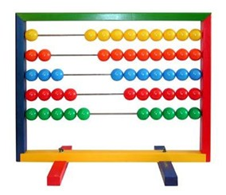
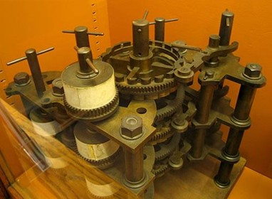
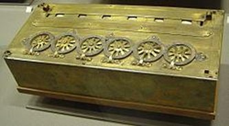
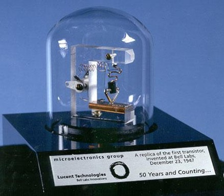
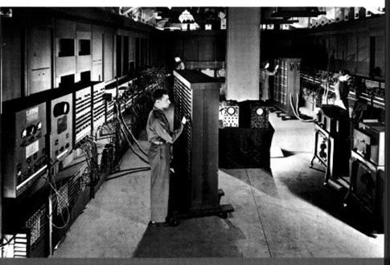
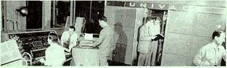
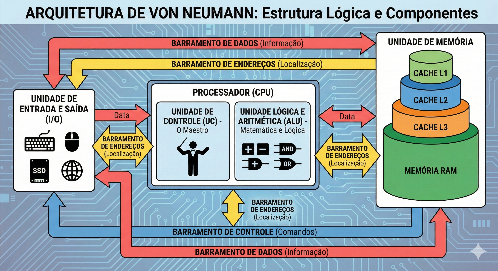
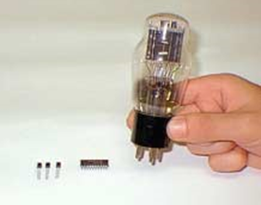
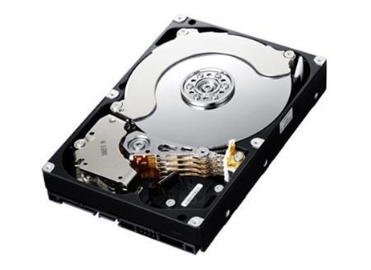

---

layout: home
author_profile: true
title: Manutenção e Montagem de Computadores
permalink: /lessons/hardware/intro/origin/
sidebar:
  nav: "hardware"

---

Criado em Fevereiro de 2026 por _Maxwell Anderson_

# Guia de Introdução ao Hardware: Da Mecânica ao NVMe (Edição 2026)

Este material é destinado a alunos que estão iniciando sua jornada no suporte técnico. Aqui, vamos desmistificar termos como "arquivo", "RAM" e "sistema operacional", conectando a história aos componentes modernos que montamos hoje.

---

## Sumário

- [Guia de Introdução ao Hardware: Da Mecânica ao NVMe (Edição 2026)](#guia-de-introdução-ao-hardware-da-mecânica-ao-nvme-edição-2026)
  - [Sumário](#sumário)
  - [1. Conceitos Básicos para o Técnico {#conceitos-basicos}](#1-conceitos-básicos-para-o-técnico-conceitos-basicos)
  - [2. A Evolução do Hardware: Onde Tudo Começou {#evolucao-hardware}](#2-a-evolução-do-hardware-onde-tudo-começou-evolucao-hardware)
    - [Dos Cálculos Manuais à Mecânica {#calculos-manuais}](#dos-cálculos-manuais-à-mecânica-calculos-manuais)
    - [O Pai da Computação e a Primeira Programadora {#pai-computacao}](#o-pai-da-computação-e-a-primeira-programadora-pai-computacao)
  - [3. A Era Eletrônica: Válvulas e Gigantes {#era-eletronica}](#3-a-era-eletrônica-válvulas-e-gigantes-era-eletronica)
    - [O Gigante ENIAC (1946) {#eniac}](#o-gigante-eniac-1946-eniac)
    - [O UNIVAC I (1951) {#univac}](#o-univac-i-1951-univac)
  - [4. Arquiteturas Fundamentais: O Legado de Von Neumann e Turing {#von-neumann}](#4-arquiteturas-fundamentais-o-legado-de-von-neumann-e-turing-von-neumann)
    - [Componentes da Arquitetura de Von Neumann {#componentes-von-neumann}](#componentes-da-arquitetura-de-von-neumann-componentes-von-neumann)
    - [Alan Turing e o Automatic Computing Engine (ACE) {#alan-turing}](#alan-turing-e-o-automatic-computing-engine-ace-alan-turing)
  - [5. A Revolução do Estado Sólido: Transistores e Circuitos Integrados {#revolucao-solido}](#5-a-revolução-do-estado-sólido-transistores-e-circuitos-integrados-revolucao-solido)
    - [Do Transistor ao Microprocessador](#do-transistor-ao-microprocessador)
  - [6. Evolução Tecnológica do Armazenamento e Memória {#evolucao-armazenamento}](#6-evolução-tecnológica-do-armazenamento-e-memória-evolucao-armazenamento)
    - [O Declínio dos Discos Rígidos e a Ascensão do NVMe {#nvme}](#o-declínio-dos-discos-rígidos-e-a-ascensão-do-nvme-nvme)
  - [7. O Salto para o Século XXI {#seculo-xxi}](#7-o-salto-para-o-século-xxi-seculo-xxi)
    - [Desafios de Manutenção Atuais:](#desafios-de-manutenção-atuais)
  - [Referências citadas](#referências-citadas)

---

## 1. Conceitos Básicos para o Técnico {#conceitos-basicos}

Antes de abrirmos um computador, precisamos entender o que acontece "dentro" dos chips:

*   **Arquivo:** É a unidade básica de armazenamento. Tudo no computador (uma foto, um texto, um programa) é salvo como um arquivo.
*   **Memória RAM:** É onde o computador "anota" o que está fazendo no momento. É rápida, mas apaga tudo quando você desliga (volátil).
*   **Sistema Operacional (SO):** É o mestre de obras (ex: Windows 11/12 ou Linux). Ele gerencia o hardware e permite que o usuário use os programas.
*   **Armazenamento (SSD/NVMe):** É onde seus arquivos moram permanentemente. Em 2026, abandonamos o uso de HDDs para o sistema operacional devido à lentidão.

---

## 2. A Evolução do Hardware: Onde Tudo Começou {#evolucao-hardware}

### Dos Cálculos Manuais à Mecânica {#calculos-manuais}

A informática nasceu da necessidade de precisão. O **Ábaco** (3000 a.C.) foi o primeiro "hardware" de cálculo. Séculos depois, em 1642, **Blaise Pascal** criou a **Pascalina**, uma calculadora mecânica de engrenagens para somar e subtrair.

**Detalhamento histórico:**

A história da computação é, fundamentalmente, a história da busca pela precisão. O início dessa jornada remonta à Suméria em 4000 a.C., onde o registro de transações comerciais em tabletes de argila estabeleceu a necessidade de persistência de dados.

A invenção do ábaco na Babilônia, por volta de 3000 a.C., representou a primeira interface de hardware dedicada ao processamento aritmético, utilizando a posição física de objetos para representar valores numéricos.

### O Pai da Computação e a Primeira Programadora {#pai-computacao}

No século XIX, **Charles Babbage** projetou duas máquinas fundamentais:

**Máquina Diferencial:** Focada em calcular tabelas matemáticas sem erros humanos.

**Contexto histórico:**

> A Máquina Analítica foi o primeiro computador programável de propósito geral jamais concebido, antecedendo os computadores eletrônicos por mais de um século. Seu design separou o conceito de processamento (executar operações) do armazenamento (guardar dados), um princípio que permanece no cerne da arquitetura de Von Neumann e dos computadores modernos.



**Máquina Analítica:** O verdadeiro antepassado do PC moderno. Ela já separava o processamento ("moinho") do armazenamento ("armazém").

**Ada Lovelace**, colega de Babbage, percebeu que essa máquina poderia processar mais do que números, incluindo música e símbolos, tornando-se a primeira programadora da história ao escrever o primeiro algoritmo.

**Contexto histórico:**

> No entanto, o salto para a automação real ocorreu apenas no século XVII. Blaise Pascal, em 1642, desenvolveu a Pascalene, um dispositivo de engrenagens projetado para auxiliar seu pai em cálculos fiscais.[[1]](#ref-1) Embora a Pascalene fosse limitada a operações de adição e subtração e apresentasse baixa confiabilidade mecânica, ela introduziu o conceito de transporte automático de dígitos, o precursor do "carry" em somadores binários modernos.[[2]](#ref-2) Gottfried Wilhelm von Leibniz aprimorou essa visão em 1673 com a invenção da Step Reckoner, que utilizava o princípio do tambor escalonado para realizar as quatro operações aritméticas e extrair raízes quadradas, consolidando a mecânica como um meio viável para a execução de algoritmos complexos.[[2]](#ref-2)
> 
> Babbage, frequentemente referido como o pai da computação, projetou em 1834 um sistema que separava o processamento (o "moinho") do armazenamento (o "armazém").[[1]](#ref-1) A colaboração de Ada Lovelace foi fundamental neste período; Lovelace não apenas escreveu o primeiro programa de computador para calcular os números de Bernoulli, mas também discerniu que o hardware poderia processar mais do que apenas valores numéricos, podendo representar qualquer entidade simbólica, de música a gráficos.[[6]](#ref-6)

| Marco Histórico | Inventor | Inovação Técnica | Implicação para o Hardware |
| --- | --- | --- | --- |
| 1642 | Blaise Pascal | Pascalene | Mecanismo de engrenagens para transporte de dígitos [[1]](#ref-1) |
| 1673 | Gottfried Leibniz | Step Reckoner | Implementação mecânica das quatro operações [[3]](#ref-3) |
| 1804 | Joseph Jacquard | Cartões Perfurados | Primeiro sistema de controle programável por hardware [[3]](#ref-3) |
| 1834 | Charles Babbage | Máquina Analítica | Arquitetura com separação entre CPU e Memória [[1]](#ref-1) |

## 3. A Era Eletrônica: Válvulas e Gigantes {#era-eletronica}

Até a década de 1940, usavam-se **Relés** (interruptores barulhentos e lentos). A revolução veio com as **Válvulas Eletrônicas**: elas não tinham peças móveis e eram muito mais rápidas, mas esquentavam como lâmpadas e queimavam com frequência.

### O Gigante ENIAC (1946) {#eniac}

O primeiro computador eletrônico de grande escala.

**Peso:** 30 toneladas.

**Componentes:** Mais de 18.000 válvulas.

**Manutenção:** Era um pesadelo técnico. O calor gerado (174.000 watts) exigia ar-condicionado industrial, e as válvulas precisavam ser trocadas quase diariamente.

**Contexto histórico:**

> Do ponto de vista de manutenção, o ENIAC representava um desafio hercúleo. O sistema ocupava uma área de aproximadamente 180 metros quadrados e pesava 30 toneladas.[[10]](#ref-10) Com mais de 18.000 válvulas operando simultaneamente, o calor gerado chegava a 174.000 watts, exigindo sistemas de ventilação industriais e salas especialmente projetadas para evitar o colapso térmico.[[12]](#ref-12) A manutenção preventiva consistia na substituição constante de válvulas que queimavam diariamente devido ao estresse térmico. A programação, por sua vez, era uma tarefa física de montagem e desmontagem, exigindo que operadores reorganizassem cabos de conexão e ajustassem milhares de interruptores manuais para configurar cada nova tarefa.[[12]](#ref-12)

### O UNIVAC I (1951) {#univac}

Foi o primeiro computador comercial. Ele trouxe uma inovação que usamos até hoje para backups: a **Fita Magnética**. Ele operava com um clock de 2,25 MHz e pesava cerca de 7,6 toneladas, bem menos que seu antecessor.

**Contexto histórico:**

> O UNIVAC I (Universal Automatic Computer), lançado em 1951, foi o primeiro computador projetado especificamente para aplicações comerciais e administrativas nos Estados Unidos.[[13]](#ref-13) Diferente do ENIAC, o UNIVAC utilizava fita magnética para entrada e saída de dados, o que permitia uma densidade de armazenamento muito superior aos cartões perfurados.[[12]](#ref-12) Em termos de especificações técnicas, o UNIVAC utilizava 6.103 válvulas e operava com um clock de 2,25 MHz, sendo capaz de realizar cerca de 1.905 operações por segundo.[[13]](#ref-13) A memória era baseada em linhas de atraso de mercúrio, que armazenavam dados na forma de ondas acústicas, uma técnica que exigia um controle rigoroso de temperatura para manter a integridade dos bits.[[11]](#ref-11)

| Especificação Técnica | ENIAC (1946) | UNIVAC I (1951) |
| --- | --- | --- |
| Quantidade de Válvulas | 18.000+ [[12]](#ref-12) | ~6.100 [[13]](#ref-13) |
| Peso Total | 30 toneladas [[11]](#ref-11) | ~7,6 toneladas [[13]](#ref-13) |
| Consumo de Potência | 150-174 kW [[11]](#ref-11) | 125 kW [[11]](#ref-11) |
| Frequência de Clock | 100 kHz [[12]](#ref-12) | 2,25 MHz [[13]](#ref-13) |
| Memória Principal | 20 números [[12]](#ref-12) | 1.000 palavras (12 char cada) [[13]](#ref-13) |

## 4. Arquiteturas Fundamentais: O Legado de Von Neumann e Turing {#von-neumann}

A montagem e manutenção de computadores modernos baseiam-se quase inteiramente na Arquitetura de Von Neumann, formalizada em 1945. Este modelo introduziu o conceito de "programa armazenado", onde tanto as instruções do software quanto os dados processados residem na mesma unidade de memória física.[[15]](#ref-15) Antes disso, as máquinas tinham funções fixas ou exigiam reconfiguração física total.

### Componentes da Arquitetura de Von Neumann {#componentes-von-neumann}

A estrutura lógica de um sistema baseado em Von Neumann é composta por cinco unidades essenciais:

1.  **Unidade de Controle (UC):** Atua como o maestro do sistema, decodificando instruções e gerenciando o fluxo de dados entre os outros componentes.[[15]](#ref-15)
2.  **Unidade Lógica e Aritmética (ALU):** Responsável por todas as operações matemáticas (soma, subtração) e lógicas (AND, OR, comparações).[[15]](#ref-15)
3.  **Unidade de Memória:** Armazena dados e programas. Na prática moderna, esta unidade é representada pela RAM e pelos caches.[[17]](#ref-17)
4.  **Entrada e Saída (I/O):** Interfaces que permitem ao computador interagir com o mundo externo, de teclados a discos rígidos.[[16]](#ref-16)
5.  **Barramentos (Buses):** Canais de comunicação que interligam os componentes. O barramento de endereços transporta a localização do dado, o de dados transporta a informação propriamente dita e o de controle transporta sinais de comando.[[15]](#ref-15)

Um aspecto crítico para o técnico de hardware é o "Gargalo de Von Neumann". Como as instruções e os dados compartilham o mesmo barramento e memória, a CPU muitas vezes precisa esperar que os dados sejam buscados antes de processar a próxima instrução, o que limita o desempenho máximo do sistema.[[18]](#ref-18) A arquitetura Harvard, em contraste, utiliza barramentos e memórias separadas para dados e instruções, sendo comum em caches internos de processadores modernos e microcontroladores para evitar este gargalo.[[18]](#ref-18)

### Alan Turing e o Automatic Computing Engine (ACE) {#alan-turing}

Enquanto Von Neumann focava na estrutura organizacional, Alan Turing concentrou-se na eficiência algorítmica e na flexibilidade lógica. Em 1945, Turing propôs o ACE, que apresentava um design significativamente diferente e, teoricamente, mais rápido que o EDVAC de Von Neumann.[[19]](#ref-19) Turing introduziu a "programação ótima", onde as instruções eram posicionadas na memória de linha de atraso de mercúrio de forma que estivessem prontas para leitura exatamente no momento em que a CPU as solicitava, minimizando a latência de rotação da memória.[[14]](#ref-14) Embora o design original de Turing fosse complexo demais para as capacidades de engenharia da época, o Pilot ACE de 1950 tornou-se o computador mais rápido do mundo em seu lançamento, operando a 1 MHz.[[20]](#ref-20)

## 5. A Revolução do Estado Sólido: Transistores e Circuitos Integrados {#revolucao-solido}

A substituição das válvulas pelos transistores em 1947, nos Laboratórios Bell, marcou o início da segunda geração de computadores e transformou radicalmente a manutenção de hardware.[[8]](#ref-8) John Bardeen, Walter Brattain e William Shockley desenvolveram o transistor de contato de ponto utilizando germânio, um material semicondutor que podia atuar tanto como condutor quanto como isolante.[[21]](#ref-21)

### Do Transistor ao Microprocessador

Os transistores trouxeram vantagens decisivas: eram menores, consumiam uma fração da energia das válvulas, não exigiam aquecimento e tinham uma vida útil muito superior.[[5]](#ref-5) Isso permitiu que os computadores diminuíssem de tamanho, passando de salas inteiras para gabinetes de tamanho médio. A terceira geração surgiu no final dos anos 1950 com os Circuitos Integrados (ICs), onde múltiplos transistores e outros componentes eram fabricados em uma única pastilha de silício.[[5]](#ref-5) Finalmente, a quarta geração consolidou a CPU em um único chip, o microprocessador, permitindo a revolução dos computadores pessoais (PCs) na década de 1970.[[5]](#ref-5)

## 6. Evolução Tecnológica do Armazenamento e Memória {#evolucao-armazenamento}

O armazenamento de dados evoluiu de métodos mecânicos e magnéticos rudimentares para soluções de estado sólido de alta densidade. O UNIVAC I iniciou a era da fita magnética, que oferecia velocidades de leitura de aproximadamente 12.800 caracteres por segundo, uma inovação monumental frente aos cartões perfurados.[[13]](#ref-13)

### O Declínio dos Discos Rígidos e a Ascensão do NVMe {#nvme}

Durante décadas, o Disco Rígido (HDD) foi o padrão de armazenamento secundário. Baseado em pratos magnéticos rotativos e cabeças de leitura físicas, o HDD enfrentava limitações térmicas e mecânicas, com velocidades que dificilmente ultrapassavam 200 MB/s.[[23]](#ref-23) A introdução dos SSDs (Solid State Drives) baseados em flash NAND eliminou a latência mecânica, mas os modelos iniciais eram limitados pela interface SATA, originalmente projetada para HDDs, com teto de 600 MB/s.[[24]](#ref-24)

Em 2026, o protocolo NVMe (Non-Volatile Memory Express) é o padrão absoluto para sistemas de alta performance. Diferente do SATA, o NVMe comunica-se diretamente com o processador através do barramento PCIe (Peripheral Component Interconnect Express), permitindo paralelismo massivo com milhares de filas de comandos simultâneos.[[23]](#ref-23)

| Interface de Armazenamento | Protocolo | Barramento | Velocidade Máxima Típica (2026) |
| --- | --- | --- | --- |
| HDD / SSD SATA | SATA III | SATA | 600 MB/s [[24]](#ref-24) |
| NVMe Gen 3 | NVMe | PCIe 3.0 x4 | ~3.500 MB/s [[25]](#ref-25) |
| NVMe Gen 4 | NVMe | PCIe 4.0 x4 | ~7.500 MB/s [[25]](#ref-25) |
| NVMe Gen 5 | NVMe | PCIe 5.0 x4 | ~14.500 MB/s [[26]](#ref-26) |
| SD Express 8.0 | NVMe | PCIe 4.0 x2 | ~4.000 MB/s [[28]](#ref-28) |

## 7. O Salto para o Século XXI {#seculo-xxi}

Hoje, não trocamos válvulas, mas lidamos com a **Miniaturização**. O substituto da válvula foi o **Transistor** (1947), que permitiu colocar bilhões de interruptores em um único chip de silício.

### Desafios de Manutenção Atuais:

**Calor e Performance:** Assim como o ENIAC sofria com calor, nossos **SSDs NVMe Gen5** atuais chegam a velocidades de 14.500 MB/s e esquentam tanto que precisam de dissipadores de calor ativos (com ventoinhas) para não travarem.

**A Crise de Componentes de 2026:** Como técnicos, devemos avisar aos clientes que os preços de **Memória RAM (DDR5/DDR6)** e **SSDs** subiram até 60% este ano devido à alta demanda por Inteligência Artificial.

**Upgrade Estratégico:** Em 2026, HDDs mecânicos são usados apenas para "depósito" de arquivos pesados (fotos/vídeos). Para o Windows e programas, o uso de SSDs NVMe é obrigatório para evitar lentidão extrema.

---

**Dica do Professor:** Entender o passado nos ajuda a diagnosticar o futuro. Um erro de leitura em uma fita magnética de 1951 tem a mesma lógica de um erro de setor em um SSD moderno: a busca pela integridade do dado!

---

## Referências citadas

1.  \[1\] Timeline of Computing History, acessado em fevereiro 22, 2026, \<http://clab.math.auth.gr/sites/default/files/2025-03/CS_Timeline.pdf\>
2.  \[2\] Computer History Timeline, acessado em fevereiro 22, 2026, \<http://www.cis.usouthal.edu/faculty/daigle/project1/timeline.htm\>
3.  \[3\] History of Computers, acessado em fevereiro 22, 2026, \<https://www.cs.uah.edu/~rcoleman/Common/History/History.html\>
4.  \[4\] Computing History Timeline, acessado em fevereiro 22, 2026, \<https://www.computinghistory.org.uk/cgi/computing-timeline.pl\>
5.  \[5\] Electronic Components - From Vacuum Tubes to Integrated Circuits \| Viet Thai SupMan, acessado em fevereiro 22, 2026, \<https://vietthaisupman.com/electronic-components-from-vacuum-tubes-to-integrated-circuits/\>
6.  \[6\] John von Neumann and the von Neumann Architecture \| Free Essay Example - StudyCorgi, acessado em fevereiro 22, 2026, \<https://studycorgi.com/john-von-neumann-and-the-von-neumann-architecture/\>
7.  \[7\] Computer History: A Timeline of Computer Programming Languages \| HP® Tech Takes, acessado em fevereiro 22, 2026, \<https://www.hp.com/us-en/shop/tech-takes/computer-history-programming-languages\>
8.  \[8\] The Dawn of Electronics: From Vacuum Tubes to Transistors, acessado em fevereiro 22, 2026, \<https://www.hemargroup.ch/en/blog/the-dawn-of-electronics-from-vacuum-tubes-to-transistors\>
9.  \[9\] The Evolution of Electronic Computing: From Vacuum Tubes to Transistors, acessado em fevereiro 22, 2026, \<https://beaver.my/the-evolution-of-electronic-computing-from-vacuum-tubes-to-transistors/\>
10.  \[10\] ENIAC - Wikipedia, acessado em fevereiro 22, 2026, \<https://en.wikipedia.org/wiki/ENIAC\>
11.  \[11\] UNIVAC: the first commercial computer that revolutionized data management is 70 years old, acessado em fevereiro 22, 2026, \<https://www.primeur.com/blog/univac-the-first-commercial-computer-that-revolutionized-data-management-is-70-years-old\>
12.  \[12\] Computer History - Computer Science, acessado em fevereiro 22, 2026, \<https://www.cs.kent.edu/~rothstei/10051/HistoryPt4.htm\>
13.  \[13\] UNIVAC I - Wikipedia, acessado em fevereiro 22, 2026, \<https://en.wikipedia.org/wiki/UNIVAC_I\>
14.  \[14\] Alan Turing's Other Universal Machine - Communications of the ACM, acessado em fevereiro 22, 2026, \<https://cacm.acm.org/opinion/alan-turings-other-universal-machine/\>
15.  \[15\] Von Neumann Architecture - Computer Science GCSE GURU, acessado em fevereiro 22, 2026, \<https://www.computerscience.gcse.guru/theory/von-neumann-architecture\>
16.  \[16\] Von Neumann Architecture - BYJU'S, acessado em fevereiro 22, 2026, \<https://byjus.com/gate/von-neumann-architecture-notes/\>
17.  \[17\] 5.2. The von Neumann Architecture - Dive Into Systems, acessado em fevereiro 22, 2026, \<https://diveintosystems.org/book/C5-Arch/von.html\>
18.  \[18\] Von Neumann architecture - Wikipedia, acessado em fevereiro 22, 2026, \<https://en.wikipedia.org/wiki/Von_Neumann_architecture\>
19.  \[19\] Alan Turing - Computer Designer, Codebreaker, Enigma \| Britannica, acessado em fevereiro 22, 2026, \<https://www.britannica.com/biography/Alan-Turing/Computer-designer\>
20.  \[20\] Automatic Computing Engine - Wikipedia, acessado em fevereiro 22, 2026, \<https://en.wikipedia.org/wiki/Automatic_Computing_Engine\>
21.  \[21\] The History of the Transistor - John Bardeen - Walter Brattain - William Shockley, acessado em fevereiro 22, 2026, \<https://personal.utdallas.edu/~zhoud/ee6375-2004/lecture_2_introduction_to_VLSI_design/The%20History%20of%20the%20Transistor%20-%20John%20Bardeen%20-%20Walter%20Brattain%20-%20William%20Shockley.htm\>
22.  \[22\] univac ii, acessado em fevereiro 22, 2026, \<https://www.ed-thelen.org/comp-hist///BRL2nd/U2.pdf\>
23.  \[23\] Primary Storage in 2026: Trends, Priorities and Strategic Shifts - WWT, acessado em fevereiro 22, 2026, \<https://www.wwt.com/blog/primary-storage-in-2026-trends-priorities-and-strategic-shifts\>
24.  \[24\] Please stop using these 5 storage drives in 2026 - How-To Geek, acessado em fevereiro 22, 2026, \<https://www.howtogeek.com/please-stop-using-these-storage-drives-in-2026/\>
25.  \[25\] SSD vs. NVMe: What's the difference? - IBM, acessado em fevereiro 22, 2026, \<https://www.ibm.com/think/topics/ssd-vs-nvme\>
26.  \[26\] 6 PC Hardware Upgrades That Actually Improve Gaming and Productivity in 2026, acessado em fevereiro 22, 2026, \<https://www.techtimes.com/articles/314386/20260130/6-pc-hardware-upgrades-that-actually-improve-gaming-productivity-2026.htm\>
27.  \[27\] SSD PCIe 5.0 in 2026: is it really worth it? - DropReference, acessado em fevereiro 22, 2026, \<https://dropreference.com/en/blog/guide/ssd-pcie6-2026\>
28.  \[28\] State of Memory Technology and Trends to Watch in 2026 - SD Association, acessado em fevereiro 22, 2026, \<https://www.sdcard.org/press/thoughtleadership/state-of-memory-technology-and-trends-to-watch-in-2026/\>
29.  \[29\] 5 Powerful Computer Hardware Trends in 2026 - ACE Computers, acessado em fevereiro 22, 2026, \<https://acecomputers.com/computer-hardware/\>
30.  \[30\] Hardware Prices Are Surging: What IT Leaders Need to Know About the 2026 Memory Crisis - i-Tech Support, acessado em fevereiro 22, 2026, \<https://i-techsupport.com/hardware-prices-are-surging-what-it-leaders-need-to-know-about-the-2026-memory-crisis/\>
31.  \[31\] The von Neumann Architecture — UndertheCovers - Jonathan Appavoo, acessado em fevereiro 22, 2026, \<https://jappavoo.github.io/UndertheCovers/te\>