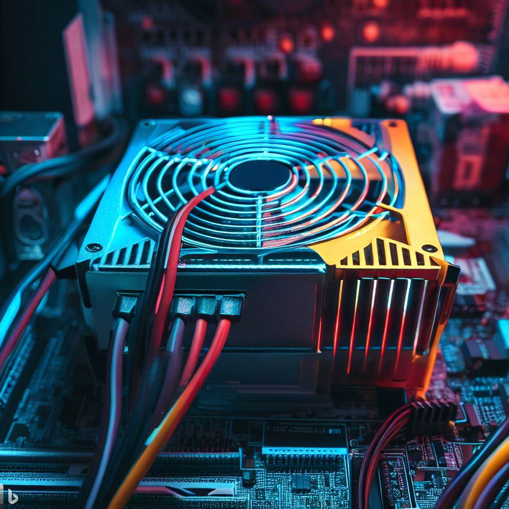
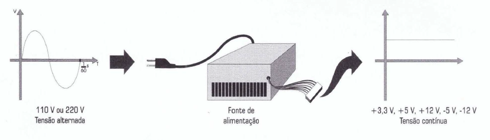
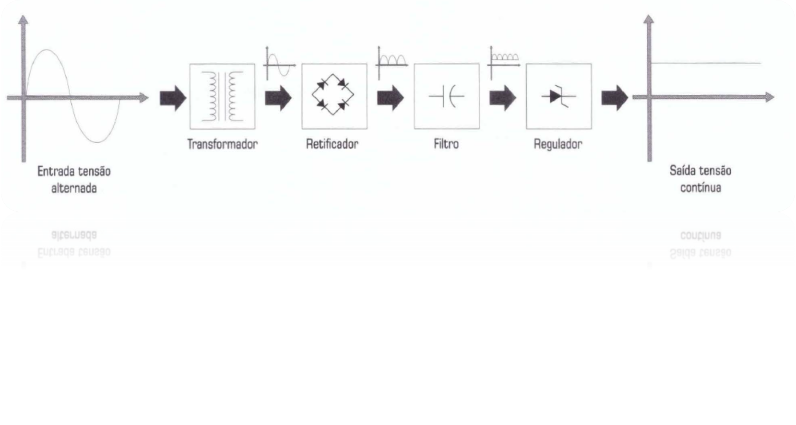
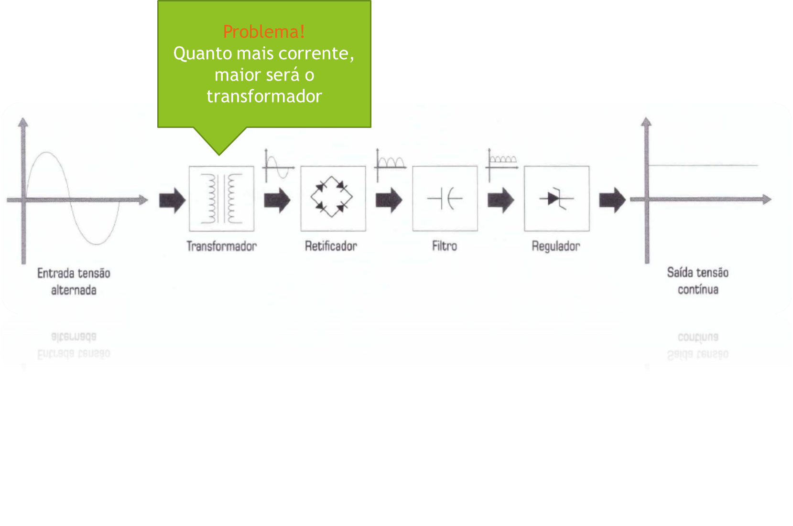
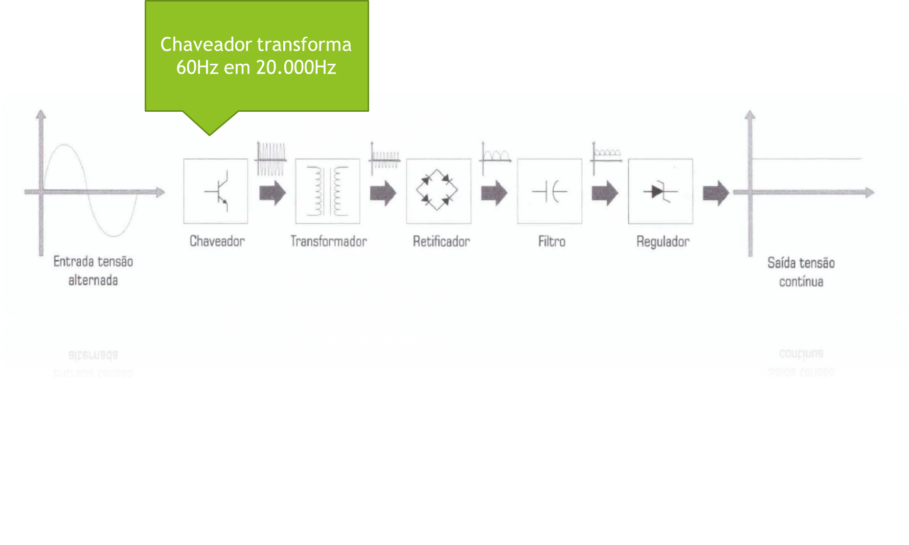
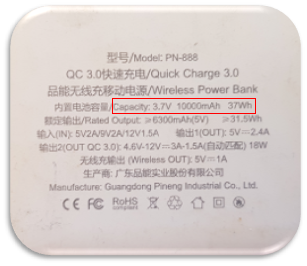

Criado em Março de 2023 por _Maxwell Anderson_

  <figure>
  
      <figcaption>Gato técnico em manutenção de computadores consertando uma fonte de alimentação</figcaption>
      <small>Fonte: gerado por IA com Bing por Maxwell Anderson (2023)</small>
  </figure>

> Se o gato consegue, você conseguirá.

## Conteúdo

- [Fonte de alimentação](#fonte-de-alimentação)
  - [Introdução](#introdução)
  - [Conversão de tensões](#conversão-de-tensões)
  - [Cálculo de potências](#cálculo-de-potências)
  - [Potência necessária para um computador](#potência-necessária-para-um-computador)

# Fonte de alimentação

## Introdução

A fonte de alimentação de um computador é um componente essencial para o funcionamento do equipamento. A fonte de alimentação converte a energia elétrica da tomada em energia elétrica de baixa tensão para alimentar os componentes do computador.

Vamos conhecer como funcionam as conversões entre tensões, bem como as características das fontes AT e ATX.

<figure style="text-align:center">
    
    <figcaption>Exemplo de fonte de alimentação.  IA prompt: "Create an image of ATX power supply of computer"</figcaption>
    <small>Fonte: gerado por IA com Bing por Maxwell Anderson (2023)</small>
</figure>

A fonte de alimentação é um componente que pode apresentar problemas de funcionamento, como a falta de energia em um componente específico ou em todos os componentes.

## Conversão de tensões

Uma rede elétrica pode oferecer uma tensão alternada de 110V ou 220V, dependendo do país.

Os componentes eletrônicos de um computador funcionam com uma tensão de 5V, 12V ou 3.3V. Essas tensões são contínuas e mais baixas.

<figure style="text-align:center">
    
    <figcaption>Visão detalhada sobre a conversão de tensão alternada para tensão contínua de tensão alternada para tensão contínua com chaveador</figcaption>
    <small>Fonte: Gabriel Torres. Hardware Curso Completo. 4ª edição. Editora Axcel Books: 2001.</small>
</figure>

**Como funciona a conversão de tensão?**

Conforme podemos ver na figura abaixo, vamos explicar o passo a passo sobre como se dá essa conversão:

1. Na **entrada**, a corrente elétrica vem da rua com uma tensão alternada de 220V. Ela alterna entre 220V positivo e 220V negativo;
2. Um **transformador** reduz a tensão para 12V, contudo, a corrente elétrica continua alternada, entre 12V positivo e 12V negativo. Outro problema é que, quanto mais corrente elétrica passa pelo transformador, maior deverá ser este transformador;
3. Um outro circuito, chamado de **circuito retificador**, converte a corrente alternada em corrente contínua pulsante positiva, isto é, a tensão pulsa entre 0V e 12V positivo. O circuito retificador é composto por diodos, que são semicondutores que conduzem corrente elétrica em apenas uma direção;
4. Depois um **filtro** transforma essa pulsação em tensão contínua de 12V. O filtro é formado por capacitores. Um problema é as oscilações que ocorrem na tensão contínua, que podem causar problemas nos componentes eletrônicos. Para resolver esse problema, o filtro é formado por vários capacitores em paralelo, que reduzem as oscilações, mas não totalmente.
5. Por último, um **regulador** remove a oscilação restante fazendo com que a tensão seja constante e contínua. O regulador pode ser um circuito integrado ou um diodo zener.

<figure style="text-align:center">
    
    <figcaption>Visão detalhada sobre a conversão de tensão alternada para tensão contínua de tensão alternada para tensão contínua com chaveador</figcaption>
    <small>Fonte: Gabriel Torres. Hardware Curso Completo. 4ª edição. Editora Axcel Books: 2001.</small>
</figure>

**Mas e o problema do tamanho do transformador?**

Imagina como seriam as fontes de alimentação para placas de vídeo e jogos que dependem de correntes mais altas? O transformador seria grande e pesado. Para resolver este problema, foi adicionado antes do transformador um **chaveador** que converte a frequência da corrente elétrica de 60Hz para 20.000Hz. Assim, a corrente elétrica passa por um transformador menor, que é mais leve e mais barato.

<figure style="text-align:center">
    
    <figcaption>Visão detalhada sobre a conversão de tensão alternada para tensão contínua de tensão alternada para tensão contínua com chaveador</figcaption>
    <small>Fonte: Gabriel Torres. Hardware Curso Completo. 4ª edição. Editora Axcel Books: 2001.</small>
</figure>

<figure style="text-align:center">
    
    <figcaption>Visão detalhada sobre a conversão de tensão alternada para tensão contínua de tensão alternada para tensão contínua com chaveador</figcaption>
    <small>Fonte: Gabriel Torres. Hardware Curso Completo. 4ª edição. Editora Axcel Books: 2001.</small>
</figure>

## Cálculo de potências

Você vai se deparar com a seguinte questão de seus clientes e familiares.

> "Eu tenho uma fonte de alimentação de 500W, mas meu computador não liga. Por que isso acontece?"

Ou então:

> "Quero montar um computador com uma placa de vídeo de 300W, mas a fonte de alimentação que eu tenho é de 200W. Será que ela vai aguentar?"

Ou ainda:

> "Eu quero montar um computador com uma placa de vídeo de 300W, com placa-mãe gamer e processador de 8 núcleos. Qual fonte de alimentação eu devo comprar?"

Para responder essas perguntas, vamos entender como calcular a potência de uma fonte de alimentação.

$$ {P=V*I} $$

A potência de uma fonte de alimentação é dada pela multiplicação da tensão pela corrente elétrica.

**Exemplo 1:**

Imagine um drive óptico de 1,8A alimentado por 5V mais 500mA alimentado a 12V. A potência desse drive é:

- **Passo 1**: converta a corrente elétrica para amperes (A).Assim sendo:

  A fórmula para converter de miliamperes para amperes é:

  $$ {1000mA = 1A} $$

  Logo:

  $$ {500mA = 0,5A} $$

- **Passo 2**: realize o cálculo da potência para o primeiro consumo (5V) e corrente (1,8A). Assim sendo:

  $$ {P1=5V*1,8A=9W} $$

- **Passo 3**: realize o cálculo da potência para a segundo consumo (12V) e corrente (0,5A). Assim sendo:

  $$ {P2=12V*0,5A=6W} $$

- **Passo 4**: some as potências. Assim sendo:

  $$ {P=P1+P2=9W+6W=15W} $$

**Exemplo 2:**

Imagine uma placa de som alimentada da seguinte forma:

- Primeiro consumo (P1): 5V a 400mA;
- Segundo consumo (P2): 12V a 200mA;
- Terceiro consumo (P3): -12V a 30mA.

Realize o cálculo da potência total da placa de som.

- **Passo 1**: converta a corrente elétrica para amperes (A). Assim sendo:

  A fórmula para converter de miliamperes para amperes é:

  $$ {1000mA = 1A} $$

  Logo:

  $$ {400mA = 0,4A} $$

  $$ {200mA = 0,2A} $$

  $$ {30mA = 0,03A} $$

- Passo 2: realize o cálculo da potência para o primeiro consumo (5V) e corrente (0,4A). Assim sendo:

  $$ {P1=5V*0,4A=2W} $$

- **Passo 3**: realize o cálculo da potência para o segundo consumo (12V) e corrente (0,2A). Assim sendo:

  $$ {P2=12V*0,2A=2,4W} $$

- **Passo 4**: realize o cálculo da potência para o terceiro consumo (-12V) e corrente (0,03A). Assim sendo:

  $$ {P3=-12V*0,03A=-0,36W} $$

  Neste caso, para valores negativos, utilizaremos o valor do módulo onde:

  $$ {|P3|=|-0,36W| => P3 = 0,36W} $$

- **Passo 5**: some as potências. Assim sendo:

  $$ {P=P1+P2+P3} $$
  $$ {P=2W+2,4W+0,36W} $$
  $$ {P=4,W} $$

**Exemplo 3:**

Veja a imagem abaixo:

<figure style="text-align:center">
    
    <figcaption>Banco de baterias</figcaption>
    <small>Fonte: autoria própria (2023)</small>
</figure>

Perceba o que está impresso no banco de baterias: "_Capacity: 3.7V 10000mAh 37Wh_". O que isso significa?

- 3.7V é a tensão nominal da bateria;
- 10000mAh é a capacidade da bateria;
- 37Wh é a potência da bateria.

Mas qual será a real potência do banco de baterias, se as informações sobre tensão e corrente são verdadeiras?

- **Passo 1**: converta a corrente elétrica para amperes (A). Assim sendo:

  A fórmula para converter de miliamperes para amperes é:

  $$ {1000mAh = 1Ah} $$

  Logo:

  $$ {10000mAh = 10Ah} $$

  _Ah_ é a unidade de medida de capacidade de uma bateria, cuja corrente é de 10A por hora.

  Assim sendo a corrente nominal da bateria é de 10A.

- **Passo 2**: realize o cálculo da potência para o primeiro consumo (3.7V) e corrente (10A). Assim sendo:

  $$ {P=3.7V*10A=37W} $$

  Logo, a potência real do banco de baterias é de 37W.

> Observação:
> Veja que são necessárias ferramentas especiais para confirmar a verdadeira potência da fonte.

## Potência necessária para um computador

Agora que você já sabe como calcular as potências de componentes de um computador, vamos entender como calcular a potência necessária para uma fonte de alimentação.

A potência necessária para um computador é dada pela soma das potências de todos os componentes do computador.

**Exemplo:** imagine um computador com as seguintes características.

| Componente     | Marca    | Modelo              | Consumo (hipotético) |
| :------------- | :------- | :------------------ | :------------------: |
| Processador    | Intel    | Core i7-8700K       |         95W          |
| Placa de vídeo | Gigabyte | GeForce GTX 1080 Ti |         250W         |
| Placa-mãe      | Gigabyte | Z370 AORUS Gaming 7 |         200W         |
| Memória RAM    | Kingston | HyperX Fury 16GB    |         1,2W         |
| HD             | Seagate  | Barracuda 1TB       |         7,2W         |
| SSD            | Samsung  | 860 EVO 500GB       |         4,8W         |
| Placa de som   | Creative | Sound Blaster Z     |         200W         |
| **Total**      |          |                     |      **758,2W**      |

<small>Fonte: autoria própria (2023)</small>

A potência necessária para esse computador é de 758,2W. Logo, a fonte de alimentação deve ter uma potência superior a 758,2W. Eu indicaria a compra de uma fonte de alimentação com uma potência de, no mínimo, 800W, sendo recomendado 1000W.

Por que recomenda-se uma fonte de alimentação com uma potência de 1000W?

Porque a potência de uma fonte de alimentação é medida em picos. Ou seja, a fonte de alimentação pode fornecer 1000W por um curto período de tempo, mas não por um longo período de tempo. Por isso, é recomendado que a fonte de alimentação tenha uma potência superior a potência necessária para o computador.

Outro motivo é de possibilitar que você possa fazer upgrades no computador no futuro. Por exemplo, você pode adicionar uma placa de vídeo ou um processador mais potente.

> Selecione o menu lateral para navegar pelo curso.
