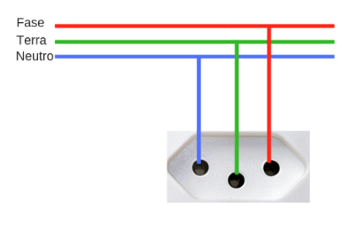
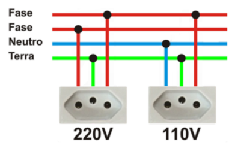
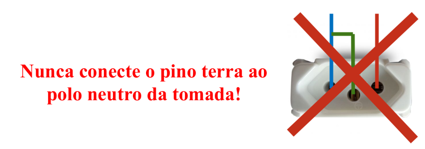
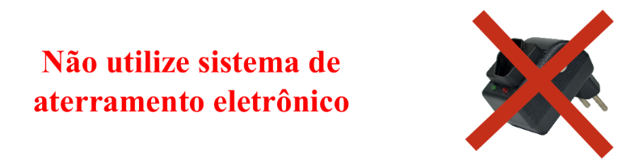

Criado em Março de 2023 por _Maxwell Anderson_

  <figure style="text-align:center">
      
      <figcaption>Gato técnico em manutenção de computadores consertando uma fonte de alimentação</figcaption>
      <small>Fonte: gerado por IA com Bing por Maxwell Anderson (2023)</small>
  </figure>

## Conteúdo

- [Fornecimento e aterramento elétrico](#fornecimento-e-aterramento-elétrico)
  - [O que ocorre com fugas de fase?](#o-que-ocorre-com-fugas-de-fase)
  - [Aterramento](#aterramento)
    - [Cuidados!](#cuidados)

# Fornecimento e aterramento elétrico

  <figure>
      
       
      <figcaption>Esquema de aterramento elétrico em 220V com uma fase</figcaption>
      <small></small>
  </figure>

  <figure>
      
       
      <figcaption>Esquema de aterramento elétrico em 220V e 110V com duas fases</figcaption>
      <small></small>
  </figure>

Alguns estados fornecem 200V e outros fornecem 110V. Antes de verificar a tomada, é necessário realizar uma medição de tensão para verificar se a tensão fornecida é a mesma que a tensão de entrada da fonte de alimentação. Se a tensão fornecida for diferente da tensão de entrada da fonte de alimentação, é necessário ajustar a tensão de entrada da fonte de alimentação para a tensão fornecida, caso contrário, a fonte de alimentação pode ser danificada.

Segue abaixo uma tabela contendo as tensões no Brasil:

| Estado              |              Tensão              |
| :------------------ | :------------------------------: |
| Acre                |               127V               |
| Alagoas             |               220V               |
| Amapá               |               127V               |
| Amazonas            |               127V               |
| Bahia               | 220V (algumas cidades são 127V)  |
| Ceará               |               220V               |
| Distrito Federal    |               220V               |
| Espírito Santo      | 127V (algumas cidades são 220V)  |
| Goiás               | 220V (algumas cidades são 127V)  |
| Maranhão            |               220V               |
| Mato Grosso         | 127V (algumas cidades são 220V)  |
| Mato Grosso do Sul  |               127V               |
| Minas Gerais        |               127V               |
| Pará                |               127V               |
| Paraíba             |               220V               |
| Paraná              |               127V               |
| Pernambuco          |               220V               |
| Piauí               |               220V               |
| Rio de Janeiro      |               127V               |
| Rio Grande do Norte |               220V               |
| Rio Grande do Sul   | 127V  (algumas cidades são 220V) |
| Rondônia            |               127V               |
| Roraima             |               127V               |
| Santa Catarina      |               220V               |
| São Paulo           |               127V               |
| Sergipe             |               127V               |
| Tocantins           |               220V               |

## O que ocorre com fugas de fase?

Existem três tipos de fugas de fase:

| Teste             | Descrição                            | Tensão                 | Exemplo em rede 220V |
| ----------------- | ------------------------------------ | ---------------------- | -------------------- |
| Fase para terra   | Corrente elétrica no aterramento     | Menor que cerca de 10% | < ~200V              |
| Fase para neutro  | Corrente elétrica no neutro          | Menor que cerca de 10% | < ~200V              |
| Neutro para terra | Corrente elétrica no neutro ou terra | Maior que 0V           | > ~0V                |

> **‼️ Muitíssimo cuidado ‼️**
>
> Apesar de não fazer diferença para motores em geral, podemos levar um choque caso ocorram os casos acima! Não realize a manutenção em um equipamento com a rede elétrica ligada desta forma!
>
> Se houver uma fuga de corrente e você estiver em contato com o solo, a corrente irá percorrer seu corpo em "busca do solo", podendo ocorrer uma fatalidade.

Veja o que acontece com o nosso corpo quando levamos choque:

| Corrente                     | Efeito                                           |
| ---------------------------- | ------------------------------------------------ |
| 10mA                         | Contração muscular                               |
| Entre 10mA e 20mA            | Aumento das contrações musculares, do coração... |
| Entre 20mA e 100mA           | Parada respiratória                              |
| Entre 100mA e 3000mA (ou 3A) | Fibrilação muscular cardíaca ☠️                   |
| Acima de 3000mA (ou 3A)      | Parada cardíaca e queimaduras graves ☠️           |

Então por que os pássaros não morrem quando tocam em fios elétricos?
Porque eles não são capazes de conduzir corrente elétrica, pois não existe diferença de potencial. Caso ele encoste o bico em um fio com potencial diferente, as cargas elétricas poderão percorrer o seu corpo (tadinho).

## Aterramento

  <figure>
      
       
      <figcaption>Haste de cobre</figcaption>
      <small>Portal Construção Fácil, disponívem em https://portalconstrucaofacil.com/aterramento-residencial/, acessado em 09/04/2023.</small>
  </figure>

O aterramento é um processo de ligação de um condutor de cobre (geralmente uma haste) ao solo, para que a corrente elétrica possa retornar ao solo, caso ocorra uma fuga de corrente.

O aterramento é feito para evitar que a corrente elétrica retorne ao fornecedor de energia, causando um curto-circuito. O curto-circuito pode causar um incêndio, uma explosão ou até mesmo uma falha no fornecimento de energia.

A instalação deve ser feito por um profissional capacitado, pois o aterramento deve ser feito de forma correta para evitar problemas futuros.

### Cuidados!

Veja os principais cuidados que devemos ter:

| Cuidado 1                                                                                      | Cuidado 2                                                                                                     |
| ---------------------------------------------------------------------------------------------- | ------------------------------------------------------------------------------------------------------------- |
|  |  |

  <figure>
      
       
      <figcaption>Gato técnico em computador levando um choque por não ter tomado cuidado. Prompt: create an image of computer technician cat getting shocked for not being careful. </figcaption>
      <small>Fonte: gerado por IA com Bing por Maxwell Anderson (2023)</small>
  </figure>

