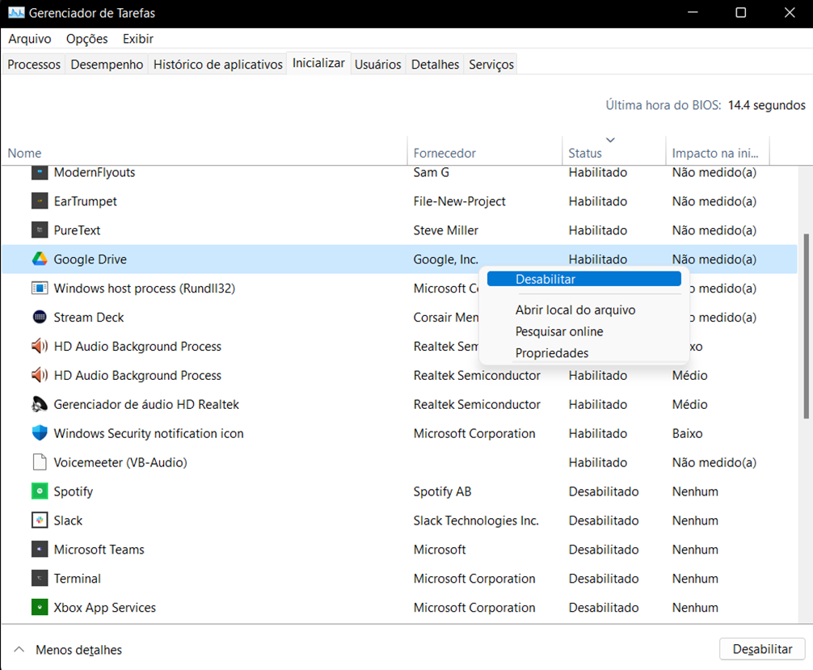
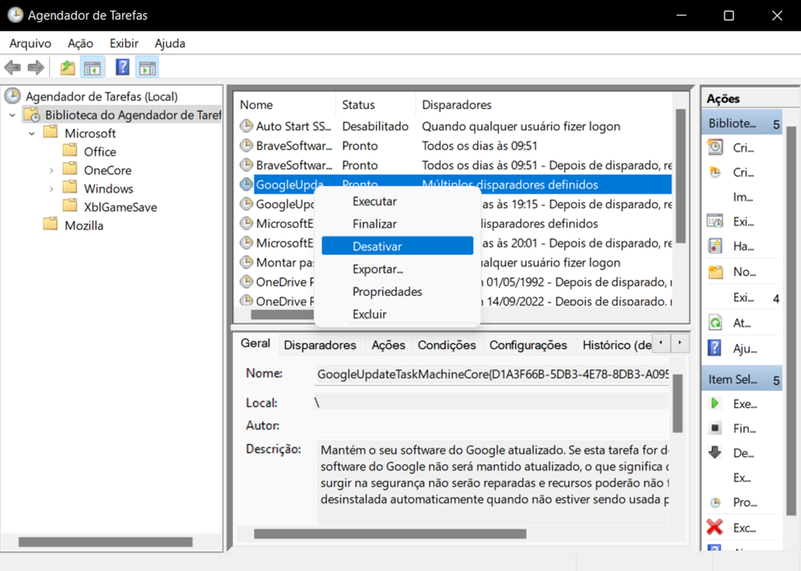


{: .align-center}

# Introdução

Esta lição possui um roteiro geral para manutenção preventiva de computadores. O objetivo é fornecer um guia para a realização de manutenção preventiva em computadores, incluindo a detecção de problemas e a otimização do sistema.

O roteiro é baseado em experiências pessoais e em pesquisas realizadas em fontes confiáveis. É dividido em seções, cada uma abordando um aspecto específico da manutenção preventiva.

É destinado a técnicos de informática e entusiastas de computadores.

> **Nota**
>
> O roteiro **não é detalhado** e exige que o técnico ou entusiasta tenha conhecimento prévio sobre os procedimentos e ferramentas necessários para realizar a manutenção preventiva. Também não é um guia de reparo, nem faço sugestões de ferramentas específicas para cada etapa, salvo poucas exceções. Com o passar do tempo, o roteiro será atualizado e detalhado com base em novas experiências e pesquisas.

## A importância da manutenção preventiva em computadores

A rápida evolução tecnológica e a crescente dependência de computadores no cenário atual destacam a relevância crucial da manutenção preventiva em sistemas. Assim como qualquer outra máquina, os computadores requerem cuidados periódicos para garantir seu desempenho otimizado, confiabilidade e longevidade. A manutenção preventiva não apenas reduz o risco de falhas inesperadas, mas também contribui para a preservação dos dados essenciais, a segurança do sistema e a eficiência operacional.

Este processo não se concentra em atividades de reparos; pelo contrário, concentra-se em antecipar potenciais problemas, identificando e resolvendo-os antes que possam impactar negativamente o funcionamento do computador. Ao seguir um roteiro estruturado de manutenção preventiva, os profissionais de TI e entusiastas garantem não apenas a estabilidade do sistema, mas também uma experiência de usuário contínua, maximizando assim o retorno do investimento em hardware e software.

# Roteiro geral para PCs

Lembre-se de adaptar essas sugestões de acordo com as necessidades específicas do usuário ou do ambiente em que o computador está inserido.

## 1. Preparativos

1. Lembre-se de utilizar pulseira antiestática durante a inspeção interna. Se não tiver, toque em uma superfície metálica aterrada para descarregar a eletricidade estática do corpo. Se possível, realize a inspeção em um local com piso antiestático.
   - Observação: certa vez desprezei essa recomendação e acabei danificando um processador de um cliente quando jovem simplesmente ao tocá-lo. Não cometa o mesmo erro!
2. **Backup antes de alterações críticas**: recomende ao usuário/cliente que faça backup dos dados importantes antes de qualquer alteração no sistema. Isso inclui a criação de uma imagem do sistema ou a cópia de todos os dados importantes para um local seguro. Garanta que o backup seja testado e funcional. É importante que o cliente assine um **termo de responsabilidade**, isentando você de qualquer responsabilidade por perda de dados. Não receba um computador para manutenção antes de realizar este procedimento.

## 2. Inspeção Externa do Computador

1. Verifique se o estabilizador ou no-break está na tensão correta.
     1. Certifique-se de que o cabo de alimentação está firme na tomada.
     2. Verifique se a chave 110V/220V está na posição correta, se não for de detecção automática de tensão.
     3. Verifique com multímetro ou outra ferramenta de verificação se a fonte e o estabilizador/no-break estão funcionando corretamente, lembrando de testar as saídas.
     4. Certifique-se de que o estabilizador ou no-break tenha proteção contra sobretensão. Se não tiver, recomende ao cliente que compre um, podendo ser um filtro de linha apropriadamente dimensionado.
2. Retire o cabo de alimentação do estabilizador ou no-break da tomada.
3. Verifique se todos os cabos de alimentação do computador estão firmes e conectados em seus devidos locais.
4. Verifique se os periféricos externos estão conectados.
5. Verifique se a tomada possui aterramento adequado e se as tensões estão corretas.
6. Certifique-se de que a chave 110V/220V da fonte de alimentação está na posição correta, se não for de detecção automática de tensão. Sempre faça isso com proteção! Esteja isolado e com calçados adequados.
1. Verifique se não há danos visíveis nos cabos, conectores e periféricos.
2. Certifique-se de que o mouse e o teclado estão funcionando corretamente. Em caso de dúvida, teste-os em outro computador.
3. Repita o mesmo procedimento com relação ao monitor. Verifique se a tensão do monitor está correta e se os cabos de alimentação e vídeo estão em perfeitas condições. Em caso de dúvida, teste-o em outro computador para garantir seu perfeito funcionamento.

## 3. Inspeção Interna do Computador

1. Verifique se a parte interna está limpa e livre de pó e sujeira. Em caso negativo, limpe-a com pincel, aspirador de pó e considere o uso de ar comprimido para remover poeira de locais mais difíceis.
2. Certifique-se de que todos os cabos internos estão devidamente conectados.
3. Verifique a instalação física dos componentes, incluindo placas *off-board* (placa de som, rede, vídeo, etc.) e dispositivos de armazenamento primário e secundário (HDDs, SSDs, drivers ópticos etc.)
   1. Verifique se o sistema operacional será instalado em HDD. Se sim, confirme se está conectado na porta SATA 1 ou equivalente.
   2. Se for SSD, verifique se está conectado corretamente.
4. Certifique-se de que os dissipadores de calor estão corretamente instalados.
5. Verifique se o dissipador de calor do processador não está com pasta térmica ressecada.
6. Certifique-se de que a bateria do CMOS está em bom estado. Use um multímetro ou ferramenta apropriada para verificar se a tensão está correta (geralmente 3V). Se não estiver, troque-a.
7. Verifique se os cabos da parte frontal do gabinete estão conectados corretamente na placa-mãe (cabos das portas USB, botão liga/desliga, botão reset, LEDs de atividade etc.) Consulte o manual da placa-mãe para saber a posição correta de cada um deles.
8. Teste a voltagem nas diferentes saídas da fonte de alimentação. Verifique se estão de acordo com as especificações. Se não estiverem, troque a fonte.

## 4. Verificação/edição do SETUP

1. Antes de fazer alterações no SETUP, faça backup das configurações atuais.
2. Verifique a data e hora.
3. Confirme se as opções de aumento de desempenho estão habilitadas (cache, *hyperthreading*, entre outras).
4. Confira as configurações de dispositivos plug-and-play (PnP), se houver.
5. Verifique as configurações do processador.
6. Confira a sequência de boot/inicialização:
      1. Se estiver instalando um novo sistema operacional, certifique-se de que o pendrive ou dispositivo externo é a primeira opção na sequência de inicialização. O HDD/SSD onde o sistema operacional será instalado deve ser a segunda opção.
      2. Se o sistema operacional já estiver instalado, certifique-se de que o HDD/SSD onde o sistema operacional está instalado é a primeira opção na sequência de inicialização.
      3. Verifique se a opção de inicialização rápida está habilitada.
      4. Confira se a opção de inicialização segura está habilitada.
      5. Verifique se a opção de inicialização por UEFI ou Legacy está correta.

## 5. Verificação de Software

1. Caso o computador não seja novo, utilizando um pendrive inicializável, realize a verificação de vírus, malware, estado do disco rígido (HDD), se houver, e desempenho da memória RAM.
2. Use ferramentas especializadas para verificar o estado do disco rígido e o desempenho da memória RAM. Realize uma verificação de integridade mais aprofundada usando ferramentas como o `CHKDSK` no Windows ou o `FSCK` no Linux. Isso ajuda a identificar e corrigir desorganização e imperfeições do sistema de arquivos e setores defeituosos (em HDDs, neste último caso).
3. Se encontrar algum problema, comunique ao cliente.
    - Se encontrar um vírus, alerte o cliente sobre a descoberta, gerando um relatório (geralmente as ferramentas de antivírus geram), desinfetando também os pendrives e outros dispositivos de armazenamento secundário que ele possua.

## 6. Atualização e Segurança

1. Atualize o sistema operacional para a versão mais recente para reduzir possíveis falhas de segurança.
2. Instale um antivírus atualizado e configure-o para verificações automáticas e atualizações em tempo real.
3. Se o computador for usado para jogos, configure o antivírus para não realizar verificações completas durante o jogo. O mesmo vale para outras atividades que exijam alto desempenho do sistema.

## 7. Limpeza de Arquivos Temporários

1. No Windows, procure por arquivos que comecem com `~*.*`. No CMD, como administrador, use o comando `dir c:\~*.* /s /w`. Para deletar, digite `del c:\~*.* /s`. Confirme a exclusão.
2. No Linux, no terminal, acesse a pasta com `cd /var/tmp` e exclua com `rm –r *` (ou `sudo rm –r *` se necessário). Confirme a exclusão.
3. Além dos arquivos temporários, verifique e remova caches e logs desnecessários.
4. Existem ferramentas que realizam esta limpeza de forma automática, como o CCleaner no Windows e o BleachBit no Linux.

## 8. Verificação de Hardware

1. No Windows, verifique no Gerenciador de Dispositivos do Painel de Controle:
   1. Certifique-se de que todos os drivers estão instalados.
   2. Confira se o driver de vídeo está atualizado e é específico para a placa de vídeo.
   3. Verifique se o adaptador de rede está funcionando corretamente.
   4. Confira se há algum driver instalado incorretamente.
2. Verifique se a placa de vídeo está configurada corretamente e se a Área de Trabalho do sistema está sendo exibida corretamente na resolução apropriada para o usuário. Realize correções se necessário.

## 9. Configurações Adicionais do Sistema

1. Verifique se a memória virtual do sistema operacional está configurada corretamente. Considere fixar o dobro do tamanho da RAM.
2. Analise os programas carregados na inicialização do sistema operacional. No Windows, pressione `CTRL + SHIFT + ESC` para abrir o Gerenciador de Tarefas e desabilite programas desnecessários na guia Inicializar.
3. Realize procedimento semelhante no Agendador de Tarefas, desabilitando programas desnecessários.

 
<small>Gerenciador de Tarefas do Windows</small>
 
<small>Fonte: autoria própria (2023)</small>

 
<small>Agendador de Tarefas do Windows</small>
 
<small>Fonte: autoria própria (2023)</small>

## 10. Verificação de Periféricos

Verifique o funcionamento correto de todos os periféricos:

1. Faça testes de reprodução e gravação de áudio para o sistema de som.
2. Verifique o acesso à Internet, garantindo velocidade conforme contratado.
3. Teste a webcam para captura de imagem e vídeo na resolução adequada, verificando se o driver está instalado corretamente.
4. Teste o teclado, certificando-se de que todas as teclas estão funcionando. Utilize aplicativos específicos para testar teclados. Exemplo:
      - [KeyboardTester.com](https://www.keyboardtester.com/) (teclado americano)
      - [Yet another keyboard tester](https://stendec.io/yakt/) (teclado brasileiro ABNT2)
5. Avalie o mouse, verificando a velocidade do ponteiro e do duplo clique, testando todos os botões.
6. Confira o funcionamento das portas USB, HDMI, VGA etc.

## 11. Otimização do Sistema

1. Realize uma desfragmentação de disco se utilizar HDDs, orientando o usuário a agendar periodicamente.
2. Atualize os programas instalados para a versão mais recente, reduzindo possíveis falhas de segurança.
3. Organize os atalhos da Área de Trabalho.
4. Organize os itens do menu Iniciar.
5. Faça outros ajustes a gosto do usuário/cliente, consultando-o para ajustes personalizados considerando suas preferências.
6. Sugira que o usuário faça backup das configurações personalizadas, seja com ferramentas específicas ou manualmente, copiando os arquivos de configuração para um local seguro.

## 12. Monitoramento de Temperatura

1. Utilize ferramentas de monitoramento de temperatura para verificar se os componentes, especialmente o processador e a placa de vídeo, estão operando dentro das faixas de temperatura recomendadas. O superaquecimento pode levar a problemas de desempenho e danos aos componentes.
2. Ferramentas de monitoramento de temperatura:

  - [Core Temp](https://www.alcpu.com/CoreTemp/)
  - [HWMonitor](https://www.cpuid.com/softwares/hwmonitor.html)
  - [Open Hardware Monitor](https://openhardwaremonitor.org/)
  - [SpeedFan](https://www.almico.com/speedfan.php)

## 13. Verificação de Conexões de Rede

1. Caso o computador esteja conectado a uma rede, verifique se todas as conexões de rede, tanto com fio quanto sem fio, estão funcionando corretamente.
2. Certifique-se de que os drivers de rede estão atualizados.

## 15. Verificação de Segurança

- Além da instalação do antivírus, verifique se o firewall do sistema está ativado e configurado corretamente. Isso é crucial para a segurança online.

## 16. Avaliação de Desempenho

- Utilize ferramentas de *benchmarking* para avaliar o desempenho geral do sistema. Isso pode ajudar a identificar áreas que podem ser otimizadas para um melhor desempenho.

## 17. Verificação da Configuração de Energia

1. Certifique-se de que as configurações de gerenciamento de energia estão otimizadas para o melhor equilíbrio entre desempenho e eficiência energética. Isso é especialmente relevante para laptops.
2. Se o cliente possuir no-break, confirme se a bateria está em bom estado e se o no-break está funcionando corretamente.

## 18. Documentação das Alterações

1. Durante o processo de inspeção e otimização, mantenha uma documentação detalhada de todas as alterações realizadas. Isso facilita futuras referências e solução de problemas.
2. Essa etapa é crucial para clientes corporativos.

---
Criado em Março de 2023 por *Maxwell Anderson*
