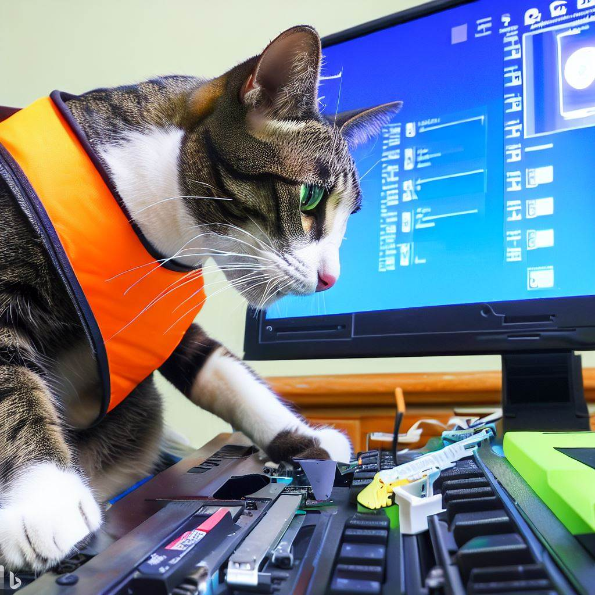

Criado em Junho de 2023 por *Maxwell Anderson*

    <figure style="text-align:center">
        
        <figcaption>Gato realizando a configuração do setup.</figcaption>
        <small>Prompt: crie uma imagem de um gato técnico em manutenção de computadores que está realizando a configuração do setup de BIOS, olhando para a tela de um computador.</small>
         
        <small>Fonte: gerado por IA com Bing por Maxwell Anderson (2023)</small>
    </figure>

## Conteúdo

- [Introdução](#introdução)
  - [Troca de bateria da CMOS](#troca-de-bateria-da-cmos)
  - [Atualização de firmware](#atualização-de-firmware)

# Introdução

Manutenções preventivas devem ser realizadas periodicamente. No caso do BIOS, é recomendado que seja realizada uma atualização de firmware, caso esteja disponível, e que seja realizada a troca da bateria do CMOS da placa-mãe.

## Troca de bateria da CMOS

<figure style="text-align:center">
    
    <figcaption>
        Bateria do CMPS da placa-mãe Pico ITX.
    </figcaption>
    <small>
        Por <a href="//commons.wikimedia.org/w/index.php?title=User:Dayj&amp;amp;action=edit&amp;amp;redlink=1" class="new" title="User:Dayj (page does not exist)">Dayj</a> - obra do próprio, domínio público, <a href="https://commons.wikimedia.org/w/index.php?curid=3237734">link</a>
    </small>
</figure>

A bateria que alimenta a CMOS do PC é responsável por manter as configurações do Setup, mesmo quando o computador está desligado, e deve ser trocada assim que o computador apresentar problemas de inicialização, como por exemplo, a data e hora estarem desconfiguradas.

<figure style="text-align:center">
  
  <figcaption>Bateria CR203 de lítio</figcaption>
  <small>Por Krzysztof Woźnica - <a href="//commons.wikimedia.org/w/index.php?title=User:Kylodee&amp;amp;action=edit&amp;amp;redlink=1" class="new" title="User:Kylodee (page does not exist)">KyloDee</a>, domínio público, <a href="https://commons.wikimedia.org/w/index.php?curid=242928">link</a></small>
</figure>

A bateria geralmente utilizada é a CR2032 de lítio, que pode ser encontrada em lojas de eletrônicos e informática. Tem uma vida útil de aproximadamente 3 anos. Quando a bateria está fraca, a configuração do setup é perdida e o computador volta para a configuração padrão de fábrica.

> ℹ️ **Dica**
>
> A carga de uma bateria de lítio CR2032 pode ser medida com um multímetro. A tensão de uma bateria nova é de 3,3V. Caso a tensão seja menor que 2,8V, a bateria deve ser trocada.

Algumas baterias são soldadas à placas-mãe. Nesse caso, é necessário utilizar um ferro de solda para realizar a troca da bateria. Caso não tenha experiência com solda, é recomendado que a troca seja realizada por um especialista.

## Atualização de firmware

A atualização de firmware do BIOS é realizada através de um programa fornecido pelo fabricante da placa-mãe. Esse programa pode ser executado através do sistema operacional ou através de um pendrive *bootável*. A atualização de firmware deve ser realizada com cuidado, pois caso ocorra algum problema durante o processo, o computador pode ficar inutilizável.
