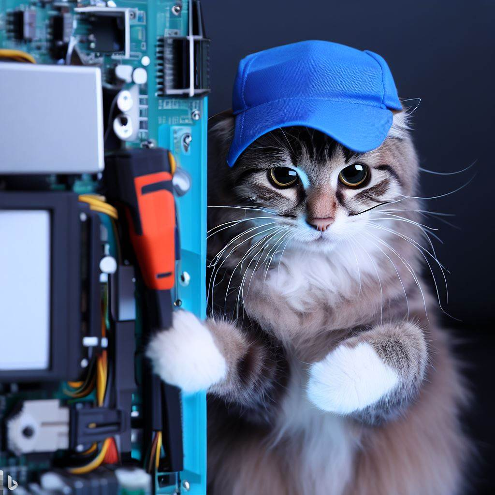

Criado em Março de 2023 por *Maxwell Anderson*

**Seja bem-vindo ao curso de Manutenção e Montagem de Computadores.**

<figure style="text-align:center">
    
    <figcaption>Gato técnico em manutenção de computadores </figcaption>
    <small>Fonte: gerado por IA com Bing por Maxwell Anderson (2023)</small>
</figure>

> Se o gato consegue, você conseguirá.

O curso de Manutenção e Montagem de Computadores tem como objetivo apresentar os conceitos básicos de montagem e manutenção de computadores, bem como a instalação de sistemas operacionais e aplicativos.

O curso é direcionado ao público em geral, partindo dos iniciantes de nível médio ao superior, mas pode ser utilizado por qualquer pessoa que tenha interesse em aprender sobre o assunto.

Maxwell Anderson Ielpo do Amaral

# Conteúdo

* [Introdução](/lessons/hardware/intro/intro/)
* [Fontes de alimentação](/lessons/hardware/psu/psu/)
* [Montagem e desmontagem de computadores](/lessons/hardware/repair/disassembly)
* [BIOS-Setup](/lessons/hardware/setup/setup/)