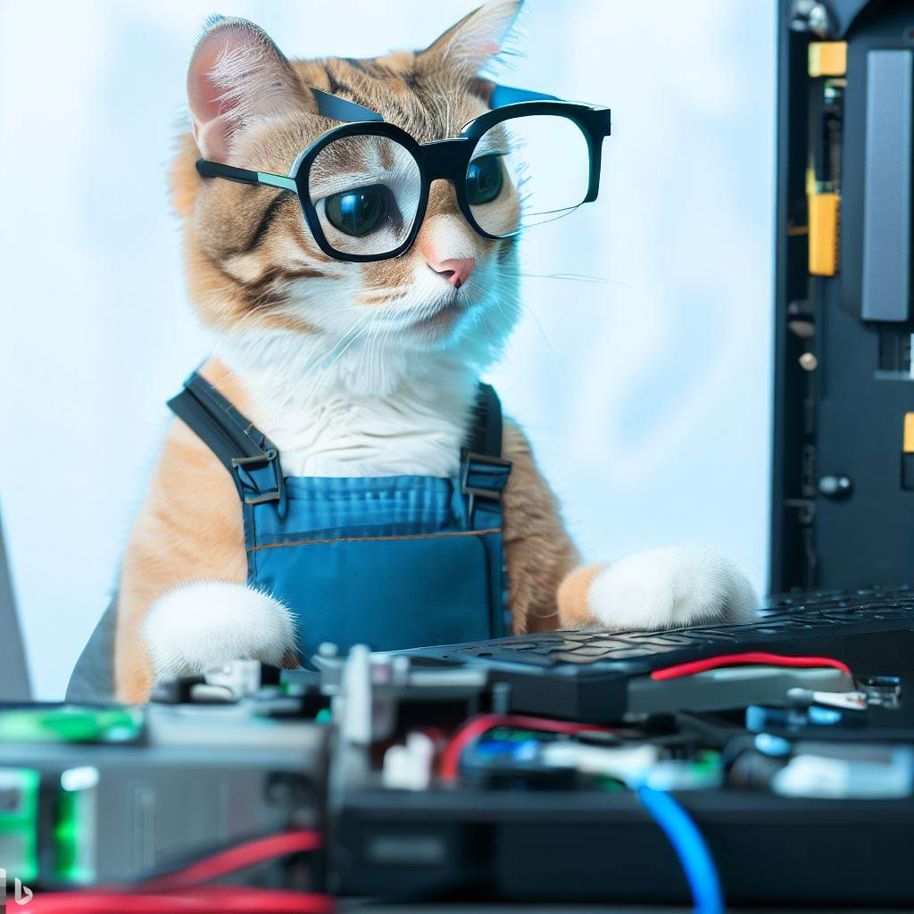

Criado em Junho de 2023 por *Maxwell Anderson*

    <figure style="text-align:center">
        
        <figcaption>Gato realizando a configuração do setup.</figcaption>
        <small>Prompt: crie uma imagem de um gato técnico em manutenção de computadores que está realizando a configuração do setup de BIOS, olhando para a tela de um computador.</small>
         
        <small>Fonte: gerado por IA com Bing por Maxwell Anderson (2023)</small>
    </figure>

## Conteúdo

- [Introdução](#introdução)
- [Problemas comuns](#problemas-comuns)
- [Solução de problemas](#solução-de-problemas)
  - [O computador não liga](#o-computador-não-liga)
  - [O computador liga, mas por pouco tempo](#o-computador-liga-mas-por-pouco-tempo)
  - [O computador liga, mas é muito lento](#o-computador-liga-mas-é-muito-lento)

# Introdução

A manutenção corretiva de fontes de alimentação

# Problemas comuns

Os problemas mais comuns que podem ocorrer com a alimentação são:

- O computador não liga;
- O computador liga, mas por pouco tempo;
- O computador liga, mas é muito lento.

# Solução de problemas

## O computador não liga

Quando o computador não liga, deve-se seguir os passos:

1. O primeiro passo é verificar se o cabo de alimentação está conectado corretamente.
2. Caso o computador esteja ligado a um filtro de linha, estabilizador ou nobreak, verifique se o cabo de alimentação está conectado corretamente.
3. Verifique se o cabo de alimentação está conectado corretamente à fonte de alimentação do computador.
4. Verifique se a fonte de alimentação está ligada na posição 110V ou 220V, de acordo com a tensão da rede elétrica.
5. Verifique se o cabo de alimentação está conectado corretamente à tomada.
6. Verifique se a tomada está funcionando corretamente.
7. Verifique se o fusível da fonte de alimentação está queimado.

## O computador liga, mas por pouco tempo

Quando o computador liga, mas por pouco tempo, deve-se seguir os passos:

1. Verifique se o cabo de alimentação está conectado corretamente à fonte de alimentação do computador e se existe alguma folga no cabo.
2. Verifique se a fonte de alimentação está ligada na posição 110V ou 220V, de acordo com a tensão da rede elétrica.
3. Verifique se a fonte de alimentação pode ser acionada corretamente pela placa-mãe. Pode-se fazer um teste da fonte em uma bancada, realizando o jampeamento entre os pinos verde e preto do conector ATX. Se a fonte não ligar, ela deve ser substituída. Caso contrário, se ligar e funcionar pelo tempo correto, o problema pode estar na placa-mãe.

## O computador liga, mas é muito lento

Quando o computador liga, mas é muito lento, deve-se seguir os passos:

1. Verifique se a potência da fonte de alimentação é a indicada para a placa-mãe. Alguns modelos de placa-mãe exigem fontes de alimentação com alta potência e, para evitar maiores danos, ativam o modo de segurança, reduzindo o desempenho do computador.