Criado em Junho de 2023 por *Maxwell Anderson*

<figure style="text-align:center">
    
    <figcaption>Gato realizando a configuração do setup.</figcaption>
    <small>Prompt: crie uma imagem de um gato técnico em manutenção de computadores que está realizando a configuração do setup de BIOS, olhando para a tela de um computador.</small>
     
    <small>Fonte: gerado por IA com Bing por Maxwell Anderson (2023)</small>
</figure>

Segue o conteúdo desta aula:

- [Introdução](#introdução)
- [Configuração](#configuração)
  - [Navegação](#navegação)
  - [Menus de configuração](#menus-de-configuração)
    - [Como praticar?](#como-praticar)
    - [Main ou Standard CMOS Setup](#main-ou-standard-cmos-setup)
    - [Advanced Setup](#advanced-setup)
    - [Chipset](#chipset)
    - [Security](#security)
    - [Boot menu](#boot-menu)
    - [Save \& Exit](#save--exit)

# Introdução

Para que o Setup seja acessado, geralmente é pressionada a tecla **[DEL]** ou **[F2]** durante a inicialização do computador. A tecla a ser pressionada pode variar de acordo com o fabricante da placa-mãe. Caso não seja possível acessar o Setup, é necessário realizar a manutenção corretiva.

Em alguns micros, como os da marca Compaq, HP, DELL, Acer ou IBM, por exemplo, o Setup é acessado pressionando a tecla **[F1]** ou **[F10]** durante a inicialização do computador. Geralmente a tecla correta a ser pressionada é exibida durante o POST.

<figure style="text-align:center">
    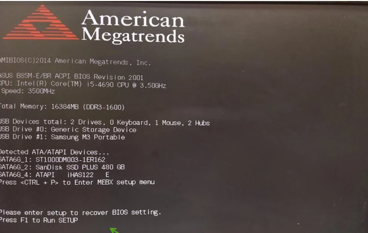
    <figcaption>Tela de POST da AMI - Exemplo 1.</figcaption>
</figure>

<figure style="text-align:center">
    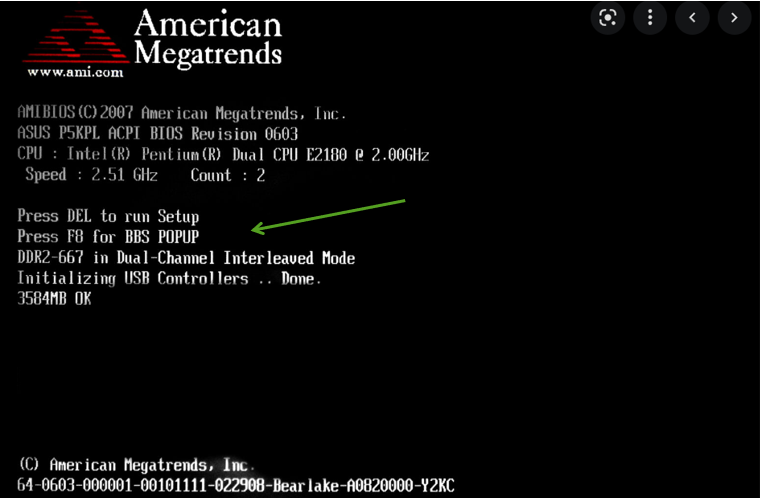
    <figcaption>Tela de POST da AMI - Exemplo 2.</figcaption>
</figure>

# Configuração

A configuração do Setup é realizada através de uma interface de texto, que pode variar de acordo com o fabricante da placa-mãe. A interface mais comum é a AMI (American Megatrends Inc.).

As opções presentes nos menus de configuração da BIOS variam de acordo com o fabricante da placa-mãe e o modelo do processador, embora compartilhem essencialmente um formato similar. Empresas especializadas no desenvolvimento de programas para o Setup da BIOS são as seguintes:

- AMI: <http://www.ami.com/>  
- Phoenix (comprou a Award em 1998): <http://www.phoenix.com/>

## Navegação

O Setup é dividido em abas, que podem variar de acordo com o fabricante da placa-mãe.

Para navegar entre as abas e opções do Setup, são utilizadas as teclas de direção do teclado. Para alterar o valor de uma opção, é necessário pressionar a tecla **[Enter]**. As teclas **[PageUp]** e **[PageDown]** geralmente podem ser utilizadas para alterar o valor de uma opção, dependendo do fabricante da placa-mãe.

As abas mais comuns são:

- **Main**: exibe informações sobre o processador, memória e data e hora;
- **Advanced**: permite configurar a ordem de inicialização dos dispositivos de armazenamento, gerenciamento de energia, da memória, da CPU e de outros dispositivos;
- **Boot**: permite configurar a ordem de inicialização dos dispositivos de armazenamento;
- **Security**: permite configurar a senha de acesso ao Setup e a inicialização do computador;

É imprescindível ressaltar que as modificações realizadas no Setup não são automaticamente registradas na memória de configuração (CMOS), portanto é necessário efetuar o salvamento das alterações antes de sair do setup, por meio de uma das opções disponíveis para tal finalidade.

Para sair do Setup, é necessário selecionar a opção **Exit** e depois selecionar a opção **Exit Saving Changes** ou **Exit Discarding Changes**. Algumas outras opções podem ser encontradas. Veja abaixo a descrição de algumas delas:

- **Exit**: permite salvar as configurações realizadas e sair do Setup.
- **Save & Exit**: permite salvar as configurações realizadas e sair do Setup.
- **Exit Saving Changes**: permite salvar as configurações realizadas e sair do Setup.
- **Exit Discarding Changes**: permite descartar as configurações realizadas e sair do Setup.
  
Também existem as opções em algumas placas-mãe:

- **Exit Without Saving**: permite sair do Setup sem salvar as configurações realizadas.
- **Load Setup Defaults**: permite carregar as configurações padrão do Setup.
- **Discard Changes**: permite descartar as configurações realizadas.
- **Save Changes**: permite salvar as configurações realizadas.

Seguem alguns exemplos de telas de configuração do Setup:

- Exemplo 1:
    <figure style="text-align:center">
        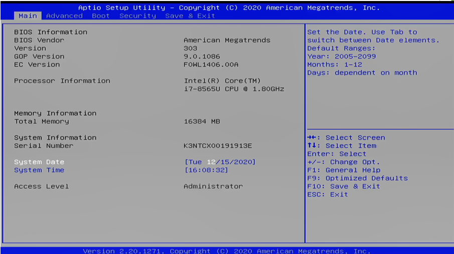
        <figcaption>Tela de Setup da AMI - Exemplo 1.</figcaption>
    </figure>
- Exemplo 2:
    <figure style="text-align:center">
        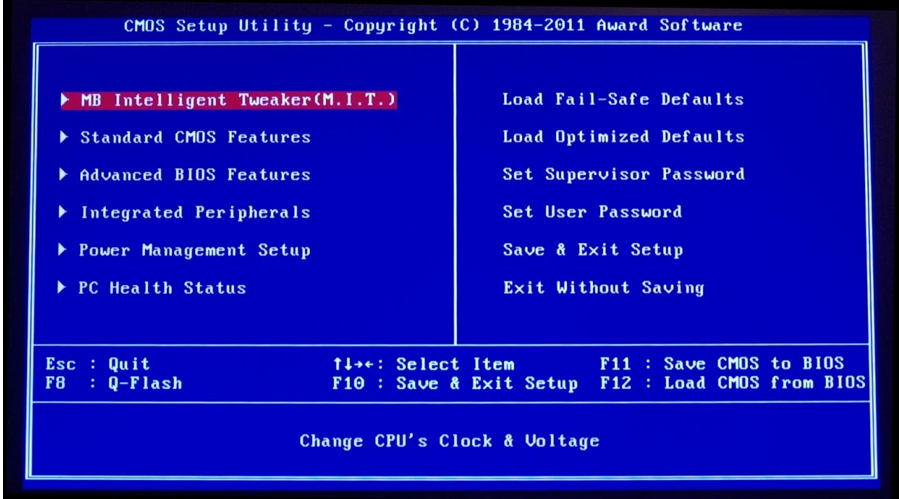
        <figcaption>Tela de Setup da AMI - Exemplo 2.</figcaption>
    </figure>
- Exemplo 3:
    <figure style="text-align:center">
        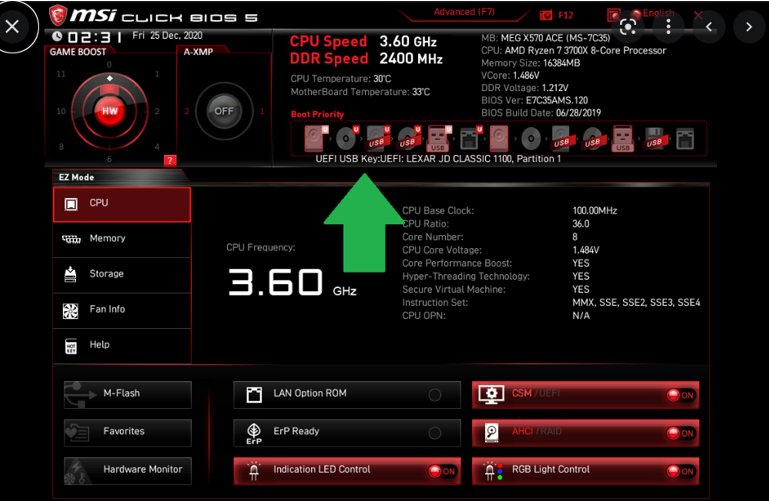
        <figcaption>Tela de Setup da AMI - Exemplo 3.</figcaption>
    </figure>
- Exemplo 4:
    <figure style="text-align:center">
        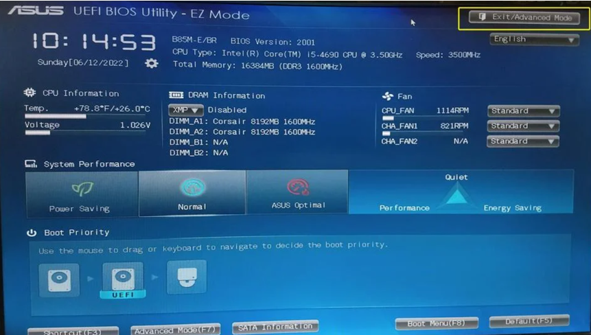
        <figcaption>Tela de Setup da AMI - Exemplo 4.</figcaption>
    </figure>

Alguns fabricantes de placas-mãe possuem um software que permite configurar o Setup através do sistema operacional. Por exemplo, a Asus possui o software [AI Suite](https://www.asus.com/pt/support/FAQ/1012780/) e a Gigabyte possui o software [App Center](https://www.gigabyte.com/FileUpload/us/Microsite/369/images/app-center.html). Estes softwares permitem configurar o Setup sem precisar reiniciar o computador.

## Menus de configuração

Os menus de configuração do Setup podem variar de acordo com o fabricante da placa-mãe. Seguem alguns exemplos de menus de configuração:

Considerando o fabricante da BIOS-Setup e a idade do sistema, é possível encontrar variações nas denominações das opções de configuração, ou mesmo a presença em alguns modelos e a ausência em outros.

O manual da placa-mãe deve ser consultado para obter informações mais detalhadas sobre as opções de configuração disponíveis. Um exemplo de manual pode ser obtido em [https://download.gigabyte.com/FileList/Manual/...](https://download.gigabyte.com/FileList/Manual/server_manual_bios_e_purley_bmc_10.pdf?authuser=1)

A elaboração de um documento abrangendo todas as opções disponíveis na BIOS-Setup é uma tarefa bastante complexa, uma vez que a cada avanço tecnológico novas opções podem ser incorporadas ou removidas do menu de configuração do sistema. Nesse sentido, serão apresentadas a seguir as principais funções encontradas na BIOS-Setup, com o objetivo de fornecer ao usuário uma visão geral das opções de configuração disponíveis.

> ℹ️ **Nota**
>
> Ao se deparar com uma opção de configuração que não esteja descrita neste documento, o usuário deve consultar o manual da placa-mãe ou o site do fabricante da BIOS-Setup.
>
> Para acessar o manual da placa-mãe, é necessário identificar o modelo da placa-mãe, podendo ser encontrado durante a verificações de [informações no POST](#introdu%C3%A7%C3%A3o), na própria placa-mãe ou na caixa do computador. Caso não seja possível identifica-lo, é necessário utilizar um programa como o CPU-Z, que pode ser baixado no site <https://www.cpuid.com/softwares/cpu-z.html>.

Para uma melhor utilização das rotinas avançadas de configuração do Setup, é imprescindível ter conhecimento de algumas características da placa-mãe, as quais podem ser encontradas principalmente no manual. Essas características incluem:

1. Tempo de acesso da memória RAM;
2. Presença ou ausência de memória cache;
3. Presença ou ausência de dispositivos onboard;
4. Processador utilizado e suas principais especificações;
6. Configuração de barramentos.

Essas informações são fundamentais para uma configuração adequada do sistema por meio do Setup, garantindo um desempenho otimizado e uma compatibilidade correta dos componentes.

### Como praticar?

Para praticar, é necessário acessar o Setup da BIOS, contudo deve-se observar que qualquer configuração errada pode causar problemas no funcionamento do computador. Por isso, é recomendado que seja feito em um computador que não seja utilizado para atividades importantes.

Outra forma de praticar sem que seja necessário acessar o Setup da BIOS é através de simuladores. Exemplos de simuladores são:

<figure style="text-align:center">
    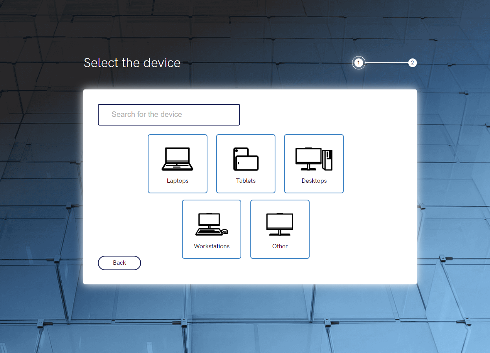
    <figcaption>Tela de seleção de dispositivo do Lenovo BIOS Simulator Center</figcaption>
</figure>

- **BIOS Setup Simulator**, em [https://appro.mit.jyu.fi/tools/biossimu/simu.html](https://appro.mit.jyu.fi/tools/biossimu/simu.html?authuser=1#)
- **Phoenix BIOS Simulator**, em [https://www.grs-software.de/sims/bios/phoenix](https://www.grs-software.de/sims/bios/phoenix/pages/?authuser=1)
- **Lenovo BIOS Simulator Center**, em [https://download.lenovo.com/bsco/index.html](https://download.lenovo.com/bsco/index.html?authuser=1#/)

### Main ou Standard CMOS Setup

O menu **Main** ou **Standard CMOS Setup** é o primeiro menu exibido ao acessar o Setup. Esse menu exibe informações sobre o memória, teclado, discos e data e hora.

<figure style="text-align:center">
    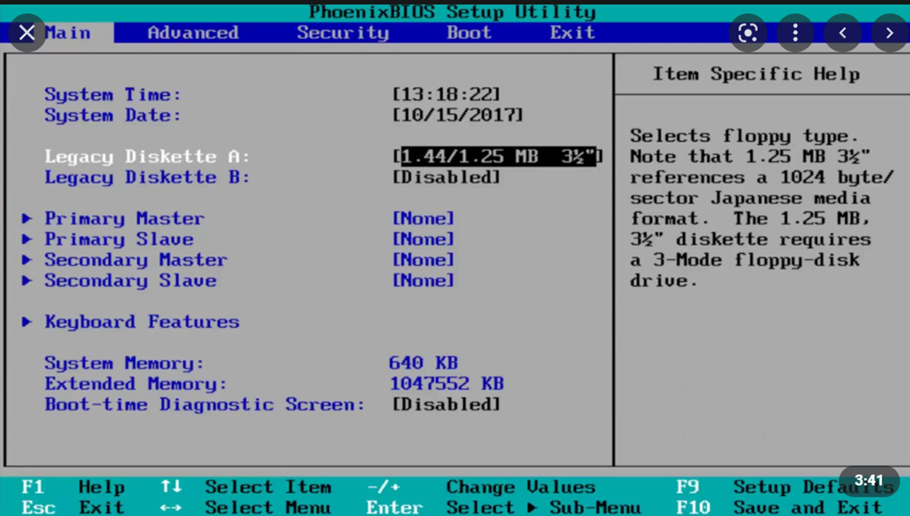
    <figcaption>Tela Main do Setup da PhoenixBIOS - Exemplo 1.</figcaption>
</figure>

<figure style="text-align:center">
    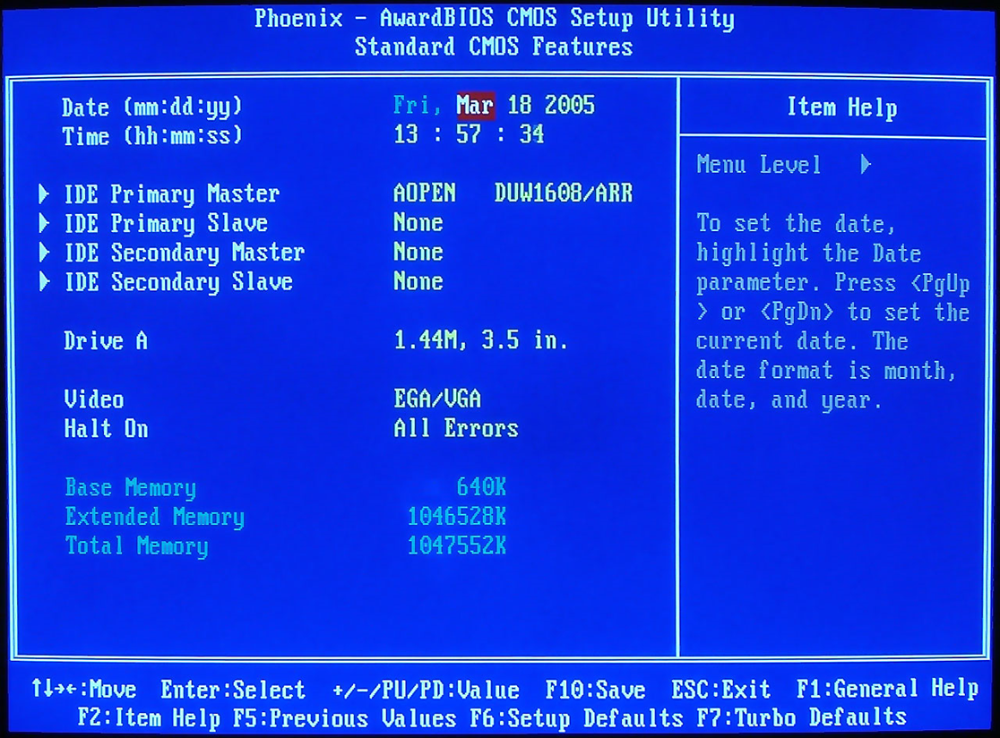
    <figcaption>Tela Standard CMOS Setup da AwardBIOS - Exemplo 2.</figcaption>
</figure>

A configuração básica se inicia através da opção padrão **Standard CMOS Setup** ou **Main**. Este menu permite a configuração de:

- **Date**: permite configurar a data.
- **Time**: permite configurar a hora.

    > ℹ️ **Nota**
    >
    > Estas opções abaixo estão, geralmente, presente em placas-mãe mais antigas.

- **Floppy Drive A**, **Legacy Diskette A:** ou **Drive A** : permite configurar o drive de disquete A.
- **Primary Master** ou **IDE HDD 0**: permite configurar o disco rígido primário.
- **Primary Slave** ou **IDE HDD 1**: permite configurar o disco rígido secundário.
- **Secondary Master** ou **IDE HDD 2**: permite configurar um terceiro disco rígido.
- **Secondary Slave** ou **IDE HDD 3**: permite configurar um quarto disco rígido.
  - **Auto Detect**: permite que o Setup detecte automaticamente o disco rígido. Esta deve ser a opção padrão.
- **Primary display**: permite configurar o dispositivo de vídeo primário (obsoleto)
  - **EGA/VGA**: permite configurar o dispositivo de vídeo primário como EGA/VGA.
  - **CGA 40**: permite configurar o dispositivo de vídeo primário como CGA 40.
  - **CGA 80**: permite configurar o dispositivo de vídeo primário como CGA 80.
  - **MONO**: permite configurar o dispositivo de vídeo primário como MONO.  
- **Halt on**: permite configurar o comportamento do computador em caso de erro.
- **Keyboard features**: permite configurar as teclas de função do teclado.

<figure style="text-align:center">
    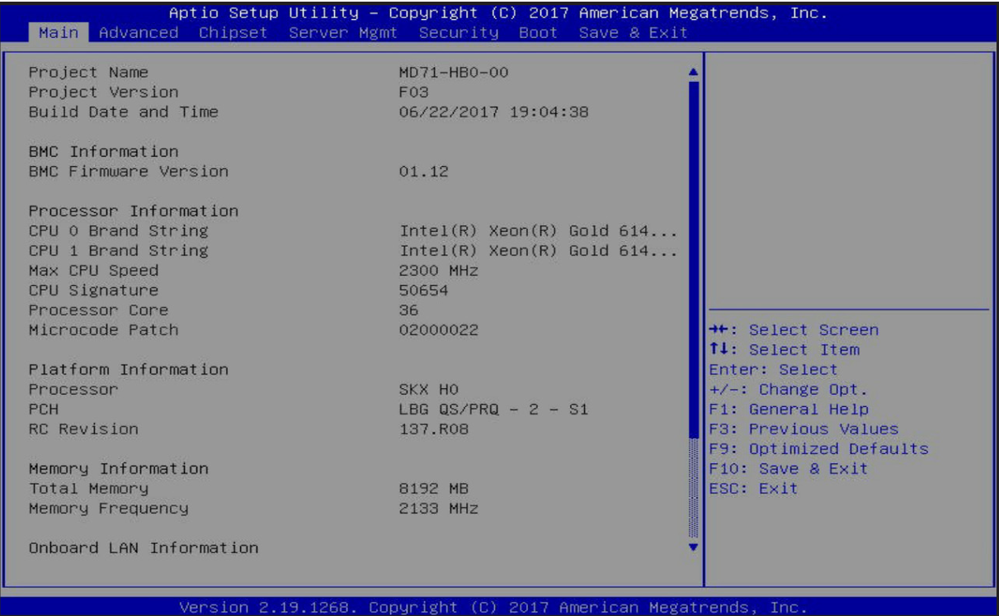
    <figcaption>Tela <i>Main</i> do Setup da AMI - Exemplo 3.</figcaption>
</figure>

> ℹ️ **Nota 2**
>
> Estas opções abaixo estão, geralmente, presente em placas-mãe mais atuais.

- **MAX CPU Speed**: permite verificar a velocidade máxima do processador.
- **CPU brand string**: permite verificar o modelo do processador.
- **Memory Information**: permite verificar a quantidade de memória RAM instalada.
- **Memory Frequency**: permite verificar a frequência da memória RAM.
- **Onboard LAN information**: permite verificar as informações das placas de rede onboard e seus respectivos endereços MAC (se disponível).

### Advanced Setup

O menu **Advanced Setup** permite configurar gerenciamento de energia, da memória, da CPU e de outros dispositivos.

<figure style="text-align:center">
    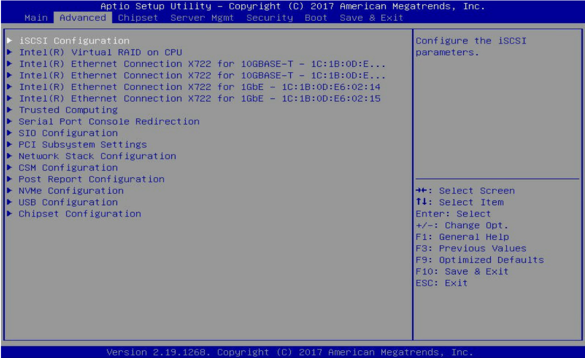
    <figcaption>Tela <i>Advanced</i> do Setup da AMI.</figcaption>
</figure>

Nesta tela, as principais funcionalidades que podemos encontrar são:

- **NIC Configuration**: permite configurar as placas de rede onboard, como por exemplo, funcionalidades relacionadas à velocidade a ser negociada em uma conexão e o WakeOnLan (WOL). O WOL permite que o computador seja ligado remotamente através de um pacote de rede bastando, para isto, que a placa de rede esteja conectada à rede elétrica e que um pacote de rede seja enviado para o endereço MAC da placa de rede através de um outro computador, dispositivo de rede ou dispositivo móvel. Neste último caso, aplicativos como o [Wake On Lan](https://play.google.com/store/apps/details?id=co.uk.mrwebb.wakeonlan&hl=pt_BR) podem ser utilizados para enviar o pacote de rede.
- **PCI Subsystem Settings** ou **PCI Configuration** : permite configurar o barramento PCI, habilitando-os ou desabilitando-os, dentre outras opções.
- **Network Stack**: permite configurar o protocolo TCP/IP para inicialização através da rede com suporte PXE. O PXE permite que um computador seja inicializado através da rede, sem a necessidade de um disco rígido, bastando para isto que o computador esteja conectado à rede e que um servidor PXE esteja configurado na rede. Neste caso, o computador irá inicializar através da rede e carregar o sistema operacional através do servidor PXE.

    > ℹ️ **Nota**
    >
    >  Muito utilizado por terminais "burros" ou <i>thin clients</i>. Muito utilizado por centrais de autoatendimento, como por exemplo, caixas eletrônicos.
    >
    > O usuário tem a impressão de que está utilizando um computador, mas na verdade está utilizando um terminal que está conectado à rede e que está sendo gerenciado por um servidor que está executando o sistema operacional. O terminal não possui disco rígido, apenas memória RAM e um processador. O sistema operacional é carregado através da rede e executado na memória RAM do terminal.
    >
    > Para isto, o terminal deve estar conectado à rede e ser gerenciado por sistemas operacionais servidores que possuem software de gerenciamento de terminais, como por exemplo, o [LTSP](https://ltsp.org/) ou o Windows Server com o [Terminal Services](https://docs.microsoft.com/en-us/windows-server/remote/remote-desktop-services/welcome-to-rds).

    <figure style="text-align:center">
        
        <figcaption>
            Um terminal "burro" ou <i>thin client</i>.
        </figcaption>
        <small>
            <a href="//commons.wikimedia.org/wiki/User:Raysonho" title="User:Raysonho">Raysonho @ Open Grid Scheduler / Grid Engine</a> - obra do próprio, domínio público, <a href="https://commons.wikimedia.org/w/index.php?curid=4329285">link</a>
        </small>
    </figure>

- **Post report configuration**: permite configurar o relatório de erros do POST.
- **NVME Configuration**: permite configurar dispositivos de armazenamento NVME.
- **USB Configuration**: permite configurar dispositivos USB, podendo habilitar ou desabilitar portas.

    > ℹ️ **Nota**
    >
    > Portas USB podem ser desabilitadas por demandas dos gestores ou de outros usuários. Por exemplo, existem empresas e instituições que desabilitam as portas USB que se evite o uso de pendrives ou outros dispositivos de armazenamento externo. Isto é feito para evitar que arquivos sejam copiados para fora ou mesmo que arquivos maliciosos sejam copiados para dentro da empresa ou instituição.

- **Chipset Configuration**: permite configurar o chipset da placa-mãe. Uma das opções pode permitir qual o estado do computador após uma queda de energia. Por exemplo, se o computador deve ligar automaticamente após uma queda de energia ou se deve permanecer desligado. Outra opção pode permitir que o computador seja ligado através de um dispositivo USB, como por exemplo, um teclado ou um mouse. Também existe a opção de emitir notificações sonoras em casa de abertura do gabinete.
- **ACPI Configuration**: permite configurar o gerenciamento de energia do computador. Por exemplo, se o computador deve desligar automaticamente após um determinado tempo de inatividade ou se deve entrar em modo de espera após um determinado tempo de inatividade.

    > ℹ️ **Nota**
    >
    > Muitas dessas funcionalidades são alteradas pelo próprio sistema operacional. No caso do Windows, basta acessar o Painel de Controle ou Configurações e acessar as opções de energia. No caso do Linux, basta acessar as configurações do sistema e acessar as opções de energia.

- **SATA Configuration**: permite configurar dispositivos de armazenamento SATA, como por exemplo, discos rígidos e SSDs.

### Chipset

O menu **Chipset** permite configurar o chipset da placa-mãe. O chipset é um conjunto de circuitos integrados que controla o fluxo de dados entre o processador, a memória RAM (ponte norte), os dispositivos de armazenamento e outros dispositivos (ponte sul). O chipset também controla a comunicação entre o processador e os dispositivos de entrada e saída, como por exemplo, teclado, mouse, monitor, impressora etc. (comunicação entre ponte norte e ponte sul).

> ℹ️ **Nota**
>
> Lembram da aula de barramentos?

<figure style="text-align:center">
    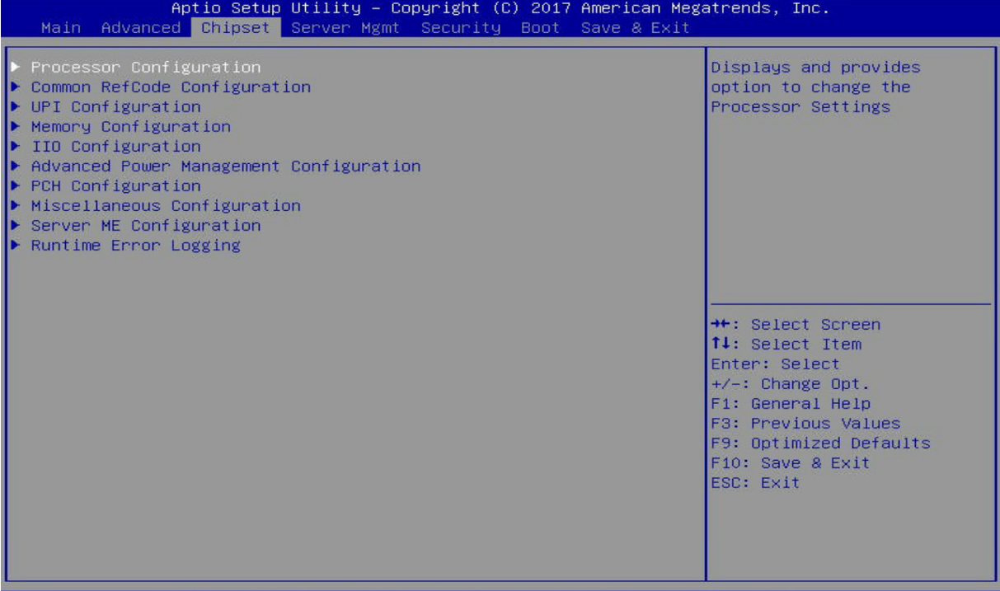
    <figcaption>Tela <i>Chipset</i> do Setup da AMI.</figcaption>
</figure>

Nesta tela, as principais funcionalidades que podemos encontrar são:

- **Processor configuration**: aqui é possível verificar informações mais detalhadas sobre o processador, como tamanho das memórias chche L1, L2 e L3, velocidade do barramento, tecnologia de virtualização, dentre outras informações. Também é possível habilitar ou desabilitar a tecnologia de virtualização, caso o processador suporte esta tecnologia.

    > ℹ️ **Nota**
    >
    > A tecnologia de virtualização permite que um computador execute mais de um sistema operacional ao mesmo tempo. Por exemplo, é possível executar o Windows e o Linux ao mesmo tempo, ou mesmo executar duas instâncias do Windows ao mesmo tempo. Para isto, é necessário que o processador suporte esta tecnologia e que ela esteja habilitada no Setup. Além disso, é necessário que o sistema operacional também suporte esta tecnologia. Por exemplo, o Windows 10 suporta esta tecnologia, mas o Windows 7 não suporta.

    <figure style="text-align:center">
        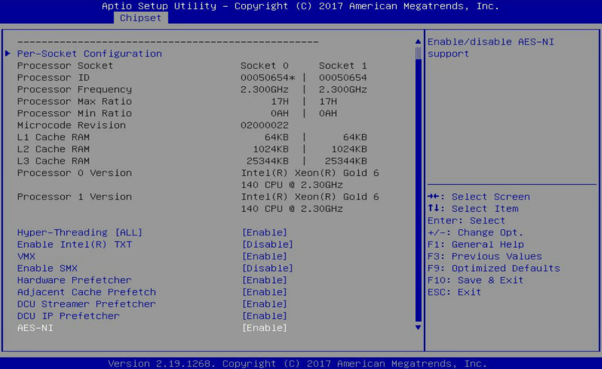
        <figcaption>Tela <i>Chipset - Processor configuration</i> do Setup da AMI.</figcaption>
    </figure>

  - **Hyper-Threading**: permite habilitar ou desabilitar o Hyper-Threading. O Hyper-Threading é uma tecnologia que permite que um processador físico execute duas tarefas ao mesmo tempo. Por exemplo, um processador com 4 núcleos e com Hyper-Threading habilitado, pode executar até 8 tarefas ao mesmo tempo. O Hyper-Threading é uma tecnologia da Intel e é chamada de Simultaneous Multithreading (SMT). A AMD possui uma tecnologia semelhante, chamada de Clustered Multithreading (CMT).

  - **VMX**: permite habilitar ou desabilitar a tecnologia de virtualização. Esta opção só aparece se o processador suportar esta tecnologia.

- **CPU P State Control**: permite configurar o gerenciamento de energia do processador. Por exemplo, se o processador deve operar em sua velocidade máxima ou se deve operar em uma velocidade menor para economizar energia.
  - **SpeedStep**: permite habilitar ou desabilitar o SpeedStep. O SpeedStep é uma tecnologia da Intel que permite que o processador opere em uma velocidade menor para economizar energia. A AMD possui uma tecnologia semelhante, chamada de Cool'n'Quiet.
  - **Turbo Mode**: permite habilitar ou desabilitar o Turbo Mode. O Turbo Mode é uma tecnologia da Intel que permite que o processador opere em uma velocidade maior quando necessário. A AMD possui uma tecnologia semelhante, chamada de Turbo Core.
- **PCH SATA Configuration**: permite configurar dispositivos de armazenamento SATA, como por exemplo, discos rígidos e SSDs.

    > ℹ️ **Nota**
    >
    > Existe uma opção interessante nesta configuração onde é possível habilitar o Hot Plug. Assim, é possível conectar e desconectar dispositivos SATA sem precisar desligar o computador. Por exemplo, é possível conectar e desconectar um HD externo sem precisar desligar o computador.

- **PCH sSATA Configuration**: o mesmo acima, mas para dispositivos SATA externos.
- **Miscellaneous Configuration**: permite outras configurações. Por exemplo, pode-se definir em **Active video** qual o dispositivo primário de vídeo a ser inicializado: *Onboard Device* para dispositivos de vídeo onboard ou integrados, *PCIE Device* para dispositivos de vídeo PCI Express, *PCI Device* para dispositivos de vídeo PCI ou *Auto* para que o Setup detecte automaticamente o dispositivo de vídeo primário.

### Security

O menu **Security** permite configurar a senha de acesso ao Setup e a inicialização do computador.

Existem dois tipos de senhas que podem ser configuradas: a senha de acesso ao Setup e a senha de inicialização do computador.

- A senha de acesso ao Setup é utilizada para impedir que pessoas não autorizadas acessem o Setup. Podem ser do tipo:
  - **Administrator Password**: inserir esta senha permitirá que o usuário acesse e altere todas as configurações no utilitário de configuração, bem como permitirá que o usuário altere as senhas de acesso ao Setup e de inicialização do computador.
  - **User Password**: inserir esta senha permitirá que o usuário acesse e altere apenas as configurações básicas no utilitário de configuração, como hora e data do sistema.
- A senha de inicialização do computador é utilizada para impedir que pessoas não autorizadas inicializem o computador.

<figure style="text-align:center">
    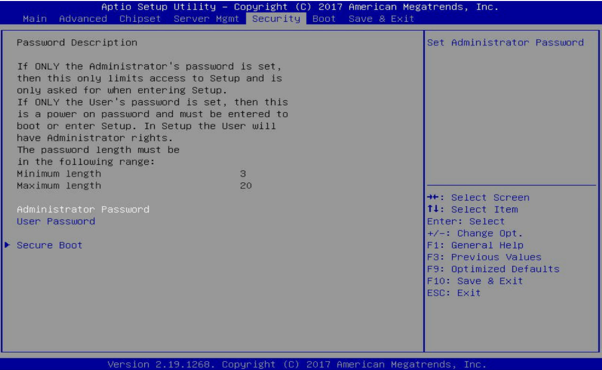
    <figcaption>Tela <i>Security</i> do Setup da AMI.</figcaption>
</figure>

- **Secure Boot**: permite habilitar ou desabilitar o Secure Boot.
  
    > ℹ️ **Nota**
    >
    > O Modo de Inicialização Segura exige que todas as aplicações em execução durante o processo de inicialização sejam pré-assinadas com certificados digitais válidos. Dessa forma, o sistema tem conhecimento de todos os arquivos que estão sendo carregados antes do carregamento do Windows e chega à tela de login sem terem sido adulterados. Ao definir para Padrão, serão carregadas automaticamente as chaves de Inicialização Segura do banco de dados da BIOS. Ao definir para Personalizado, é possível personalizar as configurações de Inicialização Segura e carregar manualmente as chaves a partir do banco de dados da BIOS.
    >
    > Por exemplo, o Windows 10 possui uma assinatura digital e pode ser inicializado com o Secure Boot habilitado, ao contrário do Windows 7.
    >
    > O Linux possui uma assinatura digital e pode ser inicializado com o Secure Boot habilitado.
    >
    > O Secure Boot é uma tecnologia da Microsoft e é chamada de UEFI Secure Boot. A AMD possui uma tecnologia semelhante, chamada de AMD Secure Technology.

### Boot menu

O menu **Boot** permite configurar a ordem de inicialização dos dispositivos de armazenamento.

<figure style="text-align:center">
    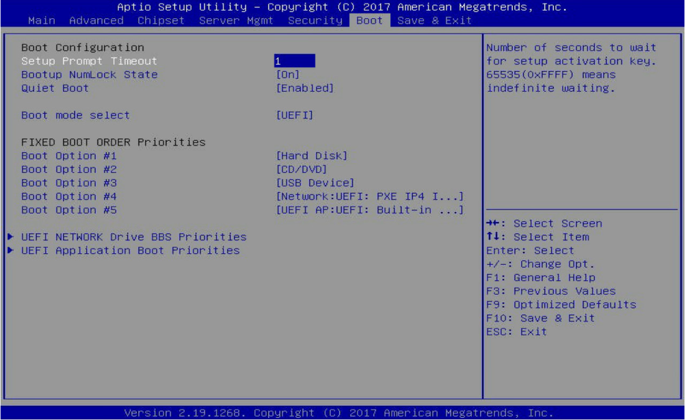
    <figcaption>Tela <i>Boot</i> do Setup da AMI.</figcaption>
</figure>

Nesta tela, as principais funcionalidades que podemos encontrar são:

- **Quiet boot**: permite habilitar ou desabilitar a exibição do logotipo do fabricante da placa-mãe durante a inicialização do computador.
- **Bootup NumLock State** ou **NumLock**: permite habilitar ou desabilitar o NumLock durante a inicialização do computador.
- **Boot mode select**: permite selecionar o modo de inicialização do computador. Por exemplo, se o computador deve inicializar através do modo UEFI ou do modo Legacy.
  
    > ℹ️ **Nota**
    >
    > UEFI é uma tecnologia que permite que o computador inicialize através de um sistema operacional que esteja instalado em um disco rígido com o sistema de arquivos GPT. O modo de inicialização via UEFI é mais recente e possui mais recursos que o modo Legacy. Por exemplo, o modo de multiboot em UEFI é mais simples que o modo Legacy, possibilitando sua configuração através do próprio Setup ou softwares de terceiros, como por exemplo, o **EasyBCD** em <https://neosmart.net/EasyBCD/>.

    <figure style="text-align:center">
        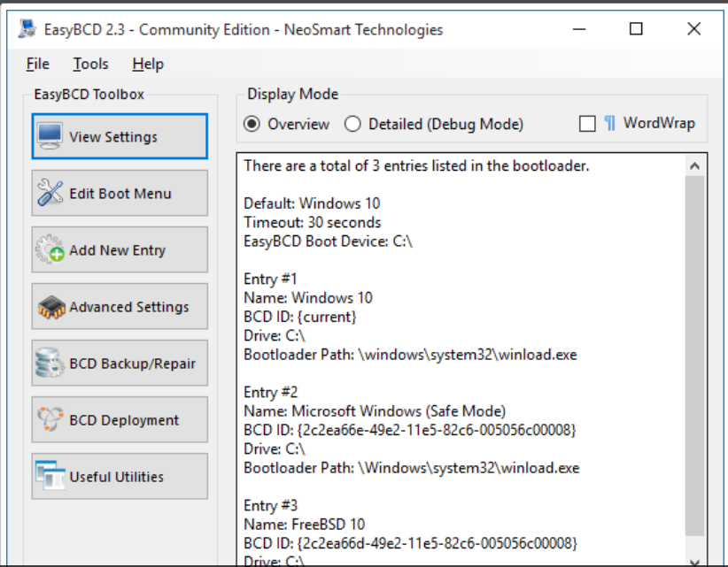
        <figcaption>Tela do EasyBCD.</figcaption>
    </figure>

- **Boot Option Priorities**: permite configurar a ordem de inicialização dos dispositivos de armazenamento. Por exemplo, se o computador deve inicializar através do disco rígido ou através de um dispositivo USB. Perceba que o disco rígido pode ser chamado de *Hard Drive*, *Hard Disk* ou *HDD* e o dispositivo USB é chamado de *Removable Device* ou *USB Device*.

    > ℹ️ **Nota**
    >
    > No exemplo da imagem acima, se não for encontrado o arquivo de boot no disco rígido, o computador irá inicializar através de um dispositivo CD/DVD. Se não for encontrado o arquivo de boot no dispositivo CD/DVD, o computador irá inicializar através do dispositivo USB.
    >
    > Outra coisa que pode-se observar é que existe a opção de inicialização através da rede/LAN na opção *Network: UEFI: PXE IP4*
    >
    > ❗ **Atenção**
    >
    > Ao configurar um novo computador sem sistema operacional no sistema de armazenamento primário (HD, SSD, etc.), é necessário que o dispositivo de inicialização esteja configurado para o dispositivo de instalação do sistema operacional. Por exemplo, se o sistema operacional for instalado através de um dispositivo USB, o dispositivo de inicialização deve estar configurado para o dispositivo USB. Se o sistema operacional for instalado através de um dispositivo CD/DVD, o dispositivo de inicialização deve estar configurado para o dispositivo CD/DVD.

### Save & Exit

O menu **Save & Exit** permite salvar as configurações realizadas e sair do Setup.

<figure style="text-align:center">
    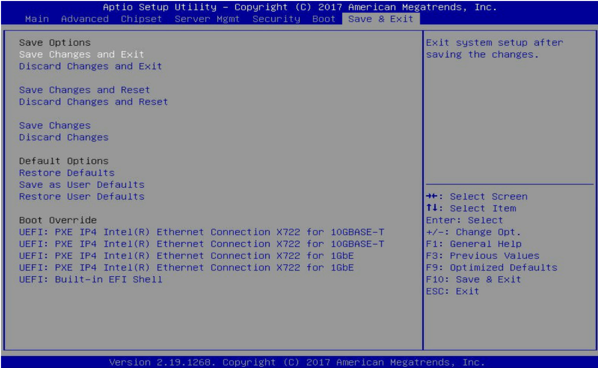
    <figcaption>Tela <i>Save & Exit</i> do Setup da AMI.</figcaption>
</figure>

Nesta tela, as principais funcionalidades que podemos encontrar são:

- **Save Changes and Exit**: permite salvar as configurações realizadas e sai do Setup.
- **Discard Changes and Exit**: permite descartar as configurações realizadas e sai do Setup.
- **Save Changes and Reset**: permite salvar as configurações realizadas e reiniciar o computador.
- **Discard Changes and Reset**: permite descartar as configurações realizadas e reiniciar o computador.
- **Save changes**: permite salvar as configurações realizadas e sem sair do Setup.
- **Discard changes**: permite descartar as configurações realizadas e sem sair do Setup.
- **Restore Defaults**: permite restaurar as configurações padrão do Setup.