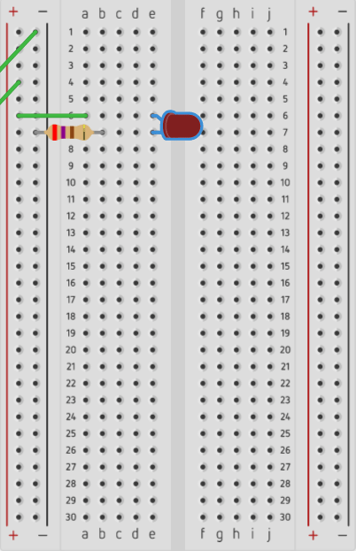
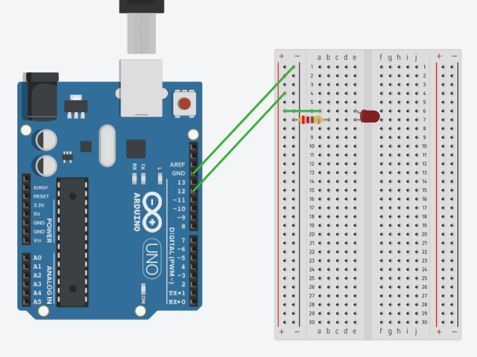
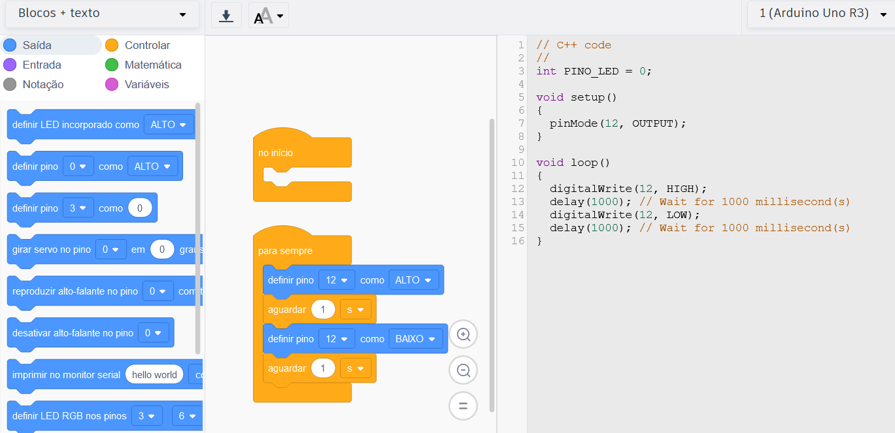

<center>
    <figure>
        
        <figcaption>
            Gato estudando IOT
            <small>
                <br>
                Fonte: gerado por IA com Bing por Maxwell Anderson (2023)</small>
                <br>
                <small><em>Prompt: crie uma imagem de um gato usando gravata e que está aprendendo a usar um Arduíno. Faça o gato utilizar uma chave de fenda no Arduino. Faça com que ele use óculos.</em>
            </small>
        </figcaption>
    </figure>
</center>

- [Introdução](#introdução)
- [Implementação](#implementação)
  - [Simulador Tinkercad](#simulador-tinkercad)

# Introdução

Nosso primeiro projeto irá tem como objetivo acender um LED e fazê-lo piscar a cada 1s. Para isso, iremos utilizar o Arduino Uno, um LED e um resistor de 270 Ohms e 1/4W.

<center>
    <figure>
        
        <figcaption>
            Placa de ensaio com LED e resistor
            <small>
                <br>
                Fonte: próprio autor (2023)
            </small>
        </figcaption>
    </figure>
</center>

Para isso, iremos utilizar a seguinte lista de materiais:

|  ID   | Descrição                     | Quantidade |
| :---: | :---------------------------- | :--------: |
|   1   | Arduino Uno                   |     1      |
|  D1   | LED Vermelho                  |     1      |
|  R1   | Resistor 270 Ohms 1/4W        |     1      |
|  B1   | Protoboard ou placa de ensaio |     1      |

# Implementação

Vamos começar montando o circuito e depois iremos programar o Arduino para acender o LED.

## Simulador Tinkercad

Para a implementação do projeto, iremos utilizar o simulador Tinkercad. Para isso, crie um novo projeto e adicione os componentes conforme a imagem abaixo:

<center>
    <figure>
        
        <figcaption>
            Projeto 01 - LED
            <small>
                <br>
                Fonte: próprio autor (2023)
            </small>
        </figcaption>
    </figure>
</center>

Um LED possui um cátodo e um ânodo. O cátodo é o pino mais curto e o ânodo é o pino mais longo. O cátodo deve ser conectado ao GND e o ânodo ao pino digital 12 do Arduino. O resistor deve ser conectado ao cátodo do LED e o ânodo ao pino digital 12 do Arduino.

Lembre-se: 

|  Pino  | Descrição       | Observação |
| :----: | :-------------- | :--------: |
| cátodo | pino mais curto |  ➖ (GND)   |
| ânodo  | pino mais longo |   ➕ (5V)   |

Agora, vamos programar o Arduíno para acender o LED. Para isso, clique no botão `Código`. Você poderá escolher entre as opções `Bloco`, `Texto` ou `Bloco + texto`. Para este projeto, iremos utilizar a opção `Bloco + texto`.

Insira os blocos conforme ilustrado abaixo:

<center>
    <figure>
        
        <figcaption>
            Código do Projeto 01 - LED
            <small>
                <br>
                Fonte: próprio autor (2023)
            </small>
        </figcaption>
    </figure> 
</center>

Veja que o código deve ter ficado como o abaixo:

```c++
    // C++ code
    //

    void setup()
    {
        pinMode(12, OUTPUT);
    }

    void loop()
    {
        digitalWrite(12, HIGH);
        delay(1000);    // Wait for 1000 millisecond(s)
        digitalWrite(12, LOW);
        delay(1000);    // Wait for 1000 millisecond(s)
    }
```

Agora, clique no botão `▶️ Iniciar simulação` e veja o resultado. O LED deve piscar a cada 1s.

<center>
    <figure>
        
        <figcaption>
            Placa de ensaio com LED e resistor
            <small>
                <br>
                Fonte: próprio autor (2023)
            </small>
        </figcaption>
    </figure>
</center>

Parabéns, agora você já sabe como acender um LED utilizando o Arduino Uno.
