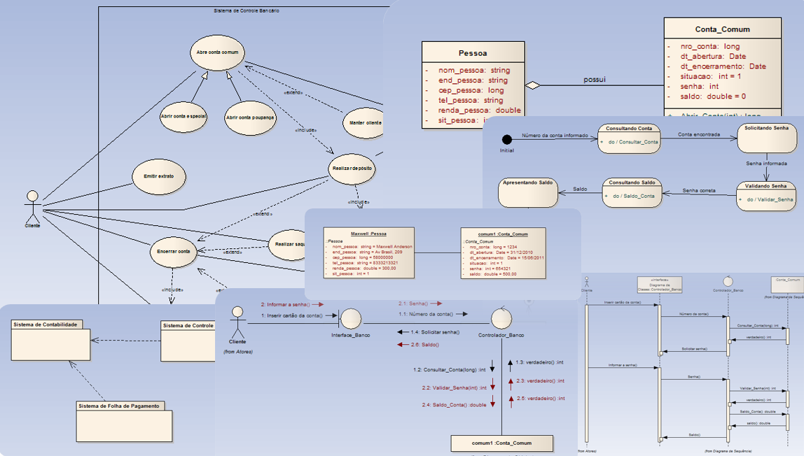
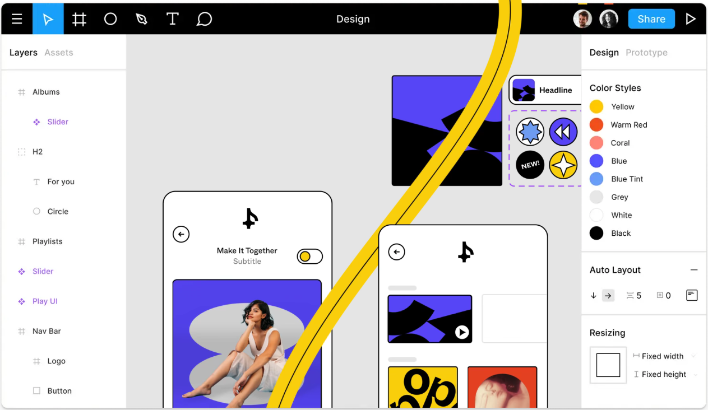
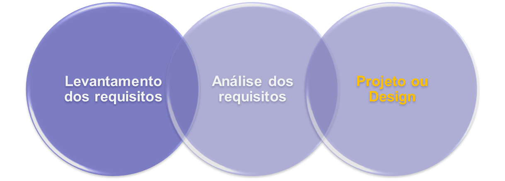

<!--SLIDE-->

    <figure>
        
        <figcaption>
            <small>
            Gato engenheiro de software que está criando um projeto de software em UML. 
            <em>Prompt: crie uma imagem de um gato engenheiro de software usando óculos criando um projeto de software em UML. O gato deve estar usando roupas formais.</em>
            </small>
        </figcaption>
        <small>Fonte: gerado por IA com Bing por Maxwell Anderson (2023)</small>
    </figure>

<!--vSLIDE-->

O projeto de sistemas de software engloba a criação de um modelo de software que descreve a estrutura e o comportamento do sistema. 

Nas próximas aulas iremos aprender a criar um projeto de software usando a UML. Mas antes, vamos entender o que é um projeto de software e por que ele é importante.

<!--SLIDE-->

## O que é um projeto de software?

Um projeto de software é um modelo que descreve a estrutura e o comportamento do sistema. Ele pode ser criado usando uma linguagem de modelagem de software, como a UML.

O projeto de software é importante porque ele permite que os desenvolvedores de software entendam como o sistema funciona e como ele deve ser implementado e testado.

<!--vSLIDE-->

Todavia, alguns modelos também podem e devem ser analisados e confirmados pelos clientes e usuários do sistema. Isso permite que eles entendam como o sistema funcionará e como ele atenderá às suas necessidades. Isto é crucial.

<!--SLIDE-->

## Como um software pode ser modelado?

A UML é uma linguagem de modelagem de software que permite que os engenheiros representem o sistema de várias formas, sob várias perspectivas. Ela é composta por vários diagramas que podem ser usados para modelar diferentes aspectos do sistema.

<!--vSLIDE-->

    <figure>
        
        <figcaption>
            Diagramas UML
        </figcaption>
        <small>Fonte: elaboração própria (2010)</small>
    </figure>

<!--vSLIDE-->

Uma outra forma de modelar um software é utilizando protótipos visuais, de baixa ou alta fidelidade. Eles podem ser criados usando ferramentas de prototipação, como o [Figma](https://www.figma.com/), ou até mesmo usando ferramentas de edição de imagens, como o [GIMP](https://www.gimp.org/).

<!--vSLIDE-->

    <figure>
        
        <figcaption>
            Tela de desenho do Figma
        </figcaption>
        <small>Fonte: <a href="https://www.figma.com/">https://www.figma.com/</a>, em jun/2023</small>
    </figure>

<!--SLIDE-->

## Quando um software deve ser modelado?

O projeto de software deve ser criado antes da implementação do sistema. Ele deve ser criado durante a fase de projeto do processo de desenvolvimento de software. E por mais que se utilize processos baseados unicamente em metodologias ágeis, um mínimo de projeto sempre é realizado, de acordo com as necessidades do projeto.

<!--vSLIDE-->

    <figure class="align-center">
        
        <figcaption><small>Criado pelo próprio autor (2009)</small></figcaption>
    </figure>

<!--SLIDE-->

### É sempre necessário criar um projeto de software?

Depende. Se o sistema for pequeno e simples, talvez não seja necessário criar um projeto detalhado de software. Todavia, se o sistema for grande e complexo, é recomendável criar um projeto com especificações detalhadas.

Sempre use quando você perceber que existe necessidade e que ele pode ajudar a entender o sistema e a implementá-lo.

<!--vSLIDE-->

Um exemplo de uso necessário de especificações detalhadas em um projeto de software é quando o sistema é composto por componentes da engenharia mecânica, elétrica ou eletrônica. As normas sempre enfatizam a especificação detalhada de sistemas que envolvem componentes dessas outras engenharias. As principais motivações envolvem a segurança, a confiabilidade e a manutenibilidade, bem como também aspectos legais que possam evitar acarretar problemas para a empresa e para os usuários! Outrossim, o simples motivo de exigência em contrato sobre detalhes de implementação podem ser solicitados pelo cliente.

<!--vSLIDE-->

Já ouvi um engenheiro mecânico afirmar que nem em sonho um sistema de missão crítica poderá ser implementado sem especificação técnica detalhada. Ele estava certo.

---
Criado em Junho de 2023 por *Maxwell Anderson*