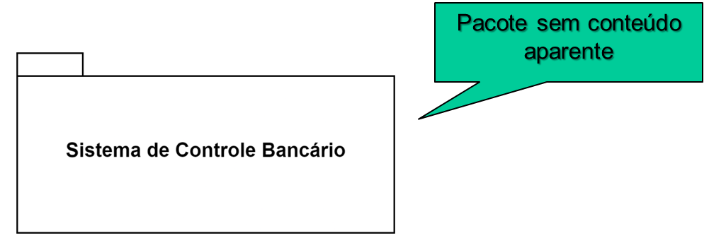

<center>
    <figure>
        
        <figcaption>
            Gato engenheiro de software que está criando um projeto de software em UML.<br>
            <em>Prompt: crie uma imagem de um gato engenheiro de software usando óculos criando um diagrama de pacotes UML.</em>
        </figcaption>
        <small>Fonte: gerado por IA com Bing por Maxwell Anderson (2023)</small>
    </figure>
</center>

# Introdução

O diagrama de pacotes descreve **como** os elementos de um sistema estão organizados ou agrupados.

Eles podem ser usados para organizar elementos de um sistema em diferentes níveis de abstração e permitem representar:

- um sistema
- um subsistema
- uma biblioteca (lembra das bibliotecas do C++ e do Java?)
- uma etapa
- dentre outros


<br>
<small>Exemplo de diagrama de pacotes</small>
<br>
<small>Fonte: elaboração própria (2023)</small>

No exemplo abaixo não definimos atributos, métodos ou associações.

[](https://tinyurl.com/ykwnkogq)<!---->
<br>
<small>Exemplo de diagrama de pacotes com elementos</small>
<br>
<small>Fonte: elaboração própria (2023)</small>

E podemos ter pacotes dentro de outros pacotes.

[](https://tinyurl.com/ywomlmlj)<!---->
<br>
<small>Exemplo de diagrama de pacotes com pacotes dentro de pacotes</small>
<br>
<small>Fonte: elaboração própria (2023)</small>

Também existem relacionamentos entre pacotes:

[](https://tinyurl.com/ykdexf3w)<!---->
<br>
<small>Exemplo de diagrama de pacotes com relacionamentos</small>
<br>
<small>Fonte: elaboração própria (2023)</small>

Os pacotes em Java são representados da seguinte forma:

```java
package br.com.maxwellanderson;
```

E em C++:

```cpp
namespace br {
    namespace com {
        namespace maxwellanderson {
        }
    }
}
```

Em Python não temos pacotes, mas podemos criar módulos:

```python
import br.com.maxwellanderson
```

Assim sendo, o diagrama ficaria assim:

[](https://tinyurl.com/yq842svu)<!---->
<br>
<small>Exemplo de diagrama de pacotes com relacionamentos</small>
<br>
<small>Fonte: elaboração própria (2023)</small>

# Referências

---. Aula 03 UML Parte01. Universidade Salvador.

Guedes, G. T. A. UML 2 Uma abordagem prática. 1ª edição. São Paulo: Novatec Editora, 2009.

Marco Tulio Valente. Engenharia de Software Moderna: Princípios e Práticas para Desenvolvimento de Software com Produtividade, Editora: Independente, 395 páginas, 2020.

Pressman, S. R. Engenharia de Software. 6ª edição. São Paulo: McGraw-Hill, 2006.

Tonsig, S. L. Engenharia de Software. Análise e Projeto de Sistemas. 1ª edição. São Paulo: Futura, 2003.

---
Criado em Junho de 2023 por *Maxwell Anderson*
