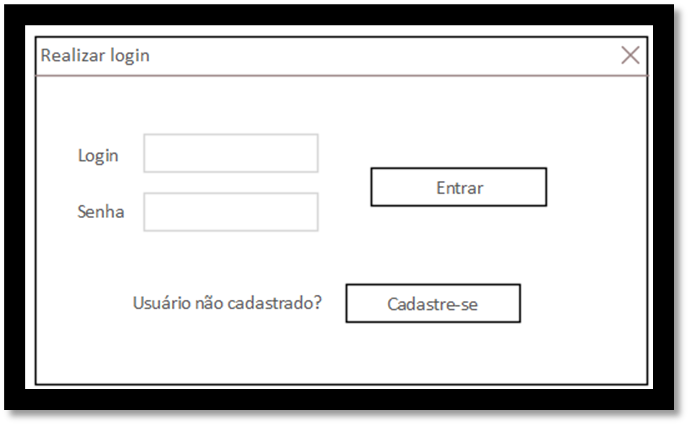

Criado em Junho de 2023 por *Maxwell Anderson*

<center>
    <figure>
        
        <figcaption>
            Gato engenheiro de software que está criando um projeto de software em UML.<br>
            <em>Prompt: crie uma imagem de um gato engenheiro de software usando óculos criando um projeto de software em UML. O gato deve estar usando roupas formais.</em>
        </figcaption>
        <small>Fonte: gerado por IA com Bing por Maxwell Anderson (2023)</small>
    </figure>
</center>

O diagrama de casos de uso é um dos diagramas mais importantes da UML. Ele é usado para modelar os requisitos funcionais do sistema. Ele mostra os atores e os casos de uso do sistema e como eles interagem entre si.

## Atores

Um ator é uma pessoa ou sistema que interage com o software. Ele pode ser um usuário, um sistema externo ou um dispositivo externo. Os atores são representados por ícones de pessoas ou sistemas externos.

Exemplos de atores:

- Cliente
- Funcionário
- Vendedor
- Administrador
- Usuário comum
- Sistema de emissão de notas fiscais
- Sistema de pagamento

Diagramando atores:

[](https://tinyurl.com/2y7zr9hr)<!---->
<br>
<small>Exemplo de atores</small>
<br>
<small>Fonte: elaboração própria (2023)</small>


As setas representam uma relação de generalização/especialização. Por exemplo, o ator `Operador de programação da afiliada` é um tipo especializado de `Operador de sistema`.

[](https://tinyurl.com/2cx9jf3g)<!---->
<br>
<small>Exemplo de atores</small>
<br>
<small>Fonte: elaboração própria (2023)</small>

Aqui, o ator `Cliente` é um tipo de `Usuário comum`. Os atores `Usuário comum` `Administrador` são tipos especializados de `Usuário`. Este tipo de representação é bem comum em arquitetura de sistemas de software em geral.

Essa forma de representação lembra a herança de classes em linguagens de programação orientadas a objetos, como Java, C# e Python. Mas não se preocupe com isso agora. Iremos estudar isso mais adiante.

## Caso de uso

Um caso de uso é uma funcionalidade do sistema. Ele representa uma ação que o sistema pode realizar. Ele é representado por uma elipse.

Exemplos de casos de uso:

- Cadastrar cliente
- Alterar cliente
- Excluir cliente
- Buscar cliente

> ℹ️ **Nota**
>
> Os casos de uso devem iniciar com verbos no infinitivo.
>
> No exemplo acima temos os verbos `Cadastrar`, `Alterar`, `Excluir` e `Buscar`. É um CRUD clássico. CRUD é um acrônimo para Create, Read, Update e Delete. Em português: Criar, Ler, Atualizar e Excluir.
>
> Assim sendo, é comum que os quatro casos de uso sejam um só representados como `Manter cliente`.

Diagramando casos de uso:

[](https://tinyurl.com/28y3k424)<!---->
<br>
<small>Exemplo de casos de uso/small>
<br>
<small>Fonte: elaboração própria (2023)</small>

Acima temos um exemplo de casos de usos `Cadastrar cliente`, `Alterar cliente`, `Excluir cliente` e `Buscar cliente`.

[](https://tinyurl.com/2y2ar3n8)<!---->
<br>
<small>Exemplo de casos de uso</small>
<br>
<small>Fonte: elaboração própria (2023)</small>

Conforme nota anterior, alteramos os casos de uso para `Manter cliente`.

## Diagrama completo

Agora que já sabemos como representar atores e casos de uso, podemos criar um diagrama completo.

Ele serve para identificar a fronteira do sistema, ou seja, o seu escopo:

- Identificando atores
- Identificando casos de uso
- Descrevendo casos de uso
- Relacionando os casos de uso
- Especificando partes ou módulos do sistema

Vamos ver tudo isto com mais detalhes agora.

### O caso de uso (elipse)

Regras:

- O caso de uso é representado por uma elipse. 
- Pode representar um serviço, uma funcionalidade ou uma ação que o sistema pode realizar.
- Pode ser utilizado por um mais atores.
- Pode também ser utilizado por outros casos de usos.

#### Como identificar?

Para identificar casos de uso, devemos ler os requisitos funcionais levantados em etapas anteriores e fazer as seguintes perguntas:

- **Quais os serviços ou funcionalidades** que os atores querem do sistema?
- O sistema **armazena informações**?
- Quais atores **utilizam** o sistema, de forma a **criar**, **ler**, **atualizar** ou **excluir** informações?
- Qual ator **inicia** o caso de uso?
- Qual ator **informa** os dados para o caso de uso? (lembre-se que o ator pode ser um sistema externo ou um dispositivo externo)
- O sistema necessita **informar** algo para o ator?
- Existe algum **processamento** de dados externo que o sistema deva saber?

Iremos ver com detalhes como fazer a extração de atores e casos de usos a partir de uma lista de requisitos funcionais em [Visões do Sistema](views_intro.md). Mas antes, vamos nos concentrar em conhecer como os casos de usos são diagramados.

#### Como diagramar?

Após identificado os atores e os casos de uso, para diagramar casos de uso, devemos fazer o seguinte:

1. Desenhar os atores
2. Desenhar os casos de uso

  [](https://tinyurl.com/29vzcy6t)<!---->
  <br>
  <small>Exemplo de atores e casos de uso</small>
  <br>
  <small>Fonte: elaboração própria (2023)</small>

3. Estabelecer os relacionamentos entre:
   - atores e casos de uso
   - atores e atores
   - casos de uso e casos de uso
  
Vamos ver como estabelecer os relacionamentos entre esses componentes.

##### Relacionamentos

Podemos organizar os relacionamentos em três grupos de forma lógica e incremental:

- **Relacionamento entre atores e atores**
  - O ator é um **tipo** de outro ator
- **Relacionamento entre atores e casos de uso**
  - O ator **utiliza** o caso de uso
  - O ator **inicia** o caso de uso
  - O ator **informa** dados para o caso de uso
  - O caso de uso **informa** algo para o ator
- **Relacionamento entre casos de uso e casos de uso**
  - O caso de uso **utiliza** outro caso de uso
  - O caso de uso **estende** outro caso de uso
  - O caso de uso **inclui** outro caso de uso
  - O caso de uso é um **tipo** de outro caso de uso

###### Relacionamento entre atores e atores

Entre atores, um pode ser um tipo de outro. 

As setas representam uma relação de generalização/especialização. Por exemplo, o ator `Operador de programação da afiliada` é um tipo **especializado** de `Operador de sistema` e `Conselho de programação` também é um tipo de `Operador de sistema`. Quando "lemos" ao contrário, dizemos que `Operador de sistema` é um tipo **genérico** de `Operador de programação da afiliada` e `Conselho de programação`.

[](https://tinyurl.com/22aypusa)<!---->
<br>
<small>Relacionamento entre atores e atores</small>
<br>
<small>Fonte: elaboração própria (2023)</small>

###### Relacionamento entre atores e casos de uso

Demonstra que o ator utiliza (ou *"usa"*) a funcionalidade do sistema (caso de uso). Ficaria estranho dizer que o "ator usa o caso de uso", mas é assim que funciona.

Utilizamos uma linha "cheia" para representar este relacionamento.

Utilizamos um retângulo em volta dos casos de uso para representar o escopo do sistema - delimitando suas fronteiras ou mesmo pode ser utilizado para representar um módulo do sistema.

[](https://tinyurl.com/2bbe328p)<!---->
<br>
<small>Relacionamento entre atores e casos de uso</small>
<br>
<small>Fonte: elaboração própria (2023)</small>

###### Relacionamento entre casos de uso e casos de uso

São três tipos:

1. Relacionamento de inclusão
2. Relacionamento de extensão
3. Relacionamento de generalização/especialização

Vamos ver com detalhes cada um deles.

- **Relacionamento de inclusão**: um caso de uso pode incluir outro caso de uso.
  - É um relacionamento de obrigatoriedade.
  - No diagrama, utilizamos uma linha tracejada com uma seta para representar este relacionamento com `<<include>>`.
  - A seta **aponta** para o caso de uso que deve ser incluído.
  - Exemplo:
  
    [](https://tinyurl.com/24oldtxf)<!---->
    <br>
    <small>Relacionamento entre casos de uso e casos de uso com inclusão</small>
    <br>
    <small>Fonte: elaboração própria (2023)</small>

    - O caso de uso - dos diagramas que utilizamos aqui - `Incluir vídeo na base compartilhada` **deve** ser utilizado quando o ator desejar `Ofertar conteúdo para afiliada`. Preste atenção no **DEVE**. O caso de uso `Incluir vídeo na base compartilhada` não pode ser utilizado sem o caso de uso `Ofertar conteúdo para afiliada`.

    > Ainda não conseguiu entender? Talvez os termos sejam estranhos. Uma pessoa que trabalha em uma TV precisa programar o conteúdo que irá passar para os telespectadores durante o dia. Ela precisa fazer isso de forma organizada. Assim, ela irá criar uma grade de programação. Esta grade de programação é o caso de uso `Ofertar conteúdo para afiliada`. Mas como ela irá fazer isso? Ela irá incluir vídeos na grade de programação. Assim, o caso de uso `Incluir vídeo na base compartilhada` é um caso de uso que **deve** ser utilizado quando o ator desejar `Ofertar conteúdo para afiliada`. Essa base compartilhada seria como uma pasta onde contém vídeos salvos e que são compartilhados entre as afiliadas da TV. Assim, a afiliada de São Paulo pode utilizar o vídeo da afiliada do Rio de Janeiro, por exemplo. Mas para isso, ela precisa incluir o vídeo na base compartilhada. Entendeu agora?
    >
    > Para ficar melhor ainda o entendimento, imagine o `Operador de programação da afiliada` como sendo a pessoa que irá fazer a programação da TV e ele estará em frente a um computador utilizando esse sistema. Ele vê a tela ou a página correspondente ao caso de uso `Ofertar conteúdo para afiliada`. Ele precisa incluir um vídeo na grade de programação. Assim, ele irá clicar em um botão ou link que o levará para a tela ou página correspondente ao caso de uso `Incluir vídeo na base compartilhada`. Ele irá selecionar o vídeo e incluir na grade de programação. Pronto. Agora ele pode voltar para a tela ou página correspondente ao caso de uso `Ofertar conteúdo para afiliada` e continuar a programação. Sacou?

- **Relacionamento de extensão**: um caso de uso pode estender outro caso de uso.
  - É um relacionamento de ação opcional. A ação é executada se o ator desejar.
  - Segue um exemplo para tornar clara a ideia:

    <center>
        <figure>
            
            <figcaption>
                Tela de login do sistema
            </figcaption>
            <small>Fonte: elaboração própria (2010)</small>
        </figure>
    </center>

    - Percebe que a funcionalidade "cadastre-se" é uma ação opcional? O usuário pode ou não clicar no link "cadastre-se". 
    - Uma funcionalidade com ação semelhante seria "esqueci minha senha".
    - O diagrama seria:
    
      [](https://tinyurl.com/24s2jmkb)<!---->
      <br>
      <small>Relacionamento entre casos de uso e casos de uso com extensão</small>
      <br>
      <small>Fonte: elaboração própria (2023)</small>

    - Aqui o ator `Usuário` realiza a ação `Fazer login`. Perceba que se ele quiser, ele poderá realizar a ação `Esqueci minha senha`. O caso de uso `Esqueci minha senha` estende o caso de uso `Fazer login`. O mesmo se dá com o caso de uso `Cadastrar-se`. O caso de uso `Cadastrar-se` também estende o caso de uso `Fazer login`.
    - Perceba ainda que existe um relacionamento entre `Cadastrar-se` e o ator `Usuário`. O ator `Usuário` pode  utilizar diretamente o caso de uso `Cadastrar-se`. Ou não pode? Imagina ele acessando diretamente essa funcionalidade em uma página principal do sistema, o que é bem comum. 

      [](https://tinyurl.com/ymp7sgxv)<!---->
      <br>
      <small>Relacionamento entre casos de uso e casos de uso com extensão</small>
      <br>
      <small>Fonte: elaboração própria (2023)</small>

    - O caso de uso - dos diagramas que utilizamos aqui - `Consultar base local` é uma ação opcional a ser executada quando o ator desejar `Ofertar conteúdo para afiliada`. Preste atenção no **PODE**. O caso de uso `Consultar base local` pode ser utilizado quando o ator desejar `Ofertar conteúdo para afiliada`. O mesmo ocorre com `Publicar e incluir vídeo na base compartilhada`.
      - Veja que a seta fica no sentido contrário ao relacionamento de inclusão `<<include>>`. Ela indica que o caso de uso `Ofertar conteúdo para afiliada` pode ser estendido pelos casos de uso `Consultar base local` e `Publicar e incluir vídeo na base compartilhada`. Assim, a execução da funcionalidade **poderá partir** destes.

    
- **Relacionamento de generalização/especialização**
  - É um relacionamento de generalização/especialização entre casos de uso tal como visto entre atores.

    [](https://tinyurl.com/2as4godb)<!---->
    <br>
    <small>Relacionamento entre casos de uso e casos de uso com generalização/especialização</small>
    <br>
    <small>Fonte: elaboração própria (2023)</small>

  - No exemplo, o caso de uso `Abrir conta comum` pode ser **especializado** em `Abrir conta poupança` e `Abrir conta corrente`. O caso de uso `Abrir conta comum` é um caso de uso genérico, enquanto `Abrir conta poupança` e `Abrir conta corrente` são casos de uso específicos.
  - Na prática, quando um desenvolvedor for implementar o sistema, ele irá implementar o caso de uso genérico `Abrir conta comum` e os casos de uso especializados `Abrir conta poupança` e `Abrir conta corrente` irão herdar as características do caso de uso genérico em **forma de métodos de classes**. Assim, não é necessário implementar tudo novamente. Apenas as características específicas do caso de uso especializado.

  - Posso também colocar anotações, conforme abaixo:

    [](https://tinyurl.com/yqxkr85b)<!---->
    <br>
    <small>Relacionamento entre casos de uso e casos de uso com generalização/especialização com anotações</small>
    <br>
    <small>Fonte: elaboração própria (2023)</small>

**Pergunta para refletir**. 

Por que o nome do ator do caso de uso `Abrir conta comum` é chamado de `Usuário` e o ator do caso de uso `Encerrar conta` é chamado de `Cliente`?

### Especificação descritiva de casos de uso

- A especificação descritiva de casos de uso é um documento que descreve de forma textual o caso de uso.
- Uma boa ferramenta CASE permitiria que o analista de sistemas pudesse selecionar ou clicar no caso de uso e visualizar a especificação abaixo.

Vamos especificar o caso de uso `Abrir conta comum`:

| Caso de uso         | [UC1 - Abrir conta comum](#uc1)                                                                                                                                                                                                                                                                                                                                                                                                                                                                                                                                                                                                                                                    |
| ------------------- | ---------------------------------------------------------------------------------------------------------------------------------------------------------------------------------------------------------------------------------------------------------------------------------------------------------------------------------------------------------------------------------------------------------------------------------------------------------------------------------------------------------------------------------------------------------------------------------------------------------------------------------------------------------------------------------- |
| Objetivo            | Permitir que o ator abra uma conta comum no banco.                                                                                                                                                                                                                                                                                                                                                                                                                                                                                                                                                                                                                                 |
| Requisitos          | RF008                                                                                                                                                                                                                                                                                                                                                                                                                                                                                                                                                                                                                                                                              |
| Atores              | Usuário                                                                                                                                                                                                                                                                                                                                                                                                                                                                                                                                                                                                                                                                            |
| Condição de entrada | O ator seleciona 'Abrir conta' no dashboard.                                                                                                                                                                                                                                                                                                                                                                                                                                                                                                                                                                                                                                       |
| Fluxo principal     | 1. O ator acessa a página Abrir conta. Ele verifica que o título da página no aplicativo e na própria página é 'Abrir conta'. Ele observa que existe uma mensagem de boas-vindas e os seguintes campos: nome completo, CPF, data de nascimento, telefone, endereço, bairro, cidade, UF, CEP, opções: criar conta, cancelar. <br> 2. O ator preenche todos os campos e seleciona o botão para criar conta. <br> 3. O sistema verifica se as informações para cadastro são válidas. [RN1](#rn1) <br> 4. O sistema exibe a página de cadastro de produtos novamente e mostra uma mensagem informando que a conta foi criada com sucesso. <br> 5. O sistema exibe o dashboard do banco |
| Fluxos alternativos | Nenhum                                                                                                                                                                                                                                                                                                                                                                                                                                                                                                                                                                                                                                                                             |
| Fluxos de exceção   | [RN1 - Validação de campos](#rn1) <br> Todas as informações são obrigatórias.                                                                                                                                                                                                                                                                                                                                                                                                                                                                                                                                                                                                      |

OK. Aparentemente tudo certo. Mas e os casos de usos especializados `Abrir conta especial` e `Abrir conta poupança`? Eles não deveriam ser especificados também? Sim, deveriam. Mas como eles são casos de uso especializados, eles herdam as características do caso de uso genérico `Abrir conta comum`. Assim, a especificação de caso de uso `Abrir conta especial` ficaria assim:

| Caso de uso         | [UC2 - Abrir conta especial](#uc2)<br>(Herda de UC1 - Abrir conta comum) |
| ------------------- | --------------------------------- |
| Objetivo            | Permitir que o ator (Usuário) abra uma conta especial no banco com benefícios adicionais. |
| Requisitos          | RF008                             |
| Atores              | Usuário                           |
| Condição de entrada | O ator seleciona 'Abrir conta' no dashboard. |
| Fluxo principal | 1. O ator segue o Fluxo Principal de [UC1 - Abrir conta comum](#uc1).<br> 2. O ator seleciona a opção 'Conta especial'. [RN1](#rn1)<br>3. O sistema define um limite.<br>4. ... |
| Fluxos alternativos | Nenhum |
| Fluxos de exceção |     [RN1 - Validação de campos]: Todas as informações são obrigatórias.<br> [RN2 - Verificação de crédito especial]: O sistema verifica o crédito do cliente para aprovar a conta especial. |

E a especificação de caso de uso `Abrir conta poupança` ficaria assim:

| Caso de uso         | [UC3 - Abrir conta poupança](#uc3)<br>(Herda de UC1 - Abrir conta comum) |
| ------------------- | --------------------------------- |
| Objetivo            | Permitir que o ator (Usuário) abra uma conta poupança no banco com benefícios adicionais. |
| Requisitos          | RF008                             |
| Atores              | Usuário                           |
| Condição de entrada | O ator seleciona 'Abrir conta' no dashboard. |
| Fluxo principal | 1. O ator segue o Fluxo Principal de [UC1 - Abrir conta comum](#uc1).<br> 2. O ator seleciona a opção 'Conta poupança'. [RN1](#rn1)<br>3. O sistema define uma data de aniversário<br>4. O sistema emite a mensagem MSG01.<br>5. ... |
| Fluxos alternativos | Nenhum |
| Fluxos de exceção |     [RN1 - Validação de campos]: Todas as informações são obrigatórias. |

Viu como é simples? O caso de uso especializado herda as características do caso de uso genérico. Assim, não é necessário especificar tudo novamente. Apenas as características específicas do caso de uso especializado.

> ℹ️ **Nota**
>
> Para entender através de outro exemplo como descrever uma especificação de caso de uso, veja [Especificação de caso de uso](/lessons/softeng/design/views/#especificao) na lição sobre [Visões](/lessons/softeng/design/views/).

> ℹ️ **Nota 2**
>
> Percebeu o texto "3. O sistema emite a mensagem MSG01." no fluxo principal da UC3? O que é isso? É uma mensagem que o sistema emite para o ator. Ela pode ser uma mensagem de erro ou de sucesso. No caso, é uma mensagem de sucesso. A mensagem de erro seria algo como "Não foi possível abrir a conta poupança. Tente novamente mais tarde." Mas qual o motivo da mensagem não ser escrita diretamente no caso de uso, ao invés de usar o atalho MSG01? Simples. A mensagem pode ser utilizada em vários casos de uso. Assim, se ela for alterada, não será necessário alterar em todos os casos de uso. Basta alterar a mensagem MSG01. Entendeu? Crie para isto um artefato chamado "Mensagens" e coloque todas as mensagens que o sistema emite. Assim, você poderá reutilizá-las em vários casos de uso. Este artefato pode ser criado utilizando a linguagem de programação no código-fonte a ser utilizado pelos desenvolvedores. Em sistemas que eu desenvolvo, eu utilizo uma pasta chamada `lang` onde irão conter arquivos com strings vinculadas às constantes de mensagens. Veja o exemplo abaixo. Uma outra utilidade para isto é a facilidade que os desenvolvedores irão ter para internacionalizar o sistema. 
>
> ```python
> # lang-ptbr.py
>
> MSG01 = 'Conta poupança aberta com sucesso.'
> MSG02 = 'Não foi possível abrir a conta poupança. Tente novamente mais tarde.'
> ```
>
> ```python	
> # lang-enus.py
>
> MSG01 = 'Savings account opened successfully.'
> MSG02 = 'Unable to open savings account. Try again later.'
> ```

# Referências

---. Aula 03 UML Parte01. Universidade Salvador.

Guedes, G. T. A. UML 2 Uma abordagem prática. 1ª edição. São Paulo: Novatec Editora, 2009.

Marco Tulio Valente. Engenharia de Software Moderna: Princípios e Práticas para Desenvolvimento de Software com Produtividade, Editora: Independente, 395 páginas, 2020.

Pressman, S. R. Engenharia de Software. 6ª edição. São Paulo: McGraw-Hill, 2006.

Tonsig, S. L. Engenharia de Software. Análise e Projeto de Sistemas. 1ª edição. São Paulo: Futura, 2003.
