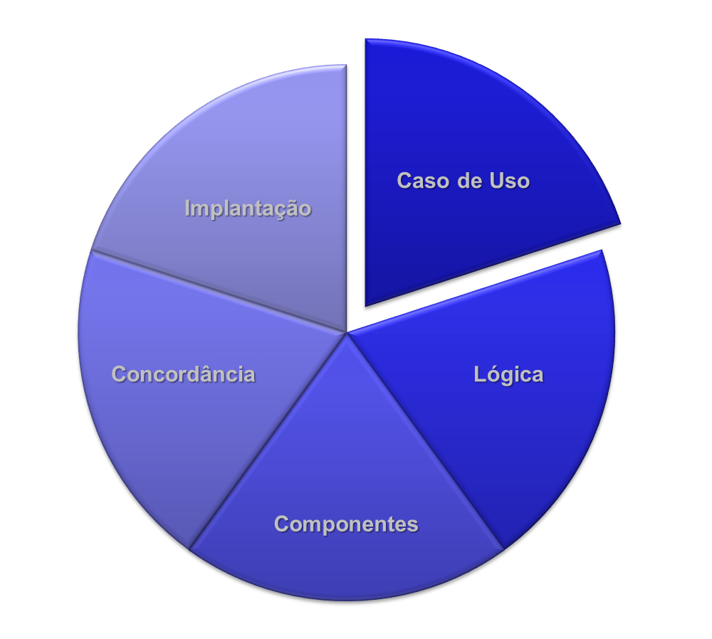

Criado em Junho de 2023 por *Maxwell Anderson*

    <figure>
        
        <figcaption>
            Gato engenheiro de software que está criando um projeto de software em UML. 
            <em>Prompt: crie uma imagem de um gato engenheiro de software usando óculos criando um projeto de software em UML. O gato deve estar usando roupas formais.</em>
        </figcaption>
        <small>Fonte: gerado por IA com Bing por Maxwell Anderson (2023)</small>
    </figure>

## Conteúdo

- [Introdução](#introdução)
- [Visão de casos de uso](#visão-de-casos-de-uso)
  - [Diagrama de Casos de Uso](#diagrama-de-casos-de-uso)
  - [Diagrama de atividades UCS Manter Produtos e Garantias](#diagrama-de-atividades-ucs-manter-produtos-e-garantias)

# Introdução

As visões exibem o sistema de diferentes perspectivas. Elas são usadas para representar os requisitos do sistema, a arquitetura do sistema, o projeto do sistema, etc.

Após a construção de um carro, vários especialistas podem estar envolvidos, como um especialista em mecânica, funilaria, pintura, eletrônica, etc. Cada um tem uma visão específica. O especialista em mecânica se concentra no funcionamento do motor, das rodas e no movimento do carro. O especialista em funilaria se preocupa com a montagem das peças. O especialista em pintura cuida da pintura do carro, enquanto o especialista em eletrônica se interessa pela parte elétrica e pelo funcionamento dos componentes.

Cada especialista tem sua própria perspectiva do carro e pode utilizar diferentes diagramas para representá-lo. Por exemplo, o especialista em mecânica usa um diagrama do motor, o de funilaria usa um diagrama de montagem, o de pintura usa um diagrama de pintura, e o de eletrônica usa um diagrama de circuito elétrico. Esses diagramas podem ser usados individualmente ou em conjunto para representar o carro.

> ⚠️ **Ponto de atenção**
>
> Realizar engenharia reversa de sistemas não conhecidos por você é uma atividade trabalhosa. É necessário entender o sistema, suas funcionalidades, suas regras de negócio, suas tecnologias, etc. E, para isso, é necessário ter acesso ao código fonte do sistema. 
>
> Por vezes, o sistema é complexo e não é entendível por completo. Neste caso, é muito útil utilizar ferramentas CASE que permitem gerar diagrama UML da arquitetura do sistema. E, melhor ainda, é quando você consegue fazer engenharia reversa utilizando análise baseada em Visões UML.

O mesmo acontece com o software. O software pode ser representado de várias formas, sob várias perspectivas. Cada perspectiva é chamada de visão. As visões são usadas para representar:

    <figure>
        
        <figcaption>
            Visões clássicas de um sistema de software
        </figcaption>
        <small>Fonte: criação própria, em jun/2023</small>
    </figure>

- Visão de casos de uso
- Visão de lógica
- Visão de componentes
- Visão de concorrência
- Visão de implantação

Assim, cada uma irá mostrar aspectos particulares, dando enfoque a determinados ângulos e níveis de abstrações diferentes.

Isto é muito útil! Não adianta conhecer todas as formas de representação ou modelagem de sistemas sem saber como e quando aplicá-las. E é aí que as visões entram. Elas são usadas para representar o sistema de diferentes perspectivas, cada uma com um foco diferente.

> ⚠️ **Ponto de atenção**
>
> Não é necessário representar todo um sistema de software utilizando todos os fluxos possíveis, todas as funcionalidades e casos de usos, para todos os requisitos do cliente. Lembre-se que somente deverão ser modelados e especificados as funcionalidades necessárias para um bom entendimento do sistema, isto é, funcionalidades que são complexas e que podem ser mal interpretadas.
>
> **O contrário é engessamento do processo de desenvolvimento.**

⚠️ Faça somente aquilo que for útil! ⚠️

# Visão de casos de uso

A visão de casos de uso exibe as funcionalidades do sistema e como elas são percebidas pelos usuários enquanto atores que interagem com o sistema.

Os principais modelos a serem utilizados são:

- Diagrama de casos de uso
- Diagrama de atividades
- Diagrama de sequência
- Diagrama de comunicação
- Protótipos visuais de baixo ou alto nível de fidelidade

Deve ser entendida por:

- Clientes
- Designers
- Desenvolvedores
- Gerentes de projeto

## Diagrama de Casos de Uso

Sobre os exemplos desta seção:

> ℹ️ **Nota**
>
> O diagrama de caso de uso abaixo modela o requisito funcional RF001 até o RF007 do [Documento de Requisitos](/lessons/softeng/requirements/req/sample/) validado junto ao cliente.

<!---->
<small>
    Diagrama de casos de uso
 
    Fonte: criação própria, em jun/2023
</small>

## Diagrama de atividades UCS Manter Produtos e Garantias

Nesta caso, estou somente representando o caso de uso Manter Produtos e Garantias.

<!---->
<small>
    Diagrama de atividades das UCS Manter Produtos e Garantias
 
    Fonte: criação própria, em jun/2023
</small>

Aqui estou representando, para fins de exemplo, o diagrama de atividades da UC Manter Clientes.

<!---->
<small>
    Diagrama de atividades das UCS Manter Clientes
 
    Fonte: criação própria, em jun/2023
</small>

> ℹ️ **Nota**
>
> Apesar de ter mencionado que podemos utilizar também os diagramas de sequência, de comunicação e/ou protótipos visuais de baixo ou alto nível de fidelidade, estes não foram utilizados aqui por não haver necessidade - pelo menos até o momento. Lembre-se, faça somente aquilo que for útil!

<!-- # Visão lógica

A visão lógica exibe a estrutura do sistema e como os componentes do sistema interagem entre si.

Os principais modelos que podem ser utilizados são:

- Para análise de estrutura estática
  - Diagrama de classes
  - Diagrama de objetos
- Para análise de comportamento dinâmico
  - Diagrama de máquina de estados
  - Diagrama de atividades

Deve ser entenda por:

- Designers
- Desenvolvedores

## Arquitetura do sistema

Você pode estar se perguntando:

- Possuo documentos ou um backlog de requisitos, e agora?
- Possuo análise do sistema baseada na visão de casos de uso, por onde devo começar? -->
