Criado em Março de 2023 por *Maxwell Anderson*

<figure>
    
    <figcaption>Gato estudando Engenharia de Software.</figcaption>
    <small>Fonte: gerado por IA com Bing por Maxwell Anderson (2023)</small>
</figure>

- [Introdução](#introdução)
- [Instalando o Git](#instalando-o-git)

## Introdução

Nesta aula, você aprenderá como instalar o Git no Windows. O Git é um sistema de controle de versão distribuído, que permite que você rastreie as alterações em seus arquivos, permitindo que você volte a versões anteriores se necessário. O Git é uma ferramenta muito poderosa e é amplamente utilizada por desenvolvedores de software. O Git é um dos sistemas de controle de versão mais populares do mundo. O Git é um software livre e de código aberto, que significa que você pode usá-lo gratuitamente e pode modificá-lo conforme desejar.

## Instalando o Git

> **Observação**
> A versão que estou instalando neste momento é o Git 2.40.0. Versões posteriores poderão diferir das instruções apresentadas abaixo, pois sempre novas melhorias vão sendo acrescentadas. Verifique as semelhanças conforme cada contexto.

Para instalar o Git no Windows, siga os seguintes passos:

- Acesse o site [https://git-scm.com/download/win](https://git-scm.com/download/win) e clique no link **Click here to download**.

  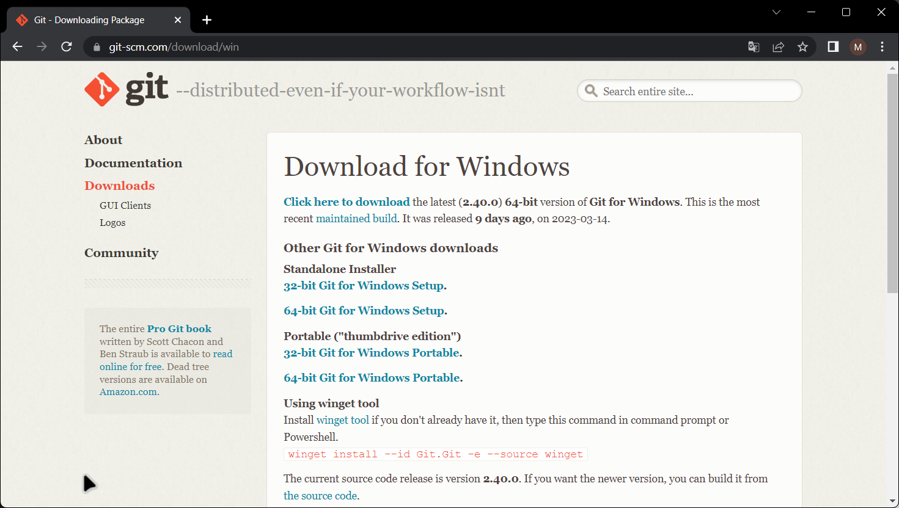

- Realize o download e siga as instruções de instalação:
   - Na tela de boas vindas, clique em **Next**.

    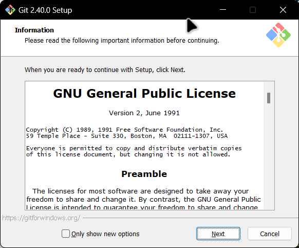

   - Gosto de marcar as opções **Windows Explorer integration** e **Add a Git Bash Profile to Windows Terminal**. Desta forma, irá aparecer um menu suspenso no Windows Explorer com atalhos úteis ao clicar sobre arquivo ou pasta, bem como no Windows Terminal será adicionado um atalho para o CLI do Git que se baseia em *Bash* Clique em **Next**;

    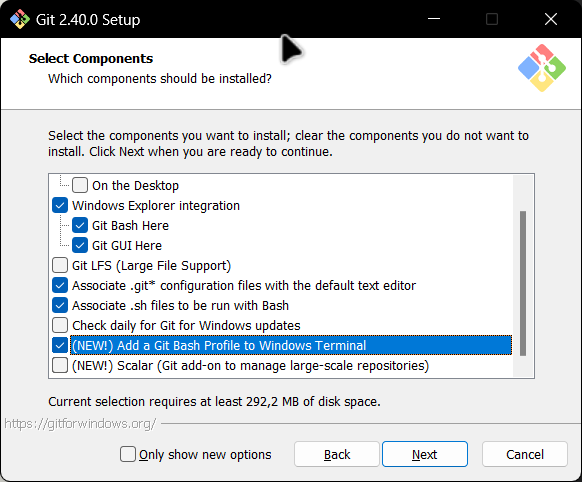

   - Em **Choosing the default editor used by Git** selecione *Use Visual Studio Code as Git's default editor*. Isto irá permitir que o Git possa utilizar o VSCode como editor padrão. Veja que é necessário ter o Visual Studio Code instalado em seu computador. Caso não tenha feito, siga as instruções em [Instalando o Visual Studio Code](02.%20Instalando%20o%20VSCode.md). Clique em **Next**;

    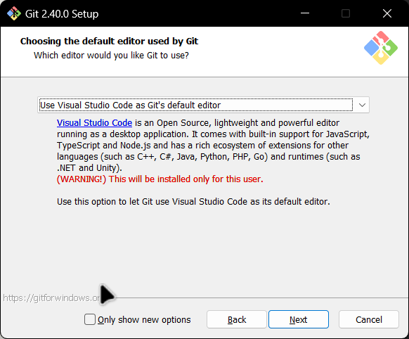

   - Em **Adjusting the name of the initial branch in new repository**, selecione a opção **Override the default branch for new repositories** e na caixa de texto abaixo, digite *main*. A branch principal é por padrão chamada de *master*, porém vamos a partir de agora sempre usar o nome *main*. Clique em **Next**;
  
    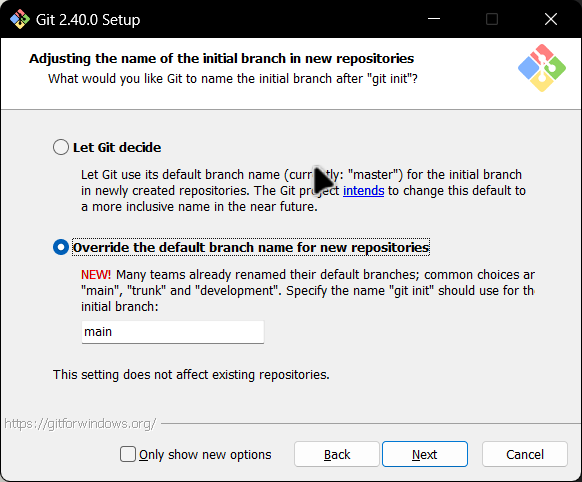

   - Em **Adjusting yout PATH environment** selecione a opção *Use Git and optional Unix tools from de Command Prompt*. Eu gosto muito dessa funcionalidade, pois permite utilizar vários comandos comuns do Linux no Prompt de Comando ou PowerShell do Windows, como o comando *ls* que lista arquivos e diretórios no terminal. Clique em **Next**;

    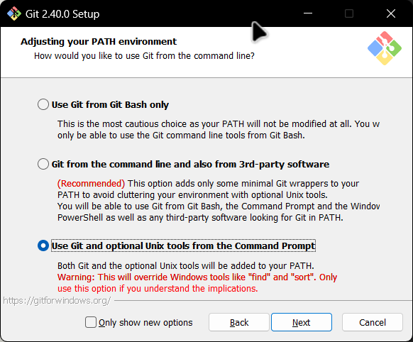

   - Em **Choosing the SSH executable**, selecione *Use bundled OpenSSH*. Isso permitirá usar o cliente SSG que já vem com o instalador. Clique em **Next**;

    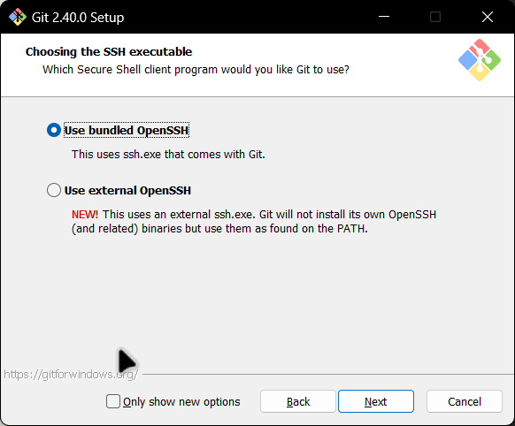

   - Em **Choosing HTTPS transport backend**, selecione *Use the OpenSSL library*. Clique em **Next**;

    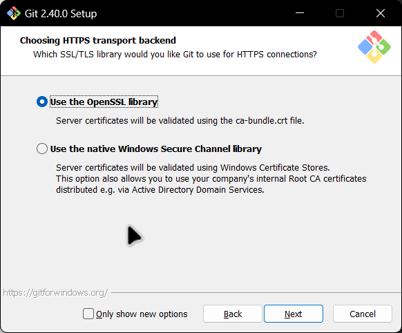

   - Em **Configuring the line ending conversions**, selecione *Checkout Windows-style, commit Unix-style line endings*. Clique em **Next**;

    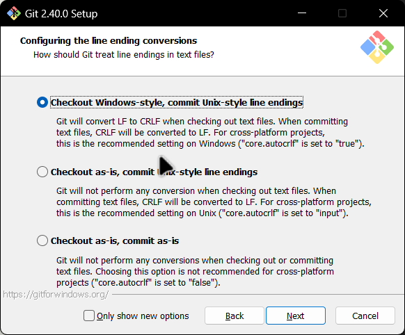

   - Em **Configuring the terminal emulator to use with Git Bash**, selecione *Use Windows' default console window*. Clique em **Next**;
  
    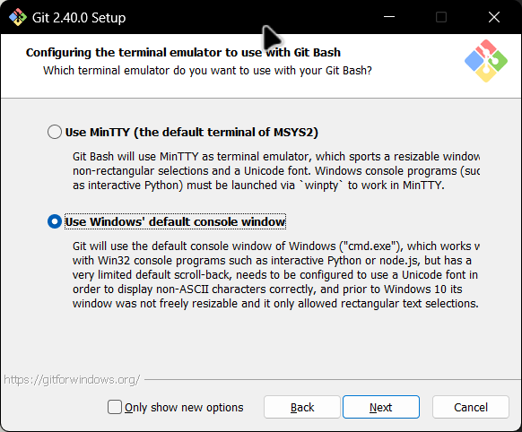

   - Nas telas seguintes, utilize as opções padrões, clicando em **Next**. A instalação será realizada.

    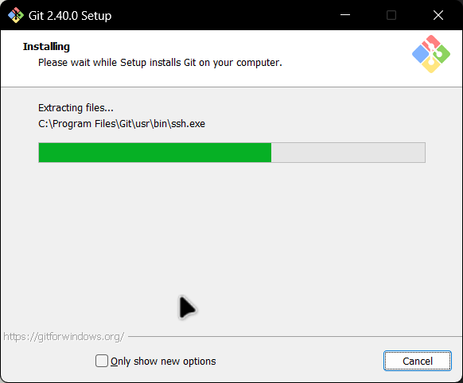

   - Ao final da instalação, clique em **Finish**.

    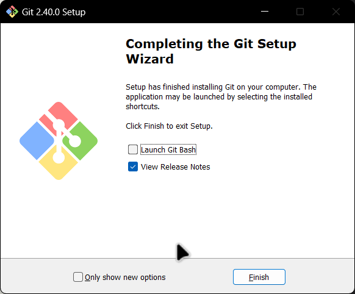

Pronto! O Git foi instalado com sucesso no Windows. Agora você pode seguir para a próxima aula.

[Próxima aula](/lessons/softeng/intro/vscode/)

[Índice](/lessons/softeng/)
