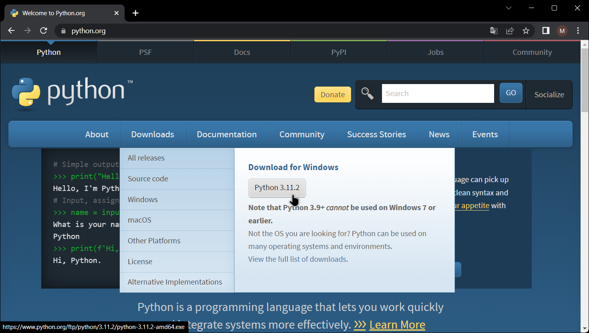
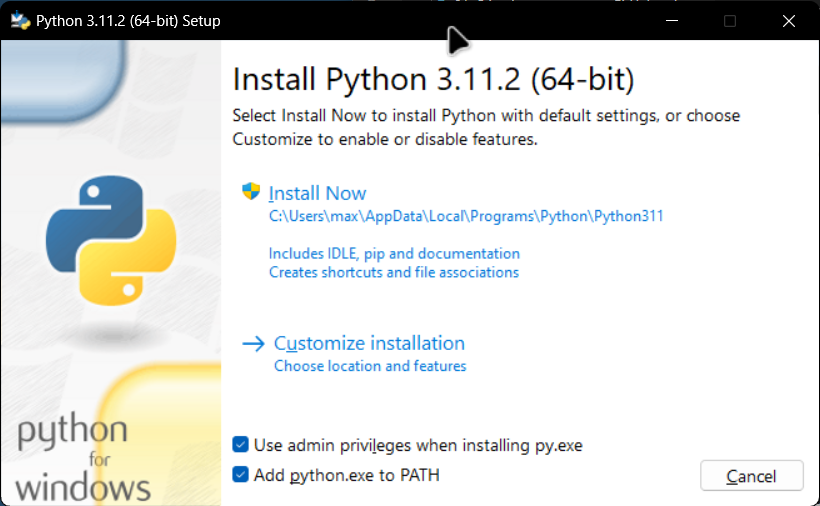

Criado em Março de 2023 por *Maxwell Anderson*

<figure>
    
    <figcaption>Gato estudando Engenharia de Software.</figcaption>
    <small>Fonte: gerado por IA com Bing por Maxwell Anderson (2023)</small>
</figure>

- [Introdução](#introdução)
- [Instalação](#instalação)

## Introdução

O Python é uma linguagem de programação de alto nível, interpretada, de script, imperativa, orientada a objetos, funcional, de tipagem dinâmica e forte. Foi lançada por Guido van Rossum em 1991. Atualmente possui uma comunidade ativa e grande número de bibliotecas disponíveis.

O Python é uma linguagem de programação interpretada, ou seja, não é necessário compilar o código-fonte para executá-lo. O código-fonte é interpretado e executado diretamente pelo interpretador Python.

## Instalação

Realize os passos abaixo para instalar o Python no Windows:

- Para instalar o Python, acesse o site oficial do [www.python.org](https://www.python.org/), aponte o mouse sobre o menu *Download* e clique no botão **Python X.X.X**, onde X.X.X é a versão mais recente.

  

- Após o término do download, clique no arquivo baixado para iniciar a instalação.
- Na janela que irá aparecer, selecione a caixa de seleção *Use admin privileges when installing py.exe* bem como também *Add python.exe to PATH*. Selecione a opção **Install Now**.

  

- Uma tela com o progresso de instalação será exibida. Aguarde o término da instalação. Após o término, clique no botão **Close**.

Pronto! O Python foi instalado com sucesso no Windows.

Agora você poderá seguir para a próxima aula.

[Próxima aula](/lessons/softeng/intro/django/)

[Índice](/lessons/softeng/)
