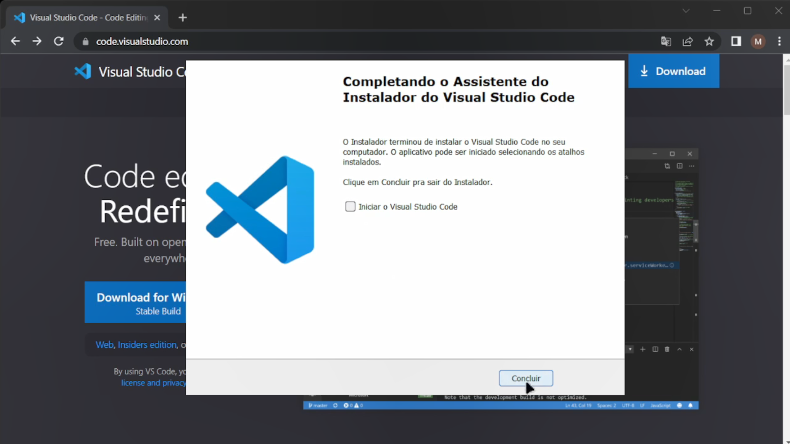

Criado em Março de 2023 por *Maxwell Anderson*

<figure>
    
    <figcaption>Gato estudando Engenharia de Software.</figcaption>
    <small>Fonte: gerado por IA com Bing por Maxwell Anderson (2023)</a></small>
</figure>

- [Assista no YouTube](#assista-no-youtube)
- [Introdução](#introdução)
- [Instalação](#instalação)

## Assista no YouTube

## Introdução

O Visual Studio Code é um editor de código-fonte desenvolvido pela Microsoft para Windows, Linux e macOS. Ele inclui suporte para depuração, controle de versão Git incorporado, realce de sintaxe, complementação inteligente de código, snippets e refatoração de código.

## Instalação

Realize os passos abaixo para instalar o Visual Studio Code no Windows:

- Para instalar o Visual Studio Code, acesse o site oficial do [Visual Studio Code](https://code.visualstudio.com/) e clique no botão **Download for Windows**.

  

- O download será iniciado. Após o término, clique no arquivo baixado para iniciar a instalação.
- A tela inicial da instalação será exibida. Clique no botão **Próximo** para continuar.
  
  

- A tela **Selecionar tarefas adicionais** será exibida. Marque as opções conforme figura abaixo e clique no botão **Próximo**.

  

- A tela de conclusão da instalação será exibida. Clique no botão **Concluir** para finalizar a instalação.

  

Pronto! O Visual Studio Code foi instalado com sucesso no Windows.

Agora você poderá seguir para a próxima aula.

[Próxima aula](/lessons/softeng/intro/python/)

[Índice](/lessons/softeng/)
