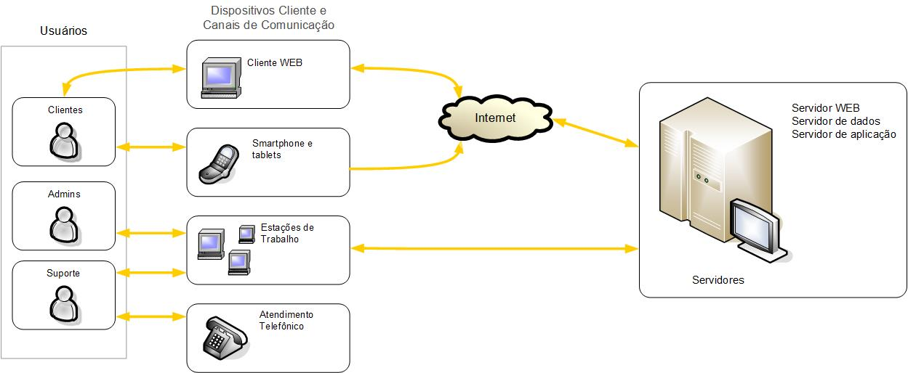

Criado em Março de 2023 por *Maxwell Anderson*

Capa
----

---

<h1>Visão do Produto</h1>

<h2>Nome do Produto</h2>

<small>Versão 1.0</small>

---

Histórico de revisões
---------------------

|    Data    | Versão |          Descrição          |      Autor       |
| :--------: | :----: | :-------------------------: | :--------------: |
| 01/03/2023 |  1.0   |    Criação do documento     | Maxwell Anderson |
| 02/03/2023 |  1.1   | Adição de novas informações | Maxwell Anderson |

---

Sumário
-------

- [Introdução](#introdução)
  - [Propósito](#propósito)
  - [Definições e abreviações](#definições-e-abreviações)
    - [Abreviações](#abreviações)
    - [Definições](#definições)
  - [Escopo do produto](#escopo-do-produto)
- [Posicionamento](#posicionamento)
  - [Oportunidade de negócios](#oportunidade-de-negócios)
  - [Descrição dos benefícios para os clientes e dos problemas resolvidos](#descrição-dos-benefícios-para-os-clientes-e-dos-problemas-resolvidos)
- [Descrição dos stakeholders e dos usuários](#descrição-dos-stakeholders-e-dos-usuários)
  - [Stakeholders](#stakeholders)
  - [Usuários e atores](#usuários-e-atores)
- [Descrição do ambiente de uso](#descrição-do-ambiente-de-uso)
  - [Ambiente de uso](#ambiente-de-uso)
  - [Necessidades principais quanto ao ambiente](#necessidades-principais-quanto-ao-ambiente)
- [Visão geral do produto](#visão-geral-do-produto)
  - [Visão geral](#visão-geral)
  - [Custo e venda](#custo-e-venda)
  - [Licenciamento e instalação](#licenciamento-e-instalação)
  - [Características e funcionalidades de alto nível](#características-e-funcionalidades-de-alto-nível)
  - [Restrições](#restrições)

# Introdução

O Documento de Visão do Produto (DVP) é um documento que descreve o produto de software que será desenvolvido. Ele descreve o problema que será resolvido, as principais necessidades dos stakeholders, as principais funcionalidades do sistema, as restrições do projeto, etc.

## Propósito

O objetivo deste documento é coletar, analisar e definir características e as necessidades de alto nível do **Sistema de Controle de Garantias de Produtos (SCGP).**

Ele se concentra nos recursos necessários aos stakeholders e aos usuários, e nas razões que levam a essas necessidades.

Os detalhes de como o **Sistema de Controle de Garantias de Produtos (SCGP).** atingem essas necessidades são descritos nas *especificações de casos de uso* e nos *requisitos funcionais*.

## Definições e abreviações

### Abreviações

| Termo | Definição                                    |
| :---: | -------------------------------------------- |
|  DVP  | Documento de Visão do Produto                |
| NFCe  | Nota Fiscal de Consumidor Eletrônica         |
|  NFe  | Nota Fiscal Eletrônica                       |
| NFSe  | Nota Fiscal de Serviços Eletrônica           |
| SCGP  | Sistema de Controle de Garantias de Produtos |
|  SRS  | Especificação de Requisitos de Software      |
|  UML  | Linguagem de Modelagem Unificada             |

### Definições

|    Termo    | Definição                                                                                                                       |
| :---------: | ------------------------------------------------------------------------------------------------------------------------------- |
|   Cliente   | É uma pessoa física ou jurídica que compra um produto ou contrata um serviço.                                                   |
| Consumidor  | É uma pessoa física que compra um produto ou contrata um serviço.                                                               |
|   Empresa   | É uma pessoa jurídica que compra um produto ou contrata um serviço.                                                             |
| Fornecedor  | É uma pessoa física ou jurídica que vende um produto ou presta um serviço.                                                      |
|  Garantia   | É um contrato entre o fabricante e o consumidor, que garante que o produto será reparado ou substituído caso apresente defeito. |
| Nota Fiscal | É um documento fiscal que atesta a compra de um produto ou serviço.                                                             |
|   Produto   | É um bem ou serviço que é vendido ou prestado.                                                                                  |
|   Serviço   | É um bem intangível que é prestado.                                                                                             |

## Escopo do produto

O **Sistema de Controle de Garantias de Produtos (SCGP).** é um sistema que tem como objetivo auxiliar o cliente a controlar as garantias de seus produtos. Será utilizado por clientes que compram produtos com garantia e necessitam que sejam informados quando o prazo de garantia estiver próximo de expirar.

---

# Posicionamento

## Oportunidade de negócios

O Sistema de Controle de Garantias de Produtos (SCGP) apresenta várias oportunidades de negócios, tais como:

1. Serviço de assinatura: ofereça aos clientes um serviço de assinatura, onde eles possam pagar uma taxa mensal para ter acesso ao SCGP. Isso pode ser atraente para clientes que possuem muitos produtos com garantia e desejam um serviço de controle automatizado.
2. Venda de publicidade: ao reunir informações sobre os produtos dos clientes, o SCGP pode ser um ótimo veículo para publicidade segmentada. Você pode vender espaço publicitário para empresas que vendem produtos relacionados aos que os clientes já possuem.
3. Venda de informações: o SCGP coleta informações valiosas sobre os produtos que os clientes possuem, como a data de compra e o prazo de garantia. Essas informações podem ser vendidas a empresas que desejam conhecer melhor seus clientes e seus hábitos de compra.
4. Parcerias com varejistas: o SCGP pode oferecer aos varejistas uma forma de se comunicar com os clientes após a venda. Os varejistas podem oferecer descontos ou promoções exclusivas para clientes que estejam usando o SCGP para controlar suas garantias.
5. Expansão para outros mercados: o SCGP pode ser expandido para atender a outros mercados, como o de serviços automotivos ou de eletrônicos. Isso pode ser feito através de parcerias com fabricantes de automóveis ou empresas de eletrônicos, oferecendo um serviço semelhante ao SCGP para seus clientes

## Descrição dos benefícios para os clientes e dos problemas resolvidos

| Benefícios                    | Problemas Resolvidos                                                    | Afetados                                   |
| ----------------------------- | ----------------------------------------------------------------------- | ------------------------------------------ |
| Facilidade de gerenciamento   | Dificuldade em gerenciar múltiplas garantias de produtos                | Clientes que compram produtos com garantia |
| Alertas personalizados        | Falta de notificação antes do vencimento da garantia                    | Clientes que compram produtos com garantia |
| Melhor experiência do cliente | Insegurança em relação à garantia de produtos                           | Clientes que compram produtos com garantia |
| Redução do tempo de espera    | Dificuldade em encontrar informações de contato para acionar a garantia | Clientes que precisam acionar a garantia   |
| Economia de dinheiro          | Despesas desnecessárias com produtos ainda cobertos pela garantia       | Clientes que compram produtos com garantia |

---

# Descrição dos stakeholders e dos usuários

Esta seção descreve os stakeholders e os usuários do **Sistema de Controle de Garantias de Produtos (SCGP).**

## Stakeholders

Segue abaixo a lista de stakeholders.

| Stakeholder                            | Descrição                                                                                                                                               | Papel                                                           |
| -------------------------------------- | ------------------------------------------------------------------------------------------------------------------------------------------------------- | --------------------------------------------------------------- |
| Clientes                               | Pessoas que compram produtos com garantia e utilizam o sistema para controlar as garantias de seus produtos.                                            | Usuário do sistema                                              |
| Equipe de Desenvolvimento              | Profissionais responsáveis por desenvolver e manter o sistema.                                                                                          | Desenvolvedores                                                 |
| Gerente de Projeto                     | Profissional responsável por gerenciar o projeto e garantir que o sistema seja entregue dentro do prazo e orçamento definidos.                          | Gerente de Projeto                                              |
| Departamento de Vendas                 | Profissionais responsáveis por vender os produtos e fornecer informações sobre a garantia dos produtos aos clientes.                                    | Fornecer informações sobre a garantia dos produtos              |
| Departamento de Atendimento ao Cliente | Profissionais responsáveis por atender os clientes e fornecer suporte em relação às garantias dos produtos.                                             | Fornecer suporte em relação às garantias dos produtos           |
| Departamento de Qualidade              | Profissionais responsáveis por garantir que os produtos vendidos estejam em conformidade com as normas de qualidade e que as garantias sejam cumpridas. | Garantir a conformidade dos produtos com as normas de qualidade |

## Usuários e atores

Segue tabela com os usuários e atores do sistema:

| Usuário                  | Descrição                                                                                                    | Responsabilidades                                                                                                                                                                                                                | Stakeholders                                                                                                                             |
| ------------------------ | ------------------------------------------------------------------------------------------------------------ | -------------------------------------------------------------------------------------------------------------------------------------------------------------------------------------------------------------------------------- | ---------------------------------------------------------------------------------------------------------------------------------------- |
| Clientes                 | Pessoas que compram produtos com garantia e utilizam o sistema para controlar as garantias de seus produtos. | Registrar os produtos adquiridos e suas garantias no sistema. Acompanhar o prazo de expiração das garantias e receber notificações sobre o vencimento.                                                                           | Equipe de Desenvolvimento, Gerente de Projeto, Departamento de Vendas, Departamento de Atendimento ao Cliente, Departamento de Qualidade |
| Atendente de Suporte     | Profissional responsável por atender os clientes e fornecer suporte em relação às garantias dos produtos.    | Atender as solicitações dos clientes relacionadas às garantias dos produtos registrados no sistema. Verificar as informações do produto e da garantia no sistema e fornecer orientações sobre os procedimentos a serem seguidos. | Clientes, Equipe de Desenvolvimento, Gerente de Projeto, Departamento de Vendas, Departamento de Qualidade                               |
| Administrador do Sistema | Profissional responsável por gerenciar e manter o sistema.                                                   | Gerenciar os usuários do sistema, realizar backup dos dados, atualizar o sistema e garantir o seu funcionamento adequado.                                                                                                        | Equipe de Desenvolvimento, Gerente de Projeto                                                                                            |

---

# Descrição do ambiente de uso

## Ambiente de uso

A seguir, são descritos alguns ambientes em que o sistema pode ser utilizado:

1. **Ambiente do Cliente**: Neste ambiente, o sistema é utilizado pelos clientes para controlar as garantias de seus produtos adquiridos. Os clientes podem acessar o sistema através de dispositivos móveis, como smartphones e tablets, ou através de um navegador web em seus computadores. O navegador web poderá ser o Google Chrome, Mozilla Firefox ou Microsoft Edge com acesso através do endereço web <https://www.garantias.com.br>. O aplicativo será disponibilizado para os sistemas operacionais Android e iOS. O ambiente do cliente é acessado através da internet e requer um login e senha de acesso.
2. **Ambiente do Atendente de Suporte:** Neste ambiente, o sistema é utilizado pelos atendentes de suporte para fornecer suporte aos clientes em relação às garantias de seus produtos registrados no sistema. O ambiente do atendente de suporte é acessado através de um navegador web em um computador, e requer um login e senha de acesso.
3. **Ambiente Administrativo:** Neste ambiente, o sistema é utilizado pelos administradores do sistema para gerenciar e manter o sistema. Os administradores podem acessar o sistema através de um navegador web em um computador, e possuem acesso a recursos de gerenciamento, como gerenciamento de usuários, backup dos dados, e atualização do sistema.
4. **Ambiente de Teste:** Neste ambiente, o sistema é utilizado para testar novas funcionalidades e correções de bugs antes de serem disponibilizadas para os usuários finais. O ambiente de teste é acessado através de um navegador web em um computador, e requer um login e senha de acesso específicos para o ambiente de teste.

## Necessidades principais quanto ao ambiente

A seguir, é apresentada uma tabela que descreve as necessidades dos clientes com relação à qualidade, desempenho, segurança, usabilidade e confidencialidade do sistema SCGP, juntamente com sua prioridade, interesse, solução atual e soluções propostas:

| Necessidade                                                                                                                                              | Prioridade | Interesse                                                                                                                                                | Solução Atual                                                                                                                 | Soluções Propostas                                                                                                                                                                                                                                                       |
| -------------------------------------------------------------------------------------------------------------------------------------------------------- | ---------- | -------------------------------------------------------------------------------------------------------------------------------------------------------- | ----------------------------------------------------------------------------------------------------------------------------- | ------------------------------------------------------------------------------------------------------------------------------------------------------------------------------------------------------------------------------------------------------------------------ |
| **Qualidade:** O sistema deve ser confiável e livre de erros, bugs e falhas.                                                                             | Alta       | Os clientes esperam que o sistema funcione corretamente e não apresente problemas que possam prejudicar o controle de suas garantias.                    | Testes manuais realizados pela equipe de desenvolvimento.                                                                     | Implementar testes automatizados e processos de garantia de qualidade para identificar e corrigir erros e bugs.                                                                                                                                                          |
| **Desempenho:** O sistema deve ter um bom desempenho, com tempo de resposta rápido e sem atrasos significativos.                                         | Alta       | Os clientes esperam que o sistema responda rapidamente às suas solicitações e não apresente atrasos.                                                     | Servidor dedicado para hospedagem do sistema e monitoramento constante do desempenho.                                         | Melhorar a arquitetura do sistema para garantir melhor desempenho e escalabilidade, bem como otimizar consultas de banco de dados e uso de recursos do sistema.                                                                                                          |
| **Escalabilidade:** O sistema deve ter capacidade para suportar o crescimento do número de clientes e garantias.                                         | Alta       | Os clientes esperam que o sistema continue funcionando de forma confiável e sem atrasos, mesmo com um grande número de usuários e garantias registradas. | Arquitetura escalável, com distribuição de carga e uso de servidores em nuvem.                                                | Implementar arquitetura em nuvem e balanceamento de carga para garantir a escalabilidade do sistema.                                                                                                                                                                     |
| **Segurança:** O sistema deve ser seguro, protegido contra acesso não autorizado, invasões e roubo de dados.                                             | Alta       | Os clientes esperam que suas informações estejam seguras e protegidas contra invasões e acesso não autorizado.                                           | Autenticação de usuários com login e senha, criptografia de dados sensíveis e acesso restrito somente a usuários autorizados. | Implementar medidas adicionais de segurança, como autenticação de dois fatores, certificados SSL e criptografia avançada.                                                                                                                                                |
| **Usabilidade:** O sistema deve ser fácil de usar e entender, com uma interface intuitiva e amigável ao usuário.                                         | Moderada   | Os clientes esperam que o sistema seja fácil de usar e entender, sem a necessidade de treinamento especializado.                                         | Interface de usuário simples e intuitiva.                                                                                     | Realizar testes de usabilidade com usuários reais para identificar áreas de melhoria e implementar melhorias na interface do usuário.                                                                                                                                    |
| **Tempo de resposta:** O sistema deve ter um tempo de resposta rápido para que os clientes possam acessar e controlar suas garantias de forma eficiente. | Moderada   | Os clientes esperam que o sistema responda às suas solicitações rapidamente para que possam gerenciar suas garantias de forma mais eficiente.            | Monitoramento constante do tempo de resposta do sistema.                                                                      | Realizar otimizações de performance, como o uso de cache, e garantir que o sistema esteja sempre atualizado para obter um tempo de resposta rápido.                                                                                                                      |
| **Confidencialidade:** O sistema deve proteger a privacidade e confidencialidade das informações dos clientes.                                           | Alta       | Os clientes esperam que suas informações sejam mantidas em sigilo e protegidas contra acesso não autorizado.                                             | Controles de acesso restrito, criptografia de dados sensíveis e monitoramento constante das atividades do usuário.            | Realizar auditorias de segurança e implementar medidas adicionais de privacidade e proteção de dados, como política de privacidade clara e concisa, consentimento explícito do usuário para coleta e uso de dados, e implementação de protocolos de segurança avançados. |

---

# Visão geral do produto

## Visão geral

O sistema SCGP é um sistema de controle de garantias de produtos, que permite que os clientes gerenciem as garantias de seus produtos adquiridos. O sistema permite que os clientes registrem seus produtos, acompanhem o status de suas garantias, solicitem suporte técnico e obtenham informações sobre as garantias de seus produtos. O sistema também permite que os atendentes de suporte forneçam suporte aos clientes em relação às garantias de seus produtos registrados no sistema.

Como o sistema SCGP é um software, a estrutura operacional é baseada em infraestrutura de TI, em vez de hardware específico. Portanto, a infraestrutura necessária para operar o sistema SCGP inclui servidores, banco de dados e dispositivos de rede, como roteadores e switches.

O sistema SCGP pode ser acessado por meio de dispositivos que possuam um navegador web e acesso à Internet, como computadores, laptops, tablets e smartphones. Isso permite que os clientes acessem e controlem suas garantias de qualquer lugar e a qualquer momento.

A interação entre os dispositivos ocorre por meio de uma conexão de rede, geralmente a Internet. O servidor que hospeda o sistema SCGP se comunica com os dispositivos dos clientes por meio de solicitações HTTP e respostas, permitindo que o sistema exiba informações e interaja com o usuário.

Além disso, o sistema SCGP pode ser integrado com outros sistemas, como sistemas de gerenciamento de estoque ou sistemas de vendas, por meio de APIs (Application Programming Interface), permitindo a troca de informações entre os sistemas de forma automatizada.

Uma estrutura operacional do produto é apresentada na Figura 1.

**Figura 1** - Arquitetura ambiental do sistema SCGP

Criado por Maxwell Anderson no Microsoft® Visio®. O arquivo pode ser baixado aqui: [architecture.vsdx](architecture.vsdx).

## Custo e venda

A decisão acerca da viabilidade econômica deste requisito para planejamento de custos e orçamento do projeto dos sistema SGDP é aplicável ao departamento comercial, gerente de projetos e um futuro cliente.

## Licenciamento e instalação

O produto SCGP poderá ser licenciado por meio de uma licença de uso, que será fornecida pela empresa desenvolvedora do software. A licença permitirá ao cliente instalar e utilizar o software em seus próprios servidores ou em nuvem pública, desde que atenda aos requisitos de infraestrutura previstos no documento de instalação do produto.

A instalação do software poderá ser feita de forma autônoma pelo próprio cliente ou pela equipe técnica da empresa desenvolvedora, mediante a contratação de um serviço adicional de instalação e configuração.

O processo de instalação incluirá a configuração dos servidores e a criação de uma base de dados para armazenar as informações do sistema. A equipe técnica da empresa desenvolvedora irá fornecer um guia de instalação detalhado e prestará suporte técnico caso haja necessidade.

Após a instalação, o cliente receberá um login e senha para acessar o sistema e começar a utilizar todas as funcionalidades previstas.

## Características e funcionalidades de alto nível

Esta seção define e descreve as características do SCGP. Trata-se dos
requisitos de alto nível do sistema que são necessários para propiciar benefícios aos usuários.

1. O sistema deve permitir o cadastro de clientes e produtos, incluindo informações sobre garantia, como prazo de validade e condições para utilização.
1. O sistema deve enviar notificações aos clientes quando o prazo de garantia estiver próximo do vencimento, para que possam tomar as medidas necessárias.
1. O sistema deve permitir o acompanhamento do status das garantias, incluindo as solicitações de reparo ou substituição de produtos em garantia.
1. O sistema deve permitir a geração de relatórios sobre o status das garantias e o histórico de atendimentos realizados.
1. O sistema deve garantir a segurança das informações dos clientes e produtos, com acesso restrito e controle de permissões de usuários.
1. O sistema deve ter uma interface de usuário amigável e de fácil utilização, para que os clientes possam utilizar as funcionalidades sem dificuldade.
1. O sistema deve ter um desempenho satisfatório, com tempos de resposta rápidos e sem interrupções ou falhas.
1. O sistema deve ter escalabilidade, para que possa ser adaptado às necessidades de novos clientes e produtos, sem prejudicar o desempenho e a qualidade.
1. O sistema deve ser desenvolvido em conformidade com as normas e padrões de qualidade estabelecidos para o desenvolvimento de software.
1. O sistema deve ser documentado e ter seu código-fonte disponível para auditoria e manutenção futura.

## Restrições

Algumas possíveis restrições que podem ser aplicadas ao sistema são:

1. **Restrição de orçamento:** O projeto deve ser concluído dentro de um determinado orçamento e não pode excedê-lo.
2. **Restrição de tempo:** O sistema deve ser desenvolvido e implementado dentro de um prazo específico e não pode ser estendido, conforme negociado com o cliente, em até um ano, possuindo entregas quinzenais de um produto mínimo viável (MVP).
3. **Restrições de hardware:** O sistema deve ser capaz de funcionar em uma determinada configuração de hardware atual e não pode ser executado em sistemas mais antigos.
5. **Restrições de segurança e privacidade:** O sistema deve atender aos requisitos de segurança, privacidade e proteção de dados do usuário, conforme a Lei Geral de Proteção de Dados (LGPD).
7. **Restrições de usabilidade:** O sistema deve ser fácil de usar e acessível para usuários com deficiências visuais e motoras.
8. **Restrições de interoperabilidade**: O sistema deve ser capaz de interoperar com outros sistemas e aplicativos.
9. **Restrições de desempenho**: O sistema deve atender aos requisitos de desempenho, como velocidade, escalabilidade e disponibilidade.
10. **Restrições geográficas**: O sistema deve ser compatível com os requisitos geográficos, como fusos horários e os idiomas inglês, espanhol e português.

---

Data: 30 de março de 2023.

**Validado por:**
<address>
<a href="mailto:maxwell@empresa.com.br">Maxwell Anderson I. do Amaral</a> | Engenheiro de Software 
maxwell@empresa.com.br 
Empresa.com 
Box 564, João Pessoa 
BRA
</address>

---
