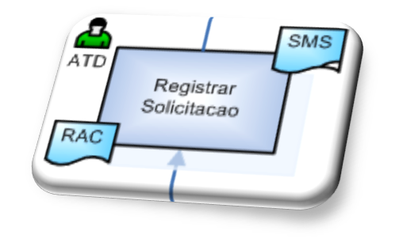

<figure style="text-align:center">
    
    <figcaption>Gato estudando Engenharia de Software</figcaption>
    <small>Fonte: gerado por IA com Bing por Maxwell Anderson (2023)</small>
     
    <small><em>Prompt: create an image of a cat studying software engineering</em></small>
</figure>

- [O que é um processo de desenvolvimento de software?](#o-que-é-um-processo-de-desenvolvimento-de-software)
  - [Atividade](#atividade)
- [Referências](#referências)

Vamos entender o que são processos de desenvolvimento de software?

# O que é um processo de desenvolvimento de software?

É uma sequência lógica de atividades que tem por objetivo final de produzir ou evoluir um produto de software.

É caracterizado por um conjunto de:

- Atividades
- Papéis
- Artefatos ou produtos de trabalho de entrada ou saída
- Fluxos

    <figure style="text-align:center">
        
        <figcaption>Criado pelo autor (2009)</figcaption>
    </figure>

## Atividade

“É uma unidade de trabalho que um indivíduo naquele papel poderá ser solicitado a executar” (Kruchten, 2003).

Atividades definem o **como fazer**

Em um primeiro nível, as atividades são ordenadas e interligadas e descrevem um fluxo de tarefas.

Exemplos:

- Analisar solicitação do cliente
- Levantar requisitos
- Documentar requisitos
- Realizar estimativas de tamanho
- Validar requisito junto ao cliente
- Realizar planejamento do projeto
- Validar projeto junto aos stakeholders
- Especificar requisitos
- Projetar arquitetura
- Desenvolver requisitos
- Realizar testes

# Referências

- Kruchten, P. Introdução ao RUP – Rational Unified Process. Edição Revisada. Rio de Janeiro: Editora Ciência Moderna, 2003.
- Sommerville, I. Engenharia de Software, 8ª edição. São Paulo: Pearson Addison-Wesley, 2007.
- AGUIAR, Heron Vieira ; ROUILLER, Ana Cristina . PEPP: Processo de Software para Empresas de Pequeno Porte baseado no Modelo CMMI. 2005.
