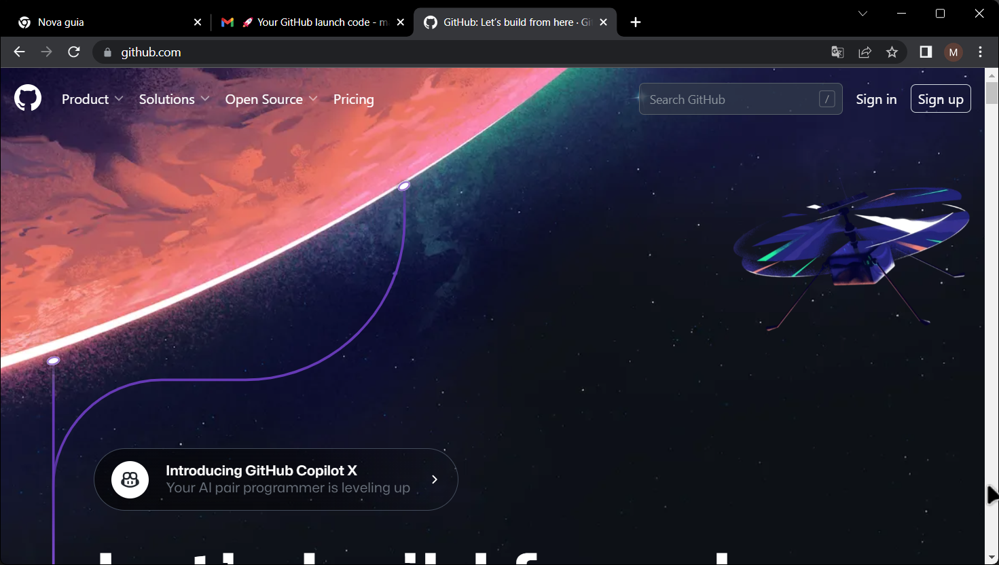
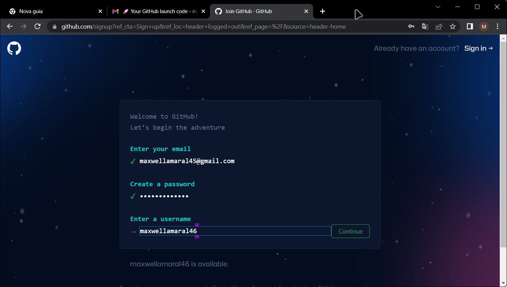
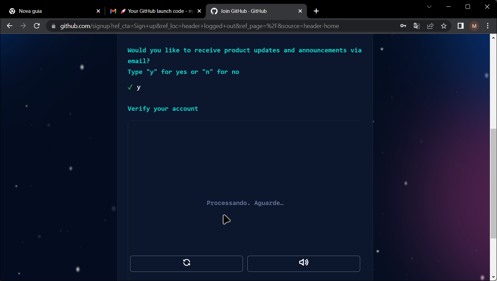
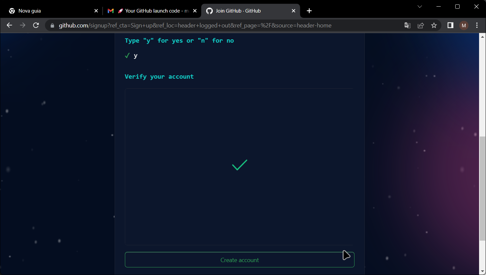
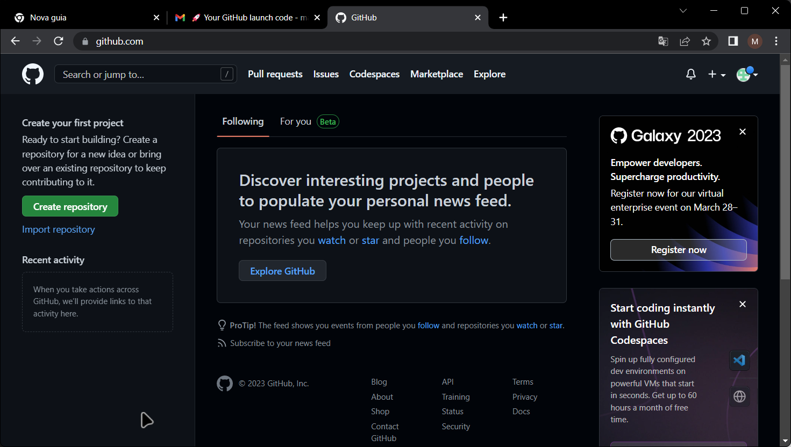

# Criando uma conta no GitHub

Criado em Março de 2023 por *Maxwell Anderson*

<figure style="text-align:center">
    
    <figcaption>Gato estudando Engenharia de Software.</figcaption>
    <small>Fonte: gerado por IA com Bing por Maxwell Anderson (2023)</a></small>
</figure>

- [Criando uma conta no GitHub](#criando-uma-conta-no-github)
  - [Assista no YouTube](#assista-no-youtube)
  - [O que seria o Git então?](#o-que-seria-o-git-então)
  - [Criando a conta](#criando-a-conta)

## Assista no YouTube

Vamos aprender como criar uma conta no Github através de um navegador. O GitHub é uma plataforma de hospedagem de código-fonte com controle de versão usando o Git. É uma das plataformas mais populares para desenvolvedores de software. O GitHub oferece planos gratuitos e pagos para seus usuários. Neste curso, usaremos a versão gratuita.

## O que seria o Git então?

O Git permite que você rastreie as alterações em seus arquivos, permitindo que você volte a versões anteriores se necessário, isto é, o Git permite que você realize uma tarefa chamada *controle de versão*. Posteriormente iremos falar mais sobre o Git.

## Criando a conta

Realize os seguintes passos:

1. Para criar uma conta no GitHub, acesse o site [https://github.com](https://github.com) e clique no botão **Sign up** no canto superior direito da tela.

  

2. Na página seguinte, você vai preencher os campos com seus dados.

    > **Um dica de ouro** 🤩
    >
    > Se você é estudante ou professor vinculado a uma instituição pública ou privada de ensino, você pode obter um plano profissional gratuito do GitHub através do [GitHub for Education](https://education.github.com/pack). Para isso, você deverá preencher o formulário com seus dados. Use preferencialmente um endereço de e-mail institucional. Depois irá enviar uma cópia do seu cartão de estudante ou comprovante de vínculo com a instituição de ensino. Após a aprovação, você receberá um e-mail com uma confirmação para usar no GitHub, bem como o GitHub Copilot, que é um assistente de código inteligente que ajuda você a escrever código mais rápido e com menos erros. Para saber mais sobre o GitHub Copilot, acesse [https://copilot.github.com](https://copilot.github.com).

3. Após o preenchimento, clique no botão **Continue**.

  

4. Irá aparecer uma pergunta relacionada ao desejo de enviar atualizações sobre produto, bem como anúncios. Eu digitei 'y' e cliquei em **Continue**.

  

5. Após isto, será solicitado que você realize uma verificação de segurança. Você deverá escolher uma das opções disponíveis e clicar em **Continue**.

  

6. Clique no botão **Create an account**.
7. Uma nova página irá solicitar que seja realizada a verificação do e-mail. Abra sua caixa de e-mails e verifique se o código de ativição foi enviado. Copie e cole na página "Enter code".
8. O GitHub irá apresentar uma página de boas vindas, solicitando mais informações sobre o perfil de uso. Se desejar, preencha as informações ou clique em **Skip personalization**.
9. Sua conta será criada e o *Dashboard* será exibido.

  

Pronto! Agora você tem uma conta no GitHub. Na próxima aula, iremos aprender como instalar o VSCode no Windows.

[Próxima aula](02.%20Instalando%20o%20VSCode.md)

[Índice](../README.md)
