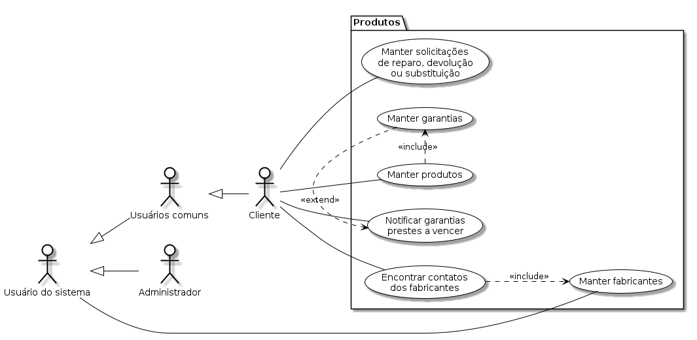

# Capa

---

<h1>Análise e Projeto de Sistemas</h1>

<h2>Visão de Casos de Uso</h2>

<h3>Sistema de Controle de Garantias de Produtos (SCGP)</h3>

<small>Versão 1.0</small>

---

## Histórico de revisões

|    Data    | Versão |      Descrição       |      Autor       |
| :--------: | :----: | :------------------: | :--------------: |
| 15/08/2023 |  1.0   | Criação do documento | Maxwell Anderson |

---

## Sumário

---
# Introdução

A visão de casos de uso exibe as funcionalidades do sistema e como elas são percebidas pelos usuários enquanto atores que interagem com o sistema.

## Quem usa estas informações?

- Clientes
- Designers
- Desenvolvedores
- Testadores
- Gerentes de projeto

## Referências

- [Visão de Produto](https://github.com/maxwellamaral/maxwellamaral.github.io/blob/8f925f5c8882263f475162a990b5da48b6779a3d/specs/requirements/vision.md)        
- [Requisitos de Software](https://github.com/maxwellamaral/maxwellamaral.github.io/blob/8f925f5c8882263f475162a990b5da48b6779a3d/specs/requirements/requirements.md)

# Visão geral

## Atores

## Produtos

## Sistema

## Monetização

# Casos de uso

|                      Caso de uso                      |     Título      |                                                                                                                                           Wireframes                                                                                                                                            |
| :---------------------------------------------------: | :-------------: | :--------------------------------------------------------------------------------------------------------------------------------------------------------------------------------------------------------------------------------------------------------------------------------------------- |
| [UCS001](../tests/products/UCS001-manter-produtos.py) | Manter produtos | <!----> <!----> |
| UCS002 | Manter garantias |-> [UCS001] ](../tests/products/UCS001-manter-produtos.py) |

